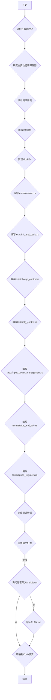

# BQ25730 驱动程序测试计划

## 任务目标

为 BQ25730 驱动程序创建测试用例，参考 `tests/integration_test.rs` 和 `bq25730.pdf` 数据手册。

- 只能完全编辑 `tests/` 目录下的文件。
- 只能有限编辑 `src/lib.rs`（不得调整代码结构，不得修改或删除 struct、impl、trait 的定义，你只被允许增加新函数、修改现有函数体，一切可能超过授权范围的修改将都需要征得用户临时授权）。
- 严格按照提供的代码示例风格编写。
- 测试源代码文件将分类存放，避免单个文件超过 500 行。
- **重要提示：** 驱动程序支持同步和异步两种方案调用，但测试用例**只针对同步部分**。所有测试用例都将使用同步方法编写。

## 测试目标

1. 验证 `Bq25730` 结构体的初始化。
2. 验证 `RegisterAccess` trait 的基本读写功能。
3. 验证主要寄存器的读写操作及其数据转换的准确性。
4. 验证状态寄存器的读取和位字段解析。
5. 验证 ADC 测量值的读取和转换。

## 测试环境模拟

由于是单元测试，我们将模拟一个 `MockI2c` 结构体，它将实现 `embedded_hal_async::i2c::I2c` trait，并允许我们预设 I2C 读写操作的预期行为和返回值。

## 测试用例分类

为了避免测试源代码文件过长，我计划在 `tests/` 目录下创建多个 Rust 文件来分类存放测试用例：

- `tests/common.rs`：存放 `MockI2c` 和其他通用测试辅助函数。
- `tests/init_and_basic.rs`：存放初始化和基本的寄存器读写测试。
- `tests/charge_control.rs`：存放充电控制相关的测试。
- `tests/otg_control.rs`：存放 OTG 功能相关的测试。
- `tests/status_and_adc.rs`：存放状态和 ADC 测量相关的测试。
- `tests/option_registers.rs`：存放其他配置寄存器的测试。

### 1. 驱动程序初始化和基本功能测试 (`tests/init_and_basic.rs`)

- **测试 `new` 函数：** 验证 `Bq25730` 实例是否正确创建，并存储了 I2C 地址和 I2C 外设。
- **测试 `init` 函数：**
  - 验证 `init` 函数是否正确写入了 `ChargeOption0` 寄存器（LSB 和 MSB）。
  - 验证 `init` 函数是否正确设置了 `IIN_HOST`。
  - 验证 `init` 函数是否正确设置了 `VSYS_MIN`。
  - 验证 `init` 函数是否尝试清除 `ChargerStatus` 寄存器中的故障标志。

### 2. 寄存器读写功能测试 (`tests/init_and_basic.rs`)

- **测试 `read_register`：** 验证单个寄存器的读取。
- **测试 `write_register`：** 验证单个寄存器的写入。
- **测试 `read_registers`：** 验证多个寄存器的读取。
- **测试 `write_registers`：** 验证多个寄存器的写入。
- **错误处理测试：** 验证无效长度的 `read_registers` 和 `write_registers` 是否返回 `Error::InvalidData`。

### 3. 充电控制功能测试 (`tests/charge_control.rs`)

- **`ChargeCurrent` (03/02h):**
  - `set_charge_current`：测试设置不同充电电流值（例如，0mA，最大值，中间值）并验证写入的原始字节。
  - `read_charge_current`：测试读取不同充电电流值并验证转换后的 mA 值。
- **`ChargeVoltage` (05/04h):**
  - `set_charge_voltage`：测试设置不同充电电压值（例如，最小值，最大值，中间值）并验证写入的原始字节。
  - `read_charge_voltage`：测试读取不同充电电压值并验证转换后的 mV 值。
- **`ChargeOption0` (01/00h):**
  - `set_charge_option0`：测试设置不同的选项位组合。
  - `read_charge_option0`：测试读取选项位并验证其值。

### 4. OTG 功能测试 (`tests/otg_control.rs`)

- **`OTGVoltage` (07/06h):**
  - `set_otg_voltage`：测试设置不同 OTG 电压值。
  - `read_otg_voltage`：测试读取 OTG 电压值。
- **`OTGCurrent` (09/08h):**
  - `set_otg_current`：测试设置不同 OTG 电流值。
  - `read_otg_current`：测试读取 OTG 电流值。

### 5. 输入电源管理功能测试 (`tests/input_power_management.rs`)

- **`InputVoltage` (0B/0Ah):**
  - `set_input_voltage`：测试设置不同输入电压限制。
  - `read_input_voltage`：测试读取输入电压限制。
- **`VsysMin` (0D/0Ch):**
  - `set_vsys_min`：测试设置不同最小系统电压。
  - `read_vsys_min`：测试读取最小系统电压。
- **`IinHost` (0F/0Eh):**
  - `set_iin_host`：测试设置不同主机输入电流限制。
  - `read_iin_host`：测试读取主机输入电流限制。
- **`IinDpm` (25/24h):**
  - `set_iin_dpm`：测试设置不同 DPM 输入电流限制。
  - `read_iin_dpm`：测试读取 DPM 输入电流限制。

### 6. 状态和监测功能测试 (`tests/status_and_adc.rs`)

- **`read_charger_status` (21/20h):**
  - 测试读取各种 `ChargerStatus` 位字段（例如 `stat_ac`, `ico_done`, `in_fchrg`, `fault_sysovp` 等）并验证其正确解析。
- **`read_prochot_status` (23/22h, 3D/3Ch):**
  - 测试读取各种 `ProchotStatus` 位字段（例如 `en_prochot_ext`, `stat_vindpm`, `stat_idchg1`, `stat_idchg2` 等）并验证其正确解析。
- **`read_adc_measurements` (27/26h, 29/28h, 2B/2Ah, 2D/2Ch):**
  - 测试读取所有 ADC 测量值并验证其正确转换。

### 7. 其他配置测试 (`tests/option_registers.rs`)

- **`ChargeOption1` (31/30h), `ChargeOption2` (33/32h), `ChargeOption3` (35/34h), `ChargeOption4` (3D/3Ch), `ProchotOption0` (37/36h), `ProchotOption1` (39/38h), `ADCOption` (3B/3Ah), `VMINActiveProtection` (3F/3Eh):**
  - 为每个寄存器实现 `set_` 和 `read_` 函数，并进行基本读写测试，验证原始字节的正确性。
- **`enter_ship_mode` (0x40):**
  - 测试调用此函数是否正确写入了船运模式寄存器。

## Mermaid 图表

## 测试用例实现流程

1. **使用 `embedded_hal_mock` 库中的 `I2cMock` (`tests/common.rs`)：**
    - 引入 `use embedded_hal_mock::eh1::i2c::{Mock as I2cMock, Transaction as I2cTransaction};`
    - 在测试中使用 `I2cMock` 来模拟 I2C 通信，并使用 `I2cTransaction` 定义预期的操作。

2. **为每个寄存器和功能编写测试函数：**
    - 使用 `#[tokio::test]` 或 `#[async_std::test]` 宏（取决于项目使用的异步运行时）来运行异步测试。
    - 在每个测试函数中，创建 `MockI2c` 实例并预设其行为。
    - 创建 `Bq25730` 实例。
    - 调用被测试的驱动程序函数。
    - 使用 `assert_eq!` 宏验证 `MockI2c` 记录的写入操作是否符合预期，以及驱动程序返回的值是否正确。

## 对 `src/lib.rs` 的有限编辑

根据任务要求，我只能在 `src/lib.rs` 中增加新函数、修改现有函数体，不得调整代码结构。

- **`init` 函数：** 已经存在，我将确保其初始化逻辑与数据手册中的推荐序列一致，并清除所有可清除的故障标志。
- **`read_charger_status` 和 `read_prochot_status`：** 已经存在，我将确保它们正确解析所有相关的位字段。
- **`read_adc_measurements`：** 已经存在，我将确保它正确解析所有相关的 ADC 测量值。
- **其他寄存器读写函数：** 我将为 `ChargeOption1` 到 `ChargeOption4`、`ProchotOption0` 到 `ProchotOption1`、`ADCOption` 和 `VMINActiveProtection` 添加 `set_` 和 `read_` 函数，这些函数将直接操作原始字节，因为这些寄存器包含多个不相关的位字段，不适合创建单独的结构体。
- **`enter_ship_mode`：** 已经存在，我将确保其写入的字节正确。

我将确保所有新增或修改的函数都符合 Rust 的最佳实践和现有代码风格，特别是参考 `tests/integration_test.rs` 的风格。
