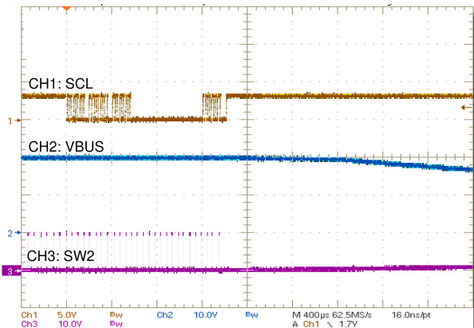

# BQ25730 具有电源路径控制功能和 USB-C PD 3.0 OTG 输出的 I2C 1 至 5 节电池降压/升压窄 VDC 电池充电控制器

# 1 特性

通过电池 MOSFET 实现电源路径控制，无需电池或电池电量耗尽即可实现独立的系统电压瞬时启动

400kHz/800kHz 可编程开关频率，可实现高效率/高功率密度

适用于 USB-C 电力输送 (PD) 接口平台的降压/升压窄电压直流 (NVDC) 充电器

输入范围为 3.5V 至 26V，可为 1 至 5 节电池充电

– 充电电流高达 16.2A/8.1A，分辨率为 128mA/64mA，基于 $5 \mathsf { m } \Omega / 1 0 \mathsf { m } \Omega$ 检测电阻

– 输入电流限制高达 10A/6.35A，分辨率为100mA/50mA，基于 $5 \mathsf { m } \Omega / 1 0 \mathsf { m } \Omega$ 检测电阻– 支持 USB 2.0、USB 3.0、USB 3.1 和 USB 电力传输 (PD)

– 输入电流优化器 (ICO)，无需过载适配器即可获取最大输入功率

可在降压、降压/升压和升压操作之间进无缝转 换

– 提供输入电流和电压调节（IINDPM 和VINDPM）以防电源过载

TI 获得专利的开关频率抖动模式，可降低 EMI 噪声

TI 获得专利的直通模式 (PTM)，可提高系统功效并实现 $9 9 \%$ 的电池快速充电。

通过专用引脚监测输入和电池电流集成型 8 位 ADC，可监控电压、电流和功率在补充模式下实现电池 MOSFET 理想二极管运行，可在适配器满载时支持系统

通过电池给 USB 端口加电 (USB OTG)– 3V 至 24V OTG，分辨率为 $8 \mathsf { m V }$ 输出电流限制高达 12.7A/6.35A，分辨率为100mA/50mA，基于 $5 \mathsf { m } \Omega / 1 0 \mathsf { m } \Omega$ 检测电阻可通过 $\mathsf { I } ^ { 2 } \mathsf { C }$ 主机控制接口实现灵活系统配置高精度调节和监控– $\pm 0 . 5 \%$ 充电电压调节– $\pm 3 \%$ 充电电流调节$\pm 2 . 5 \%$ 输入电流调节$12 \%$ 输入/充电电流监测

安全  
– 热关断– 输入、系统和电池过压保护– 输入、MOSFET 和电感器过流保护

安全相关认证– 经 IEC 62368-1 CB 认证封装：32 引脚，4.0mm × 4.0mm WQFN

# 2 应用

制氧机、呼吸机、扫地机器人平板电脑（多媒体）、无线扬声器

# 3 说明

BQ25730 是一款同步 NVDC 降压/升压电池充电控制器，可通过 USB 适配器、高电压 USB-C 电力输送(PD) 源和传统适配器等各种输入源为 1 至 5 节电池充电。它为空间受限的 1 至 5 节电池充电应用提供了一个元件数很少的高效解决方案。 窄 VDC 降压/升压架构避免了从输入源到系统电压的直接电源路径，从而同时实现宽输入电压范围和窄系统电压范围。窄系统电压范围对于加快电池充电速度和降低下一级转换器的MOSFET 额定值很重要。

器件信息

<html><body><table><tr><td></td><td>$(1)</td><td>##Rt()</td></tr><tr><td>BQ25730</td><td>RSN (WQFN 32)</td><td>4.00mm x 4.00mm</td></tr></table></body></html>

(1) 有关所有可选封装，请参阅 节 14。

  
应用示意图

# Table of Contents

1 特性. 1
2 应用.. 1
3 说明.. 1
4 说明（续） 3
5 Device Comparison Table. 4
6 Pin Configuration and Functions.. .5
7 Specifications.. 8
7.1 Absolute Maximum Ratings.. 8
7.2 ESD Ratings.. 8
7.3 Recommended Operating Conditions. .8
7.4 Thermal Information.. .9
7.5 Electrical Characteristics(BQ25730). 9
7.6 Timing Requirements. 19
7.7 Typical Characteristics. 21
8 Detailed Description. .25
8.1 Overview... .25
8.2 Functional Block Diagram.. 26
8.3 Feature Description.. .27
8.4 Device Functional Modes. .38
8.5 Programming. 39
8.6 Register Map.. .44
9 Application and Implementation.. .87
9.1 Application Information.. 87
9.2 Typical Application.. 87
10 Power Supply Recommendations. ..97
11 Layout.. .98
11.1 Layout Guidelines. 98
11.2 Layout Example.. 99
12 Device and Documentation Support. .101
12.1 Device Support. 101
12.2 Documentation Support. 101
12.3 接收文档更新通知. 101
12.4 支持资源 101
12.5 Trademarks. .101
12.6 静电放电警告 101
12.7 术语表. 101
13 Revision History.. 102
14 Mechanical, Packaging, and Orderable
Information.. 103

# 4 说明（续）

通过 NVDC 配置，可将系统电压稳定在电池电压水平，但无法将其降至低于系统最低电压。即便在电池完全放电或被取出时，系统也仍会继续工作。当负载功率超过输入源额定值时，电池会进入补电模式并防止系统崩溃。

在上电期间，充电器基于输入源和电池状况，将转换器设置为降压、升压或降压/升压配置。充电器可在降压、升压、降压/升压工作模式间无缝转换，无需主机控制。

在无输入源的情况下，BQ25730 可支持适用于 1 到 5 芯电池的 USB On-the-Go (OTG) 功能，从而在 VBUS 上生成具有 8mV 分辨率的 3V 至 24V 可调输出电压。可以配置 OTG 输出电压转换率，以符合 USB-PD 3.0 PPS 规范。

最新版本的 USB-C PD 规范包括快速角色交换 (FRS)，以确保及时进行电源角色交换，以便连接到扩展坞的器件可以避免瞬时断电或瞬时故障。此器件集成了 FRS，符合 PD 规范。

TI 获得专利的开关频率抖动模式可以在整个 EMI 传导频率范围（150kHz 至 30MHz）内显著降低 EMI 噪声。有多个抖动扩展选项可为不同的应用提供灵活性，从而简化 EMI 噪声滤波器设计。

该充电器可以在 TI 获得专利的直通模式 (PTM) 下运行，从而在整个负载范围内提高效率。在 PTM 中，输入功率直接通过充电器传递到系统。为了实现高效运行，可以节省 MOSFET 的开关损耗和电感器磁芯损耗。

BQ25730 采用 32 引脚 4mm × 4mm WQFN 封装。

# 5 Device Comparison Table

<html><body><table><tr><td></td><td>BQ25710</td><td>BQ25713</td><td>BQ25792</td><td>BQ25730</td><td>BQ25731</td></tr><tr><td>Interface</td><td>SMBus</td><td>Ic</td><td>I2c</td><td>I2C</td><td>Ic</td></tr><tr><td>Device Address</td><td>09h</td><td>6Bh</td><td>6Bh</td><td>6Bh</td><td>6Bh</td></tr><tr><td>Integrated MOSFET/Controller</td><td>Controller</td><td>Controller</td><td>Integrated MOSFET</td><td>Controller</td><td>Controller</td></tr><tr><td>Maximum Charge Current</td><td>8.128 A</td><td>8.128 A</td><td>5 A</td><td>16.256 A</td><td>16.256 A</td></tr><tr><td>Switching Frequency (Hz)</td><td>800 k/1.2 M</td><td>800 k/1.2 M</td><td>750 k/1.5 M</td><td>400 k/800 k</td><td>400 k/800 k</td></tr><tr><td>Cell Count</td><td>1s to 4s</td><td>1s to 4s</td><td>1s to 4s</td><td>1s to 5s</td><td>1s to 5s</td></tr><tr><td>Input Current Sense Resistor</td><td>10 m /20 m </td><td>10 m /20 m Q</td><td>Integrated</td><td>5 mQ/10 m Q</td><td>5 m/10 m Q</td></tr><tr><td>Independent Comparator Latch</td><td> Non Latch</td><td>Non Latch</td><td>NA</td><td>Latch/Non latch (default)</td><td>Latch/Non latch (default)</td></tr><tr><td>VSYS_UVP</td><td>2.4 V</td><td>2.4 V</td><td>2.2 V</td><td>2.4 V ~ 8.0 V (0.8- V step size) Default: 2.4 V</td><td>1.6 V</td></tr><tr><td>OTG Voltage Range</td><td>3.0 V to 20.8 V</td><td>3.0 V to 20.8 V</td><td>2.8 V to 22 V</td><td>3.0 V to 24 V</td><td>3.0 V to 24 V</td></tr><tr><td> Frequency Dithering</td><td>No</td><td>No</td><td>No</td><td>Yes</td><td>Yes</td></tr><tr><td>BATFET Power Path</td><td>Yes</td><td>Yes</td><td>Yes</td><td>Yes</td><td>No</td></tr><tr><td>Pre-charge LDO Mode</td><td>Yes</td><td>Yes</td><td>Yes</td><td>Yes</td><td>No</td></tr></table></body></html>

# 6 Pin Configuration and Functions

  
图 6-1. RSN Package 32-Pin WQFN Top View

表 6-1. Pin Functions  

<html><body><table><tr><td colspan="2">PIN</td><td rowspan="2">1/0</td><td rowspan="2">DESCRIPTION</td></tr><tr><td>NAME</td><td>NUMBER</td></tr><tr><td>ACN</td><td>2</td><td>PWR</td><td>Input current sense amplifier negative input. The leakage on ACP and ACN are matched. A RC low-pass filter is required to be placed between the sense resistor and the ACN pin to suppress the high frequency noise in the input current signal. Refer to #5 9.2.2.2 for ACP/ACN filter design.</td></tr><tr><td>ACP</td><td>3</td><td>PWR</td><td>Input current sense amplifier positive input. The leakage on ACP and ACN are matched. A RC low-pass filter is required to be placed between the sense resistor and the ACP pin to suppress the high frequency noise in the input current signal. Refer to #5 9.2.2.2 for ACP/ACN filter design.</td></tr><tr><td>BATDRVE</td><td>21</td><td>0</td><td>P-channel battery FET (BATFET) gate driver output. It is shorted to VSYS to turn off the BATFET. It goes 10 V below VSYS to fully turn on BATFET. BATFET is in linear mode to regulate VSYS at minimum system voltage when battery is depleted. BATFET is fully on during fast charge and works as an ideal-diode in supplement mode..</td></tr><tr><td>BTST1</td><td>30</td><td>PWR</td><td>Buck mode high-side power MOSFET driver power supply. Connect a 0.047-F capacitor between SW1 and BTST1. The bootstrap diode between REGN and BTST1 is integrated.</td></tr><tr><td>BTST2</td><td>25</td><td>PWR</td><td>Boost mode high-side power MOSFET driver power supply. Connect a 0.047-  F capacitor between SW2 and BTST2. The bootstrap diode between REGN and BTST2 is integrated.</td></tr><tr><td>CELL_BATPRESZ</td><td>18</td><td></td><td>Battery cell selection pin for 1- to 5- cell battery setting. CELL_BATPRESZ pin is biased from VDDA through a resistor divider. CELL_BATPRESZ pin also sets SYSOVP thresholds to 5 V for 1-cell, 12 V for 2-cell and 19.5 V for 3-cell/4-cell. CELL_BATPRESZ pin is pulled below VceLL_BArPResz_FALL to indicate battery removal. After battery is removed the charge voltage register REG0x05/04h() goes back to default. No external cap is allowed at CELL_BATPRESZ pin. The device exits LEARN mode and disables charge when. CELL_BATPRESZ pin is pulled low (upon battery removal)..</td></tr></table></body></html>

表 6-1. Pin Functions （续）  

<html><body><table><tr><td colspan="2">PIN</td><td rowspan="2">1/o</td><td rowspan="2">DESCRIPTION</td></tr><tr><td>NAME</td><td>NUMBER</td></tr><tr><td>CHRG_OK</td><td>4</td><td>0</td><td>Open drain active high indicator to inform the system good power source is connected to the charger input. Connect to the pullup rail via 10-k Q resistor. When VBUS rises above 3.5 V and falls below 25.8 V, CHRG_OK is HIGH after 50-ms deglitch time. When VBUS falls below 3.2 V or rises above 26.8 V, CHRG_OK is LOW. When one of SYSOVP, SYSUVP, ACOC, TSHUT, BATOVP, BATOC or force converter off faults occurs, CHRG_OK is asserted LOW.</td></tr><tr><td>CMPIN</td><td>14</td><td></td><td>Input of independent comparator. The independent comparator compares the voltage sensed on CMPIN pin with internal reference, and its output is on CMPOUT pin. Internal reference, output polarity and deglitch time is selectable by the I?C host. With polarity HIGH (CMP_POL = 1b), place a resistor between CMPIN and CMPOUT to program hysteresis. With polarity LOW (CMP_POL = 0b), the internal hysteresis is 100 mV. If the independent</td></tr><tr><td>CMPOUT</td><td>15</td><td>0</td><td>comparator is not in use, tie CMPIN to ground.e Open-drain output of independent comparator. Place a pullup resistor from CMPOUT to pullup supply rail. Internal reference, output polarity and deglitch time are selectable by the i2C host. If the independent comparator is not in use, float CMPOUT pin.</td></tr><tr><td>COMP2</td><td>17</td><td></td><td>Buck boost converter compensation pin 2. Refer to #5 8.3.12 for COMP2 pin RC network.</td></tr><tr><td>COMP1</td><td>16</td><td></td><td>Buck boost converter compensation pin 1. Refer to # 8.3.12 for COMP1 pin RC network.</td></tr><tr><td>OTG/VAP/FRS</td><td>5</td><td></td><td>Active HIGH to enable OTG or FRS modes. 1) When OTG_VAP_MODE=1b and EN_OTG=1b, pulling high this pin can enable OTG mode. 2) When OTG_VAP_MODE=1b and EN_FRS=1b, pulling high this pin can enable FRS mode in forward operation.</td></tr><tr><td>HIDRV1</td><td>31</td><td>0</td><td>Buck mode high-side power MOSFET (Q1) driver. Connect to high-side n-channel MOSFET gate.</td></tr><tr><td>HIDRV2</td><td>24</td><td>0</td><td>Boost mode high-side power MOSFET(Q4) driver. Connect to high-side n-channel MOSFET gate.</td></tr><tr><td>IADPT</td><td>8</td><td>0</td><td>The adapter current monitoring output pin. VIADpt = 20 or 40  (VAcp - VAcN) with ratio selectable through IADPT_GAIN bit. This pin is also used to program the inductance used in the application. Refer to #5 8.3.11 for selecting resistor from the IADPT pin to ground . For a 4.7-H inductance, the resistor is 191-k Q or 187-k Q standard value. Place a 100-pF or less ceramic decoupling capacitor from IADPT pin to ground. IADPT output voltage is clamped</td></tr><tr><td>IBAT</td><td>9</td><td>0</td><td>below 3.3 V. The battery current monitoring output pin. VIBAr = 8 or 16  (VsRp - VsRn) for charge current, or VIBAT = 8 or 16  (VsRN - VsRp) for discharge current, with ratio selectable through IBAT_GAIN bit. Place a 100-pF or less ceramic decoupling capacitor from IBAT pin to ground. This pin can be floating if not in use. Its output voltage is clamped below 3.3 V.</td></tr><tr><td>ILIM_HIZ</td><td>6</td><td></td><td>Input current limit setting pin. Program ILIM_HIZ voltage by connecting a resistor divider. from VDDA rail to ground. The pin voltage is calculated as: V(ILIm_Hiz) = 1 V + 40  IDPM x Rac, in which IDPM is the target input current limit.. When EN_EXTILIM = 1b the input current limit used by the charger is the lower setting of ILIM_HIZ pin and IIN_HOST register. When EN_EXTILIM = Ob input current limit is only determined by IIN_HOST register. When the pin voltage is below 0.4 V, the device enters high impedance (HIZ) mode with low quiescent current. When the pin voltage is above 0.8 V, the device is out of HIZ mode. The ILIM_HIZ pin voltage is continuous read and used for updating current limit seting (lf EN_ExTILIM=1b ), this allows dynamic change input current limit setting by adjusting this</td></tr><tr><td>LODRV1</td><td>29</td><td>0</td><td>pin voltage. Buck mode low side power MOSFET (Q2) driver. Connect to low side n-channel MOSFET gate.</td></tr><tr><td>LODRV2</td><td>26</td><td>0</td><td>Boost mode low side power MOSFET (Q3) driver. Connect to low side n-channel MOSFET gate.</td></tr><tr><td>PGND</td><td>27</td><td>GND</td><td>Device power ground.e</td></tr><tr><td>PROCHOT</td><td>11</td><td>0</td><td>Active low open drain output indicator. It monitors adapter input current, battery discharge current, and system voltage. After any event in the PROCHOT profile is triggered, a pulse is asserted. The minimum pulse width is adjustable through PROCHOT_WIDTH bits.</td></tr></table></body></html>

表 6-1. Pin Functions （续）  

<html><body><table><tr><td colspan="2">PIN</td><td rowspan="2">1/o</td><td rowspan="2">DESCRIPTION</td></tr><tr><td>NAME</td><td>NUMBER</td></tr><tr><td>PSYS</td><td>10</td><td>0</td><td>Current mode system power monitor. The output current is proportional to the total power voltage is clamped at 3.3 V. Place a capacitor in parallel with the resistor for filtering.</td></tr><tr><td>REGN</td><td>28</td><td>PWR</td><td>6-V linear regulator output supplied from VBUS or VSYS. The LDO is active when VBUS above VvBus_conveN. Connect a 2.2- or 3.3-  F ceramic capacitor from REGN to power ground. REGN pin output is for power stage gate drive.</td></tr><tr><td>SCL</td><td>13</td><td></td><td>I2C clock input. Connect to clock line from the host controller or smart battery. Connect a 10- k Q pullup resistor according to specifications.</td></tr><tr><td>SDA</td><td>12</td><td>I/0</td><td>I2C open-drain data I/O. Connect to data line from the host controller or smart battery. Connect a 10-k  pullup resistor according to I?C specifications.</td></tr><tr><td>SRN</td><td>19</td><td>PWR</td><td>Charge current sense amplifier negative input. SRN pin is for battery voltage sensing as well. Connect a 0.1-  F filter cap cross battery charging sensing resistor and use 10-Q contact resistor between SRN pin and battery charging sensing resistor. The leakage current on SRP and SRN are matched..</td></tr><tr><td>SRP</td><td>20</td><td>PWR</td><td>Charge current sense amplifier positive input. Connect a 0.1-  F filter cap cross battery charging sensing resistor and use 10-  contact resistor between SRP pin and battery charging sensing resistor. The leakage current on SRP and SRN are matched.</td></tr><tr><td>SW1</td><td>32</td><td>PWR</td><td>Buck mode switching node. Connect to the source of the buck half bridge high side n- channel MOSFET.</td></tr><tr><td>SW2</td><td>23</td><td>PWR</td><td>Boost mode switching node. Connect to the source of the boost half bridge high side n- channel MOSFET.</td></tr><tr><td>VBUS</td><td>1</td><td>PWR</td><td>Charger input voltage. An input low pass filter of 1  and 0.47 F (minimum) is recommended.</td></tr><tr><td>VDDA</td><td>7</td><td>PWR</td><td>Internal reference bias pin. Connect a 10- Q resistor from REGN to VDDA and a 1-  F ceramic capacitor from VDDA to power ground.</td></tr><tr><td>VSYS</td><td>22</td><td>PWR</td><td>Charger system voltage sensing. The system voltage regulation maximum limit is programmed in ChargeVoltage register plus 150 mV and regulation minimum limit is programmed in VSYS_MIN register.</td></tr><tr><td>Thermal pade</td><td></td><td></td><td>Exposed pad beneath the IC. Always solder thermal pad to the board, and have vias on the thermal pad plane connecting to power ground planes. It serves as a thermal pad to dissipate the heat..</td></tr></table></body></html>

# 7 Specifications

# 7.1 Absolute Maximum Ratings

over operating free-air temperature range (unless otherwise noted)(1)

<html><body><table><tr><td colspan="2"></td><td>mIn</td><td>MAX</td><td>UnIT</td></tr><tr><td rowspan="10">Voltage</td><td>SRN, SRP, ACN, ACP, VBUS, VSYS</td><td>- 0.3</td><td>32</td><td rowspan="9">v</td></tr><tr><td>SW1, SW2</td><td>-2</td><td>32</td></tr><tr><td>BTST1, BTST2, HIDRV1, HIDRV2, BATDRV</td><td>- 0.3</td><td>38</td></tr><tr><td>LODRV1, LODRV2 (25nS)</td><td>-4</td><td>7</td></tr><tr><td>HIDRV1, HIDRV2 (25nS)</td><td>-4</td><td>38</td></tr><tr><td>SW1, SW2 (25nS)</td><td>-4</td><td>32</td></tr><tr><td>SDA, SCL, REGN, PSYS, CHRG_OK, CELL_BATPRESZ, ILIM_HIZ, LODRV1, LODRV2, VDDA, COMP2, CMPIN, CMPOUT,OTG/VAP/ FRS,</td><td>- 0.3</td><td>7</td></tr><tr><td>PROCHOT</td><td>- 0.3</td><td>5.5</td></tr><tr><td>IADPT, IBAT, COMP1</td><td>- 0.3</td><td>3.6</td></tr><tr><td>BTST1-SW1, BTST2-SW2, HIDRV1-SW1, HIDRV2-SW2</td><td>- 0.3</td><td>7</td></tr><tr><td rowspan="2">Differential Voltage</td><td>SRP-SRN, ACP-ACN</td><td>- 0.5</td><td>0.5</td></tr><tr><td>Junction temperature range, Tj</td><td></td><td>150</td></tr><tr><td>Temperature Temperature</td><td>Storage temperature, Tstg</td><td>- 40 - 55</td><td>150</td></tr></table></body></html>

(1) Stresses beyond those listed under Absolute Maximum Rating may cause permanent damage to the device. These are stress ratings only, which do not imply functional operation of the device at these or any other conditions beyond those indicated under Recommended Operating Condition. Exposure to absolute-maximum-rated conditions for extended periods may affect device reliability.

# 7.2 ESD Ratings

<html><body><table><tr><td colspan="3"></td><td>VALUE</td><td>UNIT</td></tr><tr><td rowspan="2">V(ESD)</td><td rowspan="2">Electrostatic discharge</td><td>Human body model (HBM), per ANSI/ESDA/ JEDEC JS-001, all pins(1)</td><td>+2000</td><td rowspan="2">v</td></tr><tr><td>Charged device model (CDM), per JEDEC specification JESD22-C101, all pins(2)</td><td>500</td></tr></table></body></html>

(1) JEDEC document JEP155 states that 500-V HBM allows safe manufacturing with a standard ESD control process. (2) JEDEC document JEP157 states that 250-V CDM allows safe manufacturing with a standard ESD control process.

# 7.3 Recommended Operating Conditions

over operating free-air temperature range (unless otherwise noted)

<html><body><table><tr><td colspan="2"></td><td> MIn</td><td>NOM</td><td>MAX</td><td>UnIT</td></tr><tr><td rowspan="7">Voltage</td><td>ACN, ACP, VBUS</td><td>0</td><td></td><td>26</td><td rowspan="8">V</td></tr><tr><td>SRN, SRP, VSYS</td><td>0</td><td></td><td>23.15</td></tr><tr><td>SW1, SW2</td><td>-2</td><td></td><td>26</td></tr><tr><td>BTST1, BTST2, HIDRV1, HIDRV2, BATDRV</td><td>0</td><td></td><td>32</td></tr><tr><td>SDA, SCL, REGN, PSYS, CHRG_OK, CELL_BATPRESZ, ILIM_HIZ, LODRV1, LODRV2, VDDA, COMP2, CMPIN, CMPOUT,OTG/VAP/FRS</td><td>0</td><td></td><td>6.5</td></tr><tr><td>PROCHOT</td><td>0</td><td></td><td>5.3</td></tr><tr><td>IADPT, IBAT, COMP1</td><td>0</td><td colspan="2">3.3</td></tr><tr><td rowspan="3">Viffereniall</td><td>BTST1-SW1, BTST2-SW2, HIDRV1-SW1, HIDRV2-SW2</td><td>0</td><td colspan="2">6.5</td><td rowspan="3">V</td></tr><tr><td>SRP-SRN, ACP-ACN</td><td>- 0.5</td><td colspan="2">0.5</td></tr><tr><td>BATDRV-VSYS</td><td>0</td><td colspan="2">10.8</td></tr></table></body></html>

# 7.3 Recommended Operating Conditions （续）

over operating free-air temperature range (unless otherwise noted)

<html><body><table><tr><td colspan="2"></td><td> MIN</td><td>NOM</td><td>MAX</td><td>UnIT</td></tr><tr><td rowspan="2">Temperature</td><td>Junction temperature range, Tj</td><td> - 20</td><td></td><td>125</td><td rowspan="2">C</td></tr><tr><td>Storage temperature, Tstg</td><td>- 20</td><td></td><td>85</td></tr></table></body></html>

# 7.4 Thermal Information

<html><body><table><tr><td rowspan="3"></td><td rowspan="3">THERMAL METRIC(1)E</td><td>BQ25730</td><td rowspan="3">UNIT</td></tr><tr><td>RSN (WQFN)</td><td></td></tr><tr><td>32 PINS</td><td></td></tr><tr><td>RoJA</td><td>Junction-to-ambient thermal resistance (JEDEC(1))</td><td>37.2</td><td>C/W</td></tr><tr><td>R o JC(top)</td><td>Junction-to-case (top) thermal resistance</td><td>26.1</td><td>C/W</td></tr><tr><td>ROJB</td><td>Junction-to-board thermal resistance</td><td>7.8</td><td>C/W</td></tr><tr><td>WJT</td><td>Junction-to-top characterization parameter</td><td>0.3</td><td>C/W</td></tr><tr><td>W JB</td><td> Junction-to-board characterization parameter</td><td>7.8</td><td>C/W</td></tr><tr><td>R o JC(bot)</td><td> Junction-to-case (bottom) thermal resistance</td><td>2.3</td><td>C/W</td></tr></table></body></html>

(1) For more information about traditional and new thermal metrics, see the Semiconductor and IC Package Thermal Metrics application report.

# 7.5 Electrical Characteristics(BQ25730)

VBUS_UVLOZ < VVBUS < VVBUSOV_FALL , $\mathsf { T } _ { \mathsf { J } } = - 4 0 ^ { \circ } \mathsf { C }$ to $+ 1 2 5 ^ { \circ } \mathsf { C }$ , and ${ \sf T } _ { \sf J } = 2 5 ^ { \circ } { \sf C }$ for typical values (unless otherwise noted)

<html><body><table><tr><td colspan="2">PARAMETER</td><td>TEST CONDITIONS</td><td>MIN</td><td>TYP</td><td>MAX</td><td> UNIT</td></tr><tr><td>VINPUT_OP</td><td>Input voltage operating range MAX SYSTEM VOLTAGE REGULATION</td><td></td><td>3.5</td><td></td><td>26</td><td>v</td></tr><tr><td>VSYSMAX_RNG</td><td>System Voltage Regulation, measured on Vsys (charge disabled)</td><td></td><td>1.024</td><td></td><td>23.15</td><td>v</td></tr><tr><td rowspan="2">VSYSMAX_ACC</td><td>System vo tageracy (charge disabled and OOA disabled)</td><td rowspan="2"></td><td colspan="2">Vormt</td><td rowspan="2"></td><td rowspan="2">v</td></tr><tr><td>REG0x05/04() = 0x5208H (21.000 V)</td><td colspan="2">- 2%</td></tr><tr><td rowspan="6">VSYSMAX_ACC</td><td rowspan="4">System voltage regulation accuracy chargo disabled and</td><td rowspan="2">REG0x05/04() = 0x41A0H (16.800 V)</td><td>Vsrn + 150 mV</td><td></td><td></td><td>v</td></tr><tr><td colspan="2">- 2%</td><td colspan="2">2%</td></tr><tr><td colspan="2">REG0x05/04() = 0x3138H (12.600 V)</td><td colspan="2">1SoRm 2%</td><td>v</td></tr><tr><td colspan="2">REG0x05/04() = 0x20D0H (8.400 V)</td><td colspan="2">3%</td><td>v</td></tr><tr><td rowspan="2">REG0x05/04() = 0x1068H (4.200 V)</td><td colspan="2">- 3%</td><td colspan="2">v</td></tr><tr><td colspan="2">- 3%</td><td colspan="2">3%</td></tr><tr><td colspan="2">MINIMUM SYSTEM VOLTAGE REGULATION</td><td colspan="3"></td><td></td></tr><tr><td>VSYS_MIN_RNG</td><td>System Voltage Regulation, measured on Vsys</td><td colspan="2"></td><td colspan="2">23.00</td><td>v</td></tr></table></body></html>

# 7.5 Electrical Characteristics(BQ25730) （续）

<html><body><table><tr><td colspan="5">VvBus_uvLoz < VvBus < VvBusov FALL , Tj = -40C to +125C, and Tj = 25C for typical values (unless otherwise noted)</td></tr><tr><td colspan="2">PARAMETER</td><td>TEST CONDITIONS</td><td>MIN TYP</td><td>MAXUNIT</td></tr><tr><td rowspan="3">setting,OOA disabled) VsYS_MIN_REG_ACC</td><td rowspan="3">Minimum System Voltage Regulation Accuracy (VBAT below REG0x0D/0C()</td><td rowspan="3">REG0x0D/0C() = 0x9A00H</td><td>15.40</td><td>v</td></tr><tr><td>- 2%</td><td>- 2%</td></tr><tr><td></td><td>v</td></tr><tr><td rowspan="5">VSYS_MIN_REG_ACC</td><td rowspan="5">Minimum System Voltage Regulation Accuracy (VBAT below REG0x0D/0C() REG0x0D/0C() = 0x4200H setting, EN_OOA=0b)</td><td rowspan="2">REG0x0D/0C() = 0x7B00H REG0x0D/0C() = 0x5C00H</td><td>12.30 - 2%</td><td></td></tr><tr><td> - 2%</td><td>v</td></tr><tr><td rowspan="3"></td><td>9.20</td><td></td></tr><tr><td>- 2% 6.60</td><td>- 2% v</td></tr><tr><td>- 3% - 3%</td><td></td></tr><tr><td></td><td></td><td>REG0x0D/0C() = 0x2400H</td><td>3.60 - 3% - 3%</td><td>v</td></tr><tr><td></td><td>CHARGE VOLTAGE REGULATION</td><td colspan="3"></td></tr><tr><td>VBAT_RNG</td><td>Battery o aee</td><td rowspan="2"></td><td>1.024 23.00</td><td></td></tr><tr><td>Battery voltage regulation accuracy (0C to 85C) VBAT_REG_ACC</td><td>REG0x05/04() = 0x5208H</td><td>21</td><td>v 0.5%</td></tr><tr><td rowspan="6">VBAT_REG_ACC</td><td rowspan="6">Battery voltage regulation accuracy (0C to 85C)</td><td>REG0x05/04() = 0x41A0H</td><td>- 0.5% 16.8</td><td>v</td></tr><tr><td rowspan="2">REG0x05/04() = 0x3138H</td><td>- 0.5% 0.5%</td><td></td></tr><tr><td>12.6</td><td></td></tr><tr><td rowspan="2">REG0x05/04() = 0x20D0H</td><td>- 0.5% 0.5%</td><td></td></tr><tr><td>8.4</td><td>v</td></tr><tr><td rowspan="2"></td><td>- 0.6% 0.6%</td><td></td></tr><tr><td>REG0x05/04() = 0x1068H - 1.1%</td><td>4.2</td><td>v</td></tr><tr><td></td><td>CHARGE CURRENT REGULATION IN FAST CHARGE Charge current</td><td rowspan="2"></td><td>1.45%</td><td></td></tr><tr><td>VIREG_CHG_RNG</td><td>regulation differential VIREG_CHG = VSRP - VSRN</td><td>0 81.28</td><td>mV</td></tr><tr><td rowspan="6">ICHRG_REG_ACC</td><td rowspan="6">voltage range Charge current rogulationaoourac resistorRATabove /0C)setting(0C to 85C)</td><td rowspan="2">REG0x03/02() = 0x1000H</td><td>8192</td><td>mA</td></tr><tr><td>- 3.0% 3.0%</td><td></td></tr><tr><td rowspan="2">REG0x03/02() = 0x0800H</td><td>4096</td><td>mA</td></tr><tr><td>- 5.0% 6.0%</td><td></td></tr><tr><td rowspan="2">REG0x03/02() = 0x0400H</td><td>2048</td><td>mA</td></tr><tr><td>- 12% 13.5% 1024</td><td>mA</td></tr><tr><td colspan="3">- 18% CHARGE CURRENT REGULATION IN LDO MODE</td><td>21.5%</td><td></td></tr><tr><td rowspan="3">ICLAMP</td><td rowspan="3">Pre-charge current clamp under low battery voltage</td><td>CELL(>2 S),VSRN < VSYS_MIN</td><td>384</td><td>mA</td></tr><tr><td>CELL 1 S, VSRN < 3 V</td><td>384</td><td>mA</td></tr><tr><td>CELL 1 S, 3 V < VSRN < VSYS_MIN</td><td>2</td><td>A</td></tr></table></body></html>

<html><body><table><tr><td colspan="6">www.ti.com.cn ZHCSNB8A - FEBRUARY 2021 - REVISED JANUARY 202</td></tr><tr><td colspan="6">7.5 Electrical Characteristics(BQ25730) (  )</td></tr><tr><td colspan="6">VvBus_uvLoz < Vveus  VvBusov FALL Tj = -40C to +125C, and Tj = 25C for typical values (unless otherwise noted) PARAMETER</td></tr><tr><td rowspan="4">IPRECHRG_REG_ACC REG0x0D/0C()</td><td rowspan="4">Pre-charge current regulation accuracy</td><td>TEST CONDITIONS</td><td>MIN TYP</td><td>MAXUNIT</td><td></td></tr><tr><td>REG0x03/02() = 0x00C0H</td><td>384</td><td></td><td>mA</td></tr><tr><td>>2S 1S</td><td>- 25.0% - 50.0%</td><td>25.0% 50.0%</td><td></td></tr><tr><td>REG0x03/02() = 0x0080H</td><td>256</td><td></td><td>mA</td></tr><tr><td></td><td>setting (0C to 85C) SRP, SRN leakage</td><td>>2S</td><td>- 30.0%</td><td>30.0%</td><td></td></tr><tr><td colspan="2">ILEAK_SRP_SRN current mismatch (0C to 85C) INPUT CURRENT REGULATION</td><td></td><td>- 13.5</td><td>10.0</td><td>A</td></tr><tr><td>VIREG_DPM_RNG</td><td>Input current regulation differential voltage range with 10-m Q RAc sensing resistor</td><td>VIREG_DPM = VACP - VACN</td><td>0.5</td><td></td><td>64 mV</td></tr><tr><td rowspan="3">IIN_DPM_REG_ACC</td><td rowspan="3">Input current regulation accuracy 40C to 105C) with resistor</td><td>REG0x0F/0E() = 0x4E00H</td><td>7600 5600</td><td>7800 8000</td><td>mA</td></tr><tr><td>REG0x0F/0E() = 0x3A00H</td><td>2600</td><td>5800</td><td>6000 mA</td></tr><tr><td>REG0x0F/0E() = 0x1C00H REG0x0F/0E() = 0x0800H</td><td>600</td><td>2800 800</td><td>3000 mA 1000 mA</td></tr><tr><td>ILEAK_ACP_ACN</td><td>ACP, ACN leakage current mismatch</td><td></td><td>- 16</td><td></td><td>10 A</td></tr><tr><td>VIREG_DPM_RNG_LIM</td><td>Voltage range for input current regulation (ILIM_HIZ</td><td></td><td>1.15</td><td></td><td>4 v</td></tr><tr><td rowspan="4">Pin) JIN_DPM_REG_ACC_ILIM</td><td rowspan="4">Input Current Regulation Accuracy on ILIM_HIZ pin VILIM_HIZ = 1 V + 40 x DPM  RAC, with 5- mQ RAc sensing</td><td>VILIM_HIZ = 2.6 V</td><td>7600</td><td>8000</td><td></td></tr><tr><td>VILIM_HIZ = 2.2 V</td><td>5600 6000</td><td>8400 6400</td><td>mA mA</td></tr><tr><td>VILIM_HIZ = 1.6 V</td><td>2600</td><td>3000 3400</td><td>mA</td></tr><tr><td>VILIM_HIZ = 1.2 V</td><td>600</td><td>1000</td><td>1400 mA</td></tr><tr><td>ILEAK_ILIM</td><td>resistor LUM_HIZ pin eakage</td><td></td><td>-1</td><td></td><td>1 A</td></tr><tr><td colspan="6">INPUT VOLTAGE REGULATION Input voltage</td></tr><tr><td rowspan="5">VDPM_RNG VDPM_REG_ACC</td><td rowspan="5">regulation range Input voltage regulation accuracy</td><td>Voltage on VBUS</td><td>3.2</td><td>19.52</td><td>v</td></tr><tr><td>REG0x0B/0A()=0x3C80H</td><td>18688</td><td></td><td>mV</td></tr><tr><td>REG0x0B/0A()=0x1E00H</td><td>- 3.5% 10880</td><td>2%</td><td>mV</td></tr><tr><td>REG0x0B/0A()=0x0500H</td><td>- 4.5%</td><td>3%</td><td></td></tr><tr><td></td><td>- 8%</td><td>4480 5.5%</td><td>mV</td></tr><tr><td colspan="6">OTG CURRENT REGULATION</td></tr><tr><td>VIOTG_REG_RNG</td><td>OTG output current regulation differential voltage range</td><td>VIOTG_REG = VACP - VACN</td><td>0</td><td>81.28</td><td>mV</td></tr></table></body></html>

# 7.5 Electrical Characteristics(BQ25730) （续）

<html><body><table><tr><td colspan="6">VvBus_uvLoz < VvBus  VvBusov FALL , Tj = -40C to +125C, and Tj = 25C for typical values (unless otherwise noted)</td></tr><tr><td colspan="2">PARAMETER</td><td>TEST CONDITIONS</td><td>MIN TYP</td><td></td><td>MAXUNIT</td></tr><tr><td rowspan="3">IOTG_ACC</td><td>OTG output current</td><td>REG0x09/08() = 0x3C00H</td><td>5600 6000</td><td>6400</td><td> mA</td></tr><tr><td>5-m Q RAc series</td><td>REG0x09/08() = 0x1E00H</td><td>2600 3000</td><td></td><td>3400 mA</td></tr><tr><td>REG0x09/08() = 0x0A00H</td><td>600</td><td>1000</td><td>1400</td><td>mA</td></tr><tr><td colspan="6">OTG VOLTAGE REGULATION</td></tr><tr><td>disabled) VOTG_REG_RNG</td><td colspan="2">OTG voltage regulation range(OOAVoltage on VBUS</td><td>3</td><td>24.00</td><td>V</td></tr><tr><td rowspan="4">VOTG_REG_ACC</td><td rowspan="4">OTG voltage regulaticyo0A disabled)</td><td>REG0x07/06()=0x2CECH</td><td>23.00</td><td></td><td>v</td></tr><tr><td>REG0x07/06()=0x1770H</td><td>- 2% 12.00</td><td>2%</td><td>v</td></tr><tr><td></td><td>- 2%</td><td>2%</td><td></td></tr><tr><td>REG0x07/06()=0x09C4H</td><td>5.00 - 4%</td><td>3.5%</td><td>v</td></tr><tr><td colspan="7">REGN REGULATOR</td></tr><tr><td>VREGN_REG</td><td>REGN regulator voltage (0 mA - 60 mA)</td><td>VvBUs = 10 V</td><td>5.7</td><td>6</td><td>6.3</td><td>v</td></tr><tr><td>VDROPOUT</td><td>out mode REGN current limit REGN voltage in drop </td><td>VVBUs = 5 V, ILOAD = 20 mA</td><td>3.8</td><td>4.3</td><td>4.6</td><td>v</td></tr><tr><td>IREGN_LIM</td><td>when converter is enabled</td><td>VVBUS = 10 V, force VREGN =4 V</td><td>50</td><td>65</td><td></td><td>mA</td></tr><tr><td colspan="7">QUIESCENT CURRENT</td></tr><tr><td rowspan="4">IBAT_BATFET_ON</td><td rowspan="4">System powered by battery. BATFET on. nput current during + IvsyS</td><td>VBAT = 18 V, REG0x01[7] = 1,REG0x31[6] = 0b, in low-power mode, Disable PSYS</td><td></td><td>22</td><td>45</td><td>A</td></tr><tr><td>VBAT = 18 V, REG0x01[7] = 1, REG0x31[6] = 1b, REG0x31[5:4] = 11b,REGN off, Disable PSYS,</td><td></td><td>35</td><td>60</td><td>A</td></tr><tr><td></td><td></td><td>880</td><td>1170</td><td>A</td></tr><tr><td>VBAT = 18 V, REG0x01[7] = 0, REG0x31[5:4] = 00b, REGN on, Enable PSYS, In performance mode</td><td></td><td>980</td><td>1270</td><td>A</td></tr><tr><td>IAC_SW_LIGHT_buck</td><td>PFM in buck mode, no od us o + IsRN + ISw1 + IBTST + Isw2 + IBTST2 Input current during</td><td>OS=20 =AT=12.6V, 3s, REG0x01[21 =0;</td><td></td><td>2.2</td><td></td><td>mA</td></tr><tr><td>IAC_SW_LIGHT_boost</td><td>PFM in boost mode, o od vous + Iscp ISRN + Isw1 + IBTST2 + Isw2 + IBTST2</td><td>MOSFEY QBAT =8.4 V 2s, REG0x01[2] 0;</td><td></td><td>2.7</td><td></td><td>mA</td></tr><tr><td>IAC_SW_LIGHT_buckboost</td><td>Input current during PFM in buck boost Imodeo no ood o + ISRP + ISRN + ISw1 + BTST1 + Isw2 + IBTST2</td><td>MOsF1Qy=AT= 12 V, REG0x01[] = 0;</td><td></td><td>2.4</td><td>mA</td><td></td></tr></table></body></html>

# 7.5 Electrical Characteristics(BQ25730) （续）

VVBUS_UVLOZ < VVBUS < VVBUSOV_FALL , $\mathsf { T } _ { \mathsf { J } } = 4 0 ^ { \circ } \mathsf { C }$ to $+ 1 2 5 ^ { \circ } \mathsf { C }$ , and ${ \sf T } _ { \sf J } = 2 5 ^ { \circ } { \sf C }$ for typical values (unless otherwise noted)

<html><body><table><tr><td colspan="2">PARAMETER</td><td>TEST CONDITIONS</td><td>MIN</td><td>TYP</td><td>MAXUNIT</td></tr><tr><td rowspan="3">IOTG_STANDBY</td><td rowspan="3">Quiescent current during PFM in OTG Imode, EN_OOA-Ob IVsys + ISRp + ISRn + SW1 + IBTST2 + ISW2 + BTST2</td><td>VBAT = 8.4 V, VBUS = 5 V, 800 kHz switching frequency, MOSFET Qg = 4nC</td><td></td><td>3</td><td>mA</td></tr><tr><td>VBAT =cy oYFUS Qg12 V, 80 kHz switching</td><td></td><td>4.2</td><td>mA</td></tr><tr><td>VBAT = 8.4 V, VBUS = 20 V, 800 kHz switching frequency, MOSFET Qg = 4nC</td><td>6.2</td><td></td><td>mA</td></tr><tr><td>CURRENT SENSE AMPLIFIER</td><td></td><td></td><td></td><td></td><td></td></tr><tr><td>VACP_ACN_OP</td><td>Input common mode range</td><td>Voltage on ACP/ACN</td><td>3.8</td><td></td><td>26 v</td></tr><tr><td>VIADPT_CLAMP</td><td>'ADPT output clamp voltage</td><td></td><td>3.1</td><td>3.2</td><td>3.3 v</td></tr><tr><td>IADPT</td><td>ADPT output current</td><td></td><td></td><td></td><td>mA 1</td></tr><tr><td rowspan="5">Input current monitor AIADPT</td><td rowspan="5">Input current sensing gain</td><td>V(IADPT) / V(ACP-ACN), REG0x00[4] = 0</td><td>20</td><td></td><td>VV</td></tr><tr><td>V(IADPT) / V(ACP-ACN), REG0x00[4] = 1</td><td>40</td><td></td><td>VV</td></tr><tr><td>V(ACP-ACN) = 40.96 mV</td><td>- 2%</td><td>2%</td><td></td></tr><tr><td>V(ACP-ACN) = 20.48 mV</td><td>- 3%</td><td>3%</td><td></td></tr><tr><td>V(ACP-ACN) =10.24 mV</td><td>- 6%</td><td>6%</td><td></td></tr><tr><td>CIADPT_MAX</td><td>Maximum capacitance at IADPT</td><td>V(ACP-ACN) = 5.12 mV</td><td>- 10%</td><td>10%</td><td></td></tr><tr><td>VSRP_SRN_OP</td><td>Pin Batteyaomomon</td><td>Voltage on SRP/SRN</td><td>2.5</td><td>23.15</td><td>100 pF v</td></tr><tr><td>VIBAT_CLAMP</td><td>IBAT output clamp voltage</td><td></td><td>3.05</td><td>3.2 3.3</td><td>v</td></tr><tr><td>LIBAT</td><td>IBAT output current Charge and</td><td></td><td></td><td>1</td><td> mA</td></tr><tr><td>AIBAT</td><td>discharge current sensing gain on IBAT pin</td><td>V(IBAT)/ V(SRN-SRP), REG0x00[3] = 0,</td><td></td><td>8</td><td>VV</td></tr><tr><td rowspan="4">IBAT_CHG_ACC</td><td rowspan="4">Charge and discharge current</td><td>V(IBAT) / V(SRN-SRP), REG0x00[3] = 1,</td><td>16</td><td></td><td>VV</td></tr><tr><td>V(SRN-SRP) = 40.96 mV</td><td>- 2%</td><td>2%</td><td></td></tr><tr><td>V(SRN-SRP) = 20.48 mV monitor accuracy on</td><td>- 4%</td><td>4%</td><td></td></tr><tr><td>V(SRN-SRP) =10.24 mV</td><td>- 7%</td><td>7%</td><td></td></tr><tr><td>CIBAT_MAX</td><td>Maximum capacitance at IBAT</td><td>V(SRN-SRP) = 5.12 mV</td><td>- 15%</td><td>15%</td><td></td></tr><tr><td>SYSTEM POWER SENSE AMPLIFIER</td><td>Pin</td><td></td><td></td><td>100</td><td>pF</td></tr><tr><td>VpsyS</td><td>PSYS output voltage</td><td></td><td>0</td><td>3.3</td><td>v</td></tr><tr><td>IPSYS</td><td>range PSYS output current</td><td></td><td>0</td><td>160</td><td> A</td></tr><tr><td></td><td>PSYS system gain</td><td>R(CO31T) REG0x31[5:4 =</td><td>1</td><td></td><td> A/W</td></tr><tr><td>Apsys</td><td></td><td></td><td></td><td></td><td></td></tr><tr><td>Apsys</td><td>PSYS system gain</td><td>(PSYS)/ P(IN), REG0x31[5:4]= 01b;REG0x31[1] = 1b</td><td></td><td>1</td><td>A/W</td></tr></table></body></html>

<html><body><table><tr><td colspan="7">7.5 Electrical Characteristics(BQ25730) ( ) VvBus_uvLoz < VvBus  VvBusov FALL , Tj = -40C to +125C, and Tj = 25C for typical values (unless otherwise noted)</td></tr><tr><td colspan="2">PARAMETER</td><td colspan="3"></td><td>MAXUNIT</td><td></td></tr><tr><td rowspan="3">VpsYS_ACC</td><td rowspan="2">PSYS gain accuracy REG0x30[13:12] = 00b)</td><td>TEST CONDITIONS Adapter onl with sysiem power = 19.5 / 45 W, TA</td><td colspan="2">MIN TYP - 4%</td><td>4%</td><td></td></tr><tr><td rowspan="2"></td><td colspan="2">- 3%</td><td rowspan="2">3%</td><td rowspan="2"></td></tr><tr><td colspan="3">Bateryonly with system power 11 V/ 44 w, A =</td></tr><tr><td></td><td></td><td></td><td>Adapter only wth system power = 19.5V / 45 W, TA</td><td>- 4%</td><td>4%</td><td></td></tr><tr><td>VSYS UNDER VOLTAGE LOCKOUT COMPARATORE VpSYS_CLAMP</td><td>PSYS clamp voltage</td><td></td><td></td><td>3</td><td>3.3</td><td>v</td></tr><tr><td colspan="7">VSYS undervoltage</td></tr><tr><td>VsYs_UVLOZ</td><td>rising threshold(>1S) VSYS undervoltage falling</td><td>VSYS rising</td><td>2.3</td><td>2.5</td><td>2.65 v</td><td></td></tr><tr><td>Vsys_UVLO</td><td>threshold(>1S)</td><td>VSYS falling REG3D[7:5]=000b</td><td>2.2</td><td>2.4</td><td>2.55</td><td>v</td><td></td></tr><tr><td>VSYS_UVLO_HYST</td><td>hyYS underollage VBUS UNDER VOLTAGE LOCKOUT COMPARATORE</td><td></td><td></td><td></td><td>100</td><td>mV</td><td></td></tr><tr><td colspan="6"></td><td></td><td></td></tr><tr><td>VvBUs_UVLOZ</td><td>VBUS undervoltage rising threshold VBUS undervoltage</td><td>VBUS rising</td><td></td><td>2.35</td><td>2.55</td><td>2.80</td><td>v</td></tr><tr><td>VVBus_UVLO VVBuS_UVLO_HYST</td><td>falling threshold VBUS undervoltage hysteresis</td><td>VBUS falling</td><td></td><td>2.2</td><td>2.4 150</td><td>2.6</td><td>v mV</td></tr><tr><td>VVBUS_CONVEN</td><td>VBUS converter enable rising threshold</td><td>VBUS rising</td><td></td><td>3.2</td><td>3.5</td><td>3.9</td><td>v</td></tr><tr><td>VVBUS_CONVENZ</td><td>VBUS converter enable falling threshold</td><td>VBUS falling</td><td></td><td>2.9</td><td>3.2</td><td>3.5</td><td>v</td></tr><tr><td>VVBUS_CONVEN_HYST</td><td>VBUS converter enable hysteresis</td><td></td><td></td><td></td><td>300</td><td></td><td>mV</td></tr><tr><td colspan="6">BATTERY UNDER VOLTAGE LOCKOUT COMPARATOR</td><td></td><td></td></tr><tr><td>VBAT_UVLOZ</td><td>VBAT undervoltage rising threshold</td><td>VSRN rising</td><td></td><td>2.35</td><td>2.55</td><td>2.80</td><td>v</td></tr><tr><td>VVBAT_UVLO</td><td>VBAT undervoltage falling threshold</td><td>VSRN falling</td><td></td><td>2.2</td><td>2.4</td><td>2.6</td><td>v</td></tr><tr><td>VBAT_UVLO_HYST</td><td>AT undervoltage</td><td></td><td></td><td></td><td>150</td><td></td><td>mV</td></tr><tr><td>VVBAT_OTGEN</td><td>VBAT OTG enable rising threshold</td><td>VSRN rising</td><td></td><td>3.25</td><td>3.55</td><td>3.85</td><td>v</td></tr><tr><td>VVBAT_OTGENZ</td><td>VBAT OTG enable</td><td>VSRN falling</td><td></td><td>2.15</td><td>2.4</td><td>2.65</td><td>V</td></tr><tr><td>VBAT_OTGEN_HYST</td><td>VBAT OTG enable hysteresis</td><td></td><td></td><td></td><td>1150</td><td></td><td>mV</td></tr><tr><td colspan="6">VBUS UNDER VOLTAGE COMPARATOR (OTG MODE)</td><td rowspan="2"></td><td rowspan="2"></td></tr><tr><td>VvBUS_OTG_UV</td><td>VBUS undervolage VBUS time</td><td></td><td>As percentage of REG0x07/06()</td><td>7</td><td>85%</td></tr></table></body></html>

# 7.5 Electrical Characteristics(BQ25730) （续）

VBUS_UVLOZ < VVBUS < VVBUSOV_FALL , $\mathsf { T } _ { \mathsf { J } } = 4 0 ^ { \circ } \mathsf { C }$ to $+ 1 2 5 ^ { \circ } \mathsf { C }$ , and ${ \sf T } _ { \sf J } = 2 5 ^ { \circ } { \sf C }$ for typical values (unless otherwise noted)

<html><body><table><tr><td colspan="2">PARAMETER</td><td>TEST CONDITIONS</td><td>MIn</td><td>TYP MAX</td><td>UNIT</td></tr><tr><td>VvBUS_OTG_OV</td><td>VBUS overvoltage rising threshold</td><td>As percentage of REG0x07/06()</td><td></td><td>110%</td><td></td></tr><tr><td>tVBUS_OTG_OV</td><td>VBUS Time Overvoltage Deglitch</td><td></td><td></td><td>10</td><td>ms</td></tr></table></body></html>

# PRE-CHARGE to FAST CHARGE TRANSITION(For $\geq 2 5 1$

BATTERY LOW VOLTAGE COMPARATOR (Pre-charge to Fast Charge Threshold for 1S)

<html><body><table><tr><td>VBAT_VSYS_MIN_RISE</td><td>LDO mode to fast chargo m, dsRN rising</td><td>as percentage of 0x0D/0C()</td><td>98%</td><td>100% 102%</td><td></td></tr><tr><td>VBAT_VSYS_MIN_FALL</td><td>LDO mode to fast charge mode threshold, VSRN falling</td><td>as percentage of Ox0D/0C()</td><td></td><td>97.5%</td><td></td></tr><tr><td>VBAT_VSYS_MIN_HYST</td><td>Fast charge mode to LDO mode threshold hysteresis</td><td>as percentage of 0x0D/0C()</td><td></td><td>2.5%</td><td></td></tr></table></body></html>

<html><body><table><tr><td>VBATLV_FALL</td><td>BATLOWV falling threshold</td><td></td><td>2.8</td><td>v</td></tr><tr><td>VBATLV_RISE</td><td>BATLOWV rising threshold</td><td></td><td>3</td><td>v</td></tr><tr><td>VBATLV_RHYST</td><td>BATLOWV hysteresis</td><td></td><td>200</td><td>mV</td></tr></table></body></html>

# INPUT OVER-VOLTAGE COMPARATOR (ACOV)

<html><body><table><tr><td>VVBusOV_RISE</td><td>VBUS overvoltage rising threshold.</td><td>VBUS rising</td><td>26.0</td><td>26.8</td><td>27.7</td><td>v</td></tr><tr><td>VvBUsOV_FALL</td><td>VBUS overolage</td><td>VBUS falling</td><td>25.0</td><td>25.8</td><td>26.7</td><td>v</td></tr><tr><td>VVBUSOV_HYST</td><td>VBUS overvoltage hysteresis</td><td></td><td></td><td>1.0</td><td></td><td>v</td></tr><tr><td>tvBUSOV_RISE_DEG</td><td>VBUS degicisinig</td><td>VBUS converter rising to stop converter</td><td></td><td>100</td><td></td><td>us</td></tr><tr><td>tVBUSOV_FALL_DEG</td><td>VBUS deglitch overvoltage falling</td><td>VBUS converter falling to start converter</td><td></td><td>1</td><td></td><td>ms</td></tr></table></body></html>

# INPUT OVER CURRENT COMPARATOR (ACOC)

<html><body><table><tr><td>VACOC</td><td>ACP to ACN rising threshold, w.r.t. ILIM2_VTH</td><td>Voltage across input sense resistor rising,. Reg0x32[2]=1</td><td>180%</td><td>200%</td><td>220%</td><td></td></tr><tr><td>VACOC_FLOOR</td><td>Measure between ACP and ACN</td><td>Set IIN_DPM to minimum</td><td>44</td><td>50</td><td>56</td><td>mV</td></tr><tr><td>VACOC_CEILING</td><td>Measure between ACP and ACN</td><td>Set IIN_DPM to maximum</td><td>172</td><td>180</td><td>188</td><td>mV</td></tr><tr><td>tACOC_DEG_RISE</td><td>Rising deglitch time</td><td>Deglitch time to trigger ACOC.</td><td></td><td>250</td><td></td><td>us</td></tr><tr><td>tACOC_RELAX</td><td>Relax time</td><td>Relax time before converter starts again</td><td></td><td>250</td><td></td><td>ms</td></tr></table></body></html>

# SYSTEM OVER-VOLTAGE COMPARATOR (SYSOVP)

<html><body><table><tr><td rowspan="6">VSYSOVP_RISE</td><td rowspan="6">System overvoltage rising threshold to turnoff converter</td><td>1s</td><td>5.8</td><td>6 6.1</td><td>v</td></tr><tr><td>2 s</td><td>11.7 12</td><td>12.2</td><td>v</td></tr><tr><td>3 s</td><td>19</td><td>19.5 20</td><td>v</td></tr><tr><td>4 s</td><td>19</td><td>19.5 20</td><td>v</td></tr><tr><td>5 s</td><td>24</td><td>25 26</td><td>V</td></tr><tr><td></td><td></td><td></td><td></td></tr></table></body></html>

# 7.5 Electrical Characteristics(BQ25730) （续）

$\mathsf { T } _ { \mathsf { J } } = 4 0 ^ { \circ } \mathsf { C }$ $+ 1 2 5 ^ { \circ } \mathsf { C }$ ${ \sf T } _ { \sf J } = 2 5 ^ { \circ } { \sf C }$

<html><body><table><tr><td colspan="2">VVBUS_UVLOZ VVBUS < VvBUSOV_FALL;'j</td><td>, and Tj 25</td><td colspan="2">/alues AIse noted)</td><td>MAXUNIT</td></tr><tr><td colspan="2">PARAMETER</td><td>TEST CONDITIONS</td><td>MIN TYP</td><td></td><td></td></tr><tr><td rowspan="5">VSYSOVP_FALL</td><td rowspan="5">Systemovevolade</td><td>1s</td><td>5.5</td><td></td><td>v</td></tr><tr><td>2 s</td><td></td><td>11.7</td><td>v</td></tr><tr><td>3 s</td><td></td><td>19.3</td><td>v</td></tr><tr><td>4 s</td><td>19.3</td><td></td><td>v</td></tr><tr><td>5s</td><td></td><td>24.5</td><td>v</td></tr><tr><td>ISYSOVP</td><td>Discharge current sWen sY sovP stop triggered</td><td>on VSYS pin</td><td></td><td>20</td><td>mA</td></tr><tr><td colspan="6">BAT OVER-VOLTAGE COMPARATOR (BATOVP)</td></tr><tr><td rowspan="3">VBATOVP_RISE</td><td rowspan="2">Overvoltage rising threshold as vercentage of</td><td>1s</td><td>102.3%</td><td>104% 106%</td><td></td></tr><tr><td>>2 s</td><td>102.3%</td><td>104% 105%</td><td></td></tr><tr><td>REG0x05/04h() Overvoltage falling threshold as percentage of</td><td>1s</td><td>100%</td><td>102% 104%</td><td></td></tr><tr><td rowspan="2">VBATOVP_FALL VBATOVP_HYST</td><td rowspan="2">VBAT_REG in REG0x05/04h() Overvoltage hysteresis as</td><td>>2 s</td><td>100% 102%</td><td>103%</td><td></td></tr><tr><td>1s</td><td>2%</td><td></td><td></td></tr><tr><td>IBATOVP</td><td>percentage of VBAT_REG in REG0x05/04h()</td><td>>2 s</td><td></td><td>2%</td><td></td></tr><tr><td></td><td>Discharge ourent</td><td>Discharge current through VSYS pin</td><td></td><td>20</td><td>mA</td></tr><tr><td colspan="6">CONVERTER OVER-CURRENT COMPARATOR (Q2)</td></tr><tr><td>VOCP_im_Q2</td><td>Converter Over- Current Limit across</td><td>Reg0x32[5]=1b</td><td>150</td><td></td><td>mV</td></tr><tr><td rowspan="2"></td><td rowspan="2">Q2 MOSFET drain to source voltage System Short or SRNReg0x32[5]=1b</td><td>Reg0x32[5]=0b</td><td>210</td><td></td><td>mV</td></tr><tr><td></td><td>45</td><td></td><td>mV</td></tr><tr><td>VOCP_im_SYSSHRT_Q2</td><td><2.4V</td><td>Reg0x32[5]=0b</td><td></td><td>60</td><td>mV</td></tr><tr><td colspan="2">CONVERTER OVER-CURRENT COMPARATOR (ACX) Converter Over-</td><td colspan="4"></td></tr><tr><td rowspan="4">VOCP_im_ACX</td><td rowspan="4">Current Limit across ACP-ACN input current sensing resistor</td><td>Reg0x32[4]=1b; RSNS_RAC=0b</td><td></td><td>150</td><td>mV</td></tr><tr><td>Reg0x32[4]=1b; RSNS_RAC=1b</td><td>100</td><td></td><td>mV</td></tr><tr><td>Reg0x32[4]=0b;RSNS_RAC=0b</td><td></td><td>280</td><td>mV</td></tr><tr><td>Reg0x32[4]=0b; RSNS_RAC=1b</td><td></td><td>200</td><td>mV</td></tr><tr><td rowspan="4">VOCP_im_SYSSHRT_ACX2.4V</td><td rowspan="4"></td><td>Reg0x32[4]=1b;RSNS_RAC=0b</td><td></td><td>90</td><td>mV</td></tr><tr><td>System Short or SRNReg0x32[4]=1b;RSNS_RAC=1b</td><td>60</td><td></td><td>mV</td></tr><tr><td>Reg0x32[4]=0b;RSNS_RAC=0b</td><td></td><td>150</td><td>mV</td></tr><tr><td>Reg0x32[4]=0b;RSNS_RAC=1b</td><td></td><td>120</td><td>mV</td></tr><tr><td>THERMAL SHUTDOWN COMPARATOR</td><td></td><td></td><td></td><td></td><td></td></tr><tr><td>TSHUT_RISE</td><td>Thermal shutdown rising temperature</td><td>Temperature increasing</td><td></td><td>155</td><td></td></tr><tr><td>TSHUTF_FALL</td><td>Thermal shurdown</td><td>Temperature reducing</td><td></td><td>135</td><td></td></tr><tr><td>TSHUT_HYS</td><td>Thermal shutdown hysteresis</td><td></td><td></td><td>20</td><td>C</td></tr></table></body></html>

<html><body><table><tr><td colspan="6">www.ti.com.cr</td></tr><tr><td colspan="6">7.5 Electrical Characteristics(BQ25730)(  )</td></tr><tr><td colspan="6">VvBus uLoz  VyBus < VvBusov FALL , Tj = -40C to +125C, and Tj = 25C for typical values (unless otherwise noted)</td></tr><tr><td> PARAMETER</td><td colspan="3">TEST CONDITIONS</td><td colspan="2">MIN TYP</td><td>MAXUNIT</td></tr><tr><td>tSHUT_RDEG tSHUT_FHYS</td><td colspan="3">Thermal degich</td><td colspan="2">100 12</td><td>us ms</td></tr><tr><td colspan="6">Thermal deglit ICRIT PROCHOT COMPARATOR</td><td></td></tr><tr><td>ICRIT_PRO</td><td>Input current rising</td><td></td><td>105%</td><td>110% 117%</td><td></td></tr><tr><td colspan="6">ILIM2_VTH INOM PROCHOT COMPARATOR</td></tr><tr><td>INOM_PRO</td><td>INOM rising threshold as 10% above</td><td></td><td>105% 110%</td><td>116%</td><td></td></tr><tr><td colspan="6">IIN_DPM BATTERY DISCHARGE CURRENT LIMIT PROCHOT COMPARATOR(IDCHG)</td></tr><tr><td>IDCHG_TH1</td><td>IDCHG threshold1 forReg0x39[7:2]=010000b, with 5m 2 Rsr currente</td><td> sensing resistor</td><td>16.384</td><td></td><td>A</td></tr><tr><td>IDCHG_DEG1</td><td>throttling CPU</td><td>Reg0x39h[1:0]=01b</td><td>96% 1.25</td><td>103%</td><td></td></tr><tr><td></td><td>degHch hreshoidn IDCHG threshold2 for</td><td>Reg0x39[7:2]=010000b 3C[5:3]=001b,with 5m Q</td><td>24.576</td><td></td><td>sec A</td></tr><tr><td>DCHG_TH2</td><td>throttling for IDSCHG of 6 A</td><td>Rsr current sensing resistor</td><td>96%</td><td>103%</td><td></td></tr><tr><td>tDCHG_DEG2</td><td>DCHC treshold2</td><td>Reg0x3C[7:6]=01b</td><td></td><td>1.6</td><td>ms</td></tr><tr><td colspan="6">INDEPENDENT COMPARATOR</td></tr><tr><td>VINDEP_CMP</td><td>Independent</td><td>Reg0x30h[7]= 1, CMPIN falling</td><td>1.17 1.2</td><td>1.23</td><td>v</td></tr><tr><td></td><td>Independent comparator thresholdReg0x30h[7]= 0, CMPIN falling</td><td></td><td>2.27</td><td>2.3 2.33</td><td>v</td></tr><tr><td>VINDEP_CMP_HYS</td><td>comparator hysteresis</td><td>CMPIN falling</td><td>100</td><td></td><td>mV</td></tr><tr><td colspan="6">POWER MOSFET DRIVER PWM OSCILLATOR AND RAMP</td></tr><tr><td>Fsw</td><td>PWM switching</td><td>Reg0x01[1] = 0</td><td>680 800</td><td>920</td><td>kHz</td></tr><tr><td></td><td>frequency Reg0x01[1] =1</td><td></td><td>340 400</td><td>460</td><td>kHz</td></tr><tr><td colspan="6">BATFET GATE DRIVER (BATDRV)</td></tr><tr><td>VBATDRV_ON</td><td>Gate drive voltage on BATFET</td><td></td><td>8.5</td><td>10 11.5</td><td></td></tr><tr><td>VBATDRV_DIODE</td><td>Drain-source voltage on BATFET during ideal diode operation</td><td></td><td></td><td>30</td><td>mV</td></tr><tr><td>RBATDRV_ON</td><td>Measured by sourcing 10 A current to BATDRV</td><td></td><td>3</td><td>4 6</td><td>kQ</td></tr><tr><td>RBATDRV_OFF</td><td>Measured by sinking 10 A current from BATDRV</td><td></td><td></td><td>1.2 2.1</td><td>kQ</td></tr><tr><td colspan="6">PWM HIGH SIDE DRIVER (HIDRV Q1)</td></tr><tr><td>Rps_HI_ON_Q1</td><td>The resistance of the gate driver loop for turning on Q1</td><td>VBTST1 - Vsw1 = 5 V</td><td>6</td><td></td><td></td></tr></table></body></html>

# 7.5 Electrical Characteristics(BQ25730) （续）

<html><body><table><tr><td colspan="4">VvBus UvLoz VvBus < VvBusov FALL , Tj = -40C to +125C, and Tj = 25C for typical values (unless otherwise noted)</td><td colspan="4"></td></tr><tr><td colspan="2">PARAMETER The resistance of the</td><td>TEST CONDITIONS</td><td>MIN</td><td colspan="2">TYP</td><td>MAXUNIT</td></tr><tr><td rowspan="2">VBTST1_REFRESH Rps_HI_OFF_Q1</td><td colspan="2">gate driver loop for VBTSt1 - Vsw1 = 5 V turning off Q1</td><td colspan="2"></td><td colspan="2">2.2</td></tr><tr><td>Bootstrap refresn</td><td>VBrst1 - Vsw1 when low-side refresh pulse is requested</td><td>3.2</td><td>3.7</td><td>4.6</td><td>v</td></tr><tr><td>threshold voltage PWM HIGH SIDE DRIVER (HIDRV Q4)</td><td colspan="5"></td><td></td></tr><tr><td>Rps_HI_ON_Q4</td><td>The resistance of the gate driver loop for turning on Q4</td><td>VBTSt2 - Vsw2 = 5 V</td><td></td><td>6</td><td></td><td>Q</td></tr><tr><td>Rps_HI_OFF_Q4</td><td>The resistance of the gate driver loop for turning off Q4</td><td>VBTSt2 - Vsw2 = 5 V</td><td></td><td>1.5</td><td>2.4</td><td>Q</td></tr><tr><td>VBTST2_REFRESH</td><td></td><td></td><td>3.3</td><td>3.7</td><td>4.6</td><td>v</td></tr><tr><td colspan="5">PWM LOW SIDE DRIVER (LODRV Q2)</td><td></td><td></td></tr><tr><td>Rps_LO_ON_Q2</td><td>The resistance of the gate driver loop for turning on Q2</td><td>VBTST1 - Vsw1 = 5.5 V</td><td></td><td>6</td><td></td><td>Q</td></tr><tr><td>Rps_LO_OFF_Q2</td><td>The resistance of the gate driver loop for turning off Q2</td><td>VBTST1 - Vsw1 = 5.5 V</td><td></td><td>1.7</td><td>2.6</td><td></td></tr><tr><td colspan="5">PWM LOW SIDE DRIVER (LODRV Q3)</td><td></td><td></td></tr><tr><td>Rps_LO_ON_Q3</td><td>The resistance of the gate driver loop for turning on Q3 The resistance of the</td><td>VBTST2 - Vsw2 = 5.5 V</td><td></td><td>6.8</td><td></td><td>Q</td></tr><tr><td>INTERNAL SOFT START During Charge Enable Rps_LO_OFF_Q3</td><td>gate driver loop for turning off Q3</td><td>VBTST2 - Vsw2 = 5.5 V</td><td></td><td>2.2</td><td>4.6</td><td>Q</td></tr><tr><td colspan="5">Charge current soft-</td><td></td><td></td></tr><tr><td>SSsTEP_SIZE</td><td>start step size</td><td></td><td></td><td>64</td><td></td><td>mA</td></tr><tr><td>SSSTEP_TIME</td><td>Charge current soft- start duration time for each step</td><td></td><td></td><td>8</td><td></td><td>us</td></tr><tr><td colspan="5">Integrated btSt DiODe (D1)</td><td></td><td></td></tr><tr><td>VF_D1</td><td>Forward bias voltage</td><td>IF = 20 mA at 25C</td><td></td><td>0.8</td><td></td><td>v</td></tr><tr><td>VR_D1</td><td>Reverse breakdown voltage</td><td>IR = 2 A at 25C</td><td></td><td></td><td>20</td><td>v</td></tr><tr><td>IntegrateD Btst DiOde (D2) VF_D2</td><td>Forward bias voltageIF = 20 mA at 25C</td><td></td><td></td><td></td><td></td><td>v</td></tr><tr><td>VR_D2</td><td>Reverse breakdown voltage</td><td>IR = 2 A at 25C</td><td></td><td>0.8</td><td>20</td><td>v</td></tr><tr><td colspan="5">INTERFACE LOGIC INPUT (SDA, SCL)E</td><td></td><td></td></tr><tr><td>VIN_LO</td><td>Input low threshold</td><td>2c</td><td></td><td></td><td>0.4</td><td>v</td></tr><tr><td>LOGIC OUTPUT OPEN DRAIN (SDA, CHRG_OK, CMPOUT) VIN_HI</td><td>Input high threshold</td><td>I2c</td><td></td><td>1.3</td><td></td><td>v</td></tr><tr><td colspan="5"></td><td></td><td></td></tr><tr><td>VOuT_LO</td><td>Vutgut aturation</td><td>5 mA drain current</td><td></td><td></td><td>0.4</td><td>v</td></tr></table></body></html>

# 7.5 Electrical Characteristics(BQ25730) （续）

VVBUS_UVLOZ < VVBUS < VVBUSOV_FALL , $\mathsf { T } _ { \mathsf { J } } = 4 0 ^ { \circ } \mathsf { C }$ to $+ 1 2 5 ^ { \circ } \mathsf { C }$ , and ${ \sf T } _ { \sf J } = 2 5 ^ { \circ } { \sf C }$ for typical values (unless otherwise noted)

<html><body><table><tr><td colspan="2">PARAMETER</td><td>TEST CONDITIONS</td><td>MIN</td><td>TYP</td><td>MAXUNIT</td><td></td></tr><tr><td>VOUT_LEAK</td><td>Leakage current</td><td>Voltage = 7 V</td><td>-1</td><td></td><td>1</td><td> A</td></tr><tr><td colspan="7">LOGIC INPUT (OTG/VAP/FRS pin)</td></tr><tr><td>VIN_LO_OTG</td><td>Input low threshold</td><td></td><td></td><td></td><td>0.4</td><td>v</td></tr><tr><td>VIN_HI_OTG</td><td>Input high threshold</td><td></td><td>1.3</td><td></td><td></td><td>v</td></tr><tr><td colspan="7">LOGIC OUTPUT OPEN DRAIN SDA</td></tr><tr><td>VOUT_LO_SDA</td><td>Output Saturation</td><td>5 mA drain current</td><td></td><td></td><td>0.4</td><td>v</td></tr><tr><td>VOUT_LEAK_SDA</td><td>Leakage Current</td><td>Voltage = 7 V</td><td>-1</td><td></td><td>1</td><td> A</td></tr><tr><td colspan="7">LOGIC OUTPUT OPEN DRAIN CHRG_OK</td></tr><tr><td>VOUT_LO_CHRG_OK</td><td>Output Saturation</td><td>5 mA drain current</td><td></td><td></td><td>0.4</td><td>v</td></tr><tr><td>VOUT_LEAK_CHRG_OK</td><td>Leakage Current</td><td>Voltage = 7 V</td><td>-1</td><td></td><td>1</td><td> A</td></tr><tr><td colspan="7">LOGIC OUTPUT OPEN DRAIN CMPOUT</td></tr><tr><td>VOUT_LO_CMPOUT</td><td>Vutput Saturation</td><td>5 mA drain current</td><td></td><td></td><td>0.4</td><td>v</td></tr><tr><td>VOUT_LEAK_CMPOUT</td><td>Leakage Current</td><td>Voltage = 7 V</td><td>-1</td><td></td><td>1</td><td>A</td></tr><tr><td colspan="7">LOgIC OUTPUT OPEN DRAIN (PROCHOT)</td></tr><tr><td>VOUT_LO_PROCHOT</td><td>Vutpgut aturation</td><td>50  pullup to 1.05 V / 5-mA</td><td></td><td></td><td>300 mV</td><td></td></tr><tr><td>VOUT_LEAK_PROCHOT</td><td>Leakage current</td><td>Voltage = 5.5 V</td><td>-1</td><td></td><td>1</td><td> A</td></tr><tr><td colspan="7">ANALOG INPUT (ILIM_HIZ)</td></tr><tr><td>VHIZ_LO</td><td>Il age o get out of</td><td>ILIM_HIZ pin rising</td><td>0.8</td><td></td><td>v</td><td></td></tr><tr><td>VHIZ_HIGH</td><td>Voltage to enable HIZ mode</td><td>ILIM_HIZ pin falling</td><td></td><td></td><td>0.4</td><td>v</td></tr><tr><td colspan="7">ANALOG INPUT (CELL_BATPRESZ)</td></tr><tr><td>VCELL_5S</td><td>5s</td><td>REUN =ATPRESZ pin voltage as percentage of</td><td>90%</td><td>100%</td><td></td><td></td></tr><tr><td>VCELL_4S</td><td>4s setting</td><td>RELN ATPRESZ pin vollage as percentage of</td><td>68.4%</td><td>75%</td><td>81.5%</td><td></td></tr><tr><td>VCELL_3S</td><td>3s setting</td><td>RELN -ATPRESZ pin voltage as percentage of</td><td>51.7%</td><td>55%</td><td>65%</td><td></td></tr><tr><td>VCELL_2S</td><td>2s setting</td><td>REUNBATPRESZ pin volage as percentage of</td><td>35%</td><td>40%</td><td>48.5%</td><td></td></tr><tr><td>VCELL_1S</td><td>1s setting</td><td>CELL_BATPRESZ pin voltage as percentage of REGN = 6 V</td><td>18.4%</td><td>25%</td><td>31.6%</td><td></td></tr><tr><td>VCELL_BATPRESZ_RISE</td><td>Battery is present</td><td>CELL_BATPRESZ rising CELL_BATPRESZ falling</td><td>18%</td><td></td><td>15%</td><td></td></tr><tr><td colspan="7">VCELL_BATPRESZ_FALL Battery is removed ANALOG INPUT (COMP1, COMP2)</td></tr><tr><td>ILEAK_COMP1</td><td>COMP1 Leakage</td><td></td><td>- 120</td><td>120</td><td>nA</td><td></td></tr><tr><td>ILEAK_COMP2</td><td>COMP2 Leakage</td><td></td><td>- 120</td><td></td><td>120</td><td>nA</td></tr></table></body></html>

# 7.6 Timing Requirements

<html><body><table><tr><td colspan="2"></td><td>MIN</td><td>NOM</td><td>MAX</td><td>UnIT</td></tr><tr><td colspan="2">I2C TIMING CHARACTERISTICS</td><td></td><td></td><td></td><td></td></tr><tr><td>t</td><td>SCL/SDA rise time</td><td></td><td></td><td>300</td><td> ns</td></tr></table></body></html>

# 7.6 Timing Requirements （续）

<html><body><table><tr><td colspan="2"></td><td>MIN</td><td>NOM</td><td>MAX</td><td>UnIT</td></tr><tr><td>tf</td><td>SCL/SDA fall time</td><td></td><td></td><td>300</td><td>ns</td></tr><tr><td>tHIGH</td><td>SCL pulse width high.</td><td>0.6</td><td></td><td>50</td><td>s</td></tr><tr><td>tLOW</td><td>SCL pulse width low</td><td>1.3</td><td></td><td></td><td>s</td></tr><tr><td>tSU:STA</td><td>Setup time for START condition</td><td>0.6</td><td></td><td></td><td>s</td></tr><tr><td>HD:STA</td><td>Start condition hold time after which first clock pulse is generated</td><td>0.6</td><td></td><td></td><td>s</td></tr><tr><td>tSU:DAT</td><td>Data setup time</td><td>100</td><td></td><td></td><td>ns</td></tr><tr><td>tHD:DAT</td><td>Data hold time</td><td>300</td><td></td><td></td><td>ns</td></tr><tr><td>tSU:STO</td><td>Set up time for STOP condition</td><td>0.6</td><td></td><td></td><td></td></tr><tr><td>BUF</td><td>Bus free time between START and STOP conditions</td><td>1.3</td><td></td><td></td><td>s</td></tr><tr><td>fSCL</td><td>Clock frequency</td><td>10</td><td></td><td>400</td><td>kHz</td></tr><tr><td colspan="2">HOST COMMUNICATION FAILURE</td><td></td><td></td><td></td><td></td></tr><tr><td>TIMEOUT</td><td>I2C bus release timeout(1)</td><td>25</td><td></td><td>35</td><td></td></tr><tr><td>tBOOT</td><td>Deglitch for watchdog reset signal</td><td>10</td><td></td><td></td><td>ms ms</td></tr><tr><td rowspan="3">twDI</td><td>Watchdog timeout period, REG0x01[6:5]=01</td><td>4</td><td>5.5</td><td>7</td><td></td></tr><tr><td>Watchdog timeout period, REG0x01[6:5]=10</td><td>70</td><td>88</td><td>105</td><td>s</td></tr><tr><td>Watchdog timeout period, REG0x01[6:5]=11</td><td>140</td><td>175</td><td>210</td><td>s s</td></tr></table></body></html>

(1) Devices participating in a transfer timeout when any clock low exceeds the 25-ms minimum timeout period. Devices that have detected a timeout condition must reset the communication no later than the 35-ms maximum timeout period. Both a host and a target must adhere to the maximum value specified because it incorporates the cumulative stretch limit for both a host $( 1 0 \mathrm { m } \mathsf { s } )$ and a target (25 ms).

# 7.7 Typical Characteristics

  
图 7-3. Light Load System Efficiency  
图 7-4. Light Load System Efficiency

# 7.7 Typical Characteristics (continued)

  
图 7-7. System Efficiency  
图 7-8. System Efficiency

  
7.7 Typical Characteristics (continued)
图 7-11. OTG Efficiency with 2S Battery
图 7-12. OTG Efficiency with 3S Battery

  
7.7 Typical Characteristics (continued)

# 8 Detailed Description 8.1 Overview

The BQ25730 is a narrow VDC buck-boost charger controller for oxygen concentrator, ventilator, and portable electronics such as tablet and other mobile devices with rechargeable batteries. It provides seamless transition between different converter operation modes (buck, boost, or buck-boost), fast transient response, and high light load efficiency.

The BQ25730 supports a wide range of power sources, including USB-C PD ports, legacy USB ports, traditional AC-DC adapters, and so forth. It takes input voltage from $3 . 5 \mathrm { V }$ to $2 6 ~ \mathsf { V }$ and charges a battery of 1 to 5 cells in series. In the absence of an input source, the BQ25730 supports the USB On-the-Go (OTG) function from a $1 -$ to 5-cell battery to generate an adjustable $3 \vee$ to $2 4 \vee$ at the USB port with 8-mV resolution.

The BQ25730 features Dynamic Power Management (DPM) to limit input power and avoid AC adapter overloading. During battery charging, as system power increases, charging current is reduced to maintain total input current below adapter rating. If system power demand temporarily exceeds adapter rating, the BQ25730 supports the NVDC architecture to allow battery discharge energy to supplement system power.

The latest version of the USB-C PD specification includes Fast Role Swap (FRS) to ensure power role swapping occurs in a timely fashion so that the device(s) connected to the dock never experience momentary power loss or glitching. The device integrates FRS with compliance to the USB-C PD specification.

The TI patented switching frequency dithering pattern can significantly reduce EMI noise over the entire conductive EMI frequency range ( $1 5 0 ~ \mathsf { k H z }$ to 30 MHz). Multiple dithering scale options are available to provide flexibility for different applications to simplify EMI noise filter design.

The $\mathsf { I } ^ { 2 } \mathsf { C }$ host controls input current, charge current, and charge voltage registers with high resolution, high accuracy regulation limits.

# 8.2 Functional Block Diagram

# 8.3 Feature Description

# 8.3.1 Power-Up Sequence

The device powers up from the higher voltage of VBUS or VBAT through integrated power selector. The charger starts POR (power on reset) when VBUS exceeds VVBUS_UVLOZ or VBAT exceeds VVBAT_UVLOZ. 5 ms after either VBUS or VBAT becomes valid, the charger resets all the registers to the default state. Another 5 ms later, the user registers become accessible to the host.

Power up sequence when the charger is powered up from VBUS:

After VBUS above VVBUS_UVLOZ, enable 6-V LDO REGN pin and VDDA pin voltage increase accordingly. CHRG_OK pin goes HIGH and the AC_STAT is configured to 1.
After passing VBUS qualification, the REGN voltage is setup. VINDPM is detected in VBUS steady state voltage and IIN_DPM is detected at ILIM_HIZ pin steady state voltage.
Battery CELL configuration is read at CELL_BATPRESZ pin voltage and compared to VDDA to determine cell configuration. Corresponding the default value of ChargeVoltage register (REG0x05/04()), ChargeCurren register (Reg0x03/02), VSYS_MIN register (Reg0x0D/0C) and SYSOVP threshold are loaded.
Converter powers up.

Power up sequence when the charger is powered up from VBAT:

If only battery is present and the voltage is above VVBAT_UVLOZ , charger wakes up and the BATFET is turne on and connecting the battery to system.
By default, the charger is in low power mode (EN_LWPWR $\mathbf { \tau } = \mathbf { \tau }$ 1b) with lowest quiescent current. The REGN LDO stays off. The Quiescent current is minimized. PROCHOT is available through the independent comparator by setting EN_PROCHOT_LPWR $= 1 6$ .
The adapter present comparator is activated, to monitor the VBUS voltage.
SDA and SDL lines stand by waiting for host commands.
Device can move to performance mode by configuring EN_LWPWR $= 0 0$ . The host can enable IBAT buffer through setting EN_IBAT=1b to monitor discharge current. The PSYS, PROCHOT or the independent comparator also can be enabled by the host.
In performance mode, the REGN LDO is always available to provide an accurate reference and gate drive voltage for the converter.

# 8.3.2 Two-Level Battery Discharge Current Limit

To prevent the triggering of battery overcurrent protection and avoid battery wear-out, two battery current limit levels (IDCHG_TH1 and IDCHG_TH2) PROCHOT profiles are recommended to be enabled. Define IDCHG_TH1 through REG0x39h[7:2], IDCHG_TH2 is set through REG0x3Ch[5:3] for fixed percentage of IDCHG_TH1. There are dedicated de-glitch time setting registers(IDCHG_DEG1 and IDCHG_DEG2) for both IDCHG_TH1 and IDCHG_TH2.

When battery discharge current is continuously higher than IDCHG_TH1 for more than IDCHG_DEG1 deglitch time, PROCHOT is asserted immediately. If the discharge current reduces to lower than IDCHG_TH1, then the time counter resets automatically. STAT_IDCHG1 bit will be set to 1 after PROCHOT is triggered. Set PP_IDCHG $1 = 1 6$ to enable IDCHG_TH1 for triggering PROCHOT. When battery discharge current is continuously higher than IDCHG_TH2 for more than IDCHG_DEG2 deglitch time, PROCHOT is asserted immediately. If the discharge current reduces to lower than IDCHG_TH2, then the time counter resets automatically. STAT_IDCHG2 bit will be set to 1 after PROCHOT is triggered.

Set PP_IDCHG2=1b to enable IDCHG_TH2 for triggering PROCHOT.

  
图 8-1. Two-Level Battery Discharging Current Trigger PROCHOT Diagram

# 8.3.3 Fast Role Swap Feature

Fast Role Swap (FRS) means charger quickly swaps from power sink role to power source role to provide an OTG output voltage to accessories when the original power source is disconnected. This feature is defined to transfer the charger from forward mode to OTG mode quickly without dropping VBUS voltage per USB-C PD specification requirement.Please contact factory for more detail information about FRS mode.

# 8.3.4 CHRG_OK Indicator

CHRG_OK is an active HIGH open drain indicator. It indicates the charger is in normal operation when the following conditions are valid:

VBUS is above VVBUS_CONVEN
• VBUS is below VACOV_FALL
• No faults triggered such as: SYSOVP/SYSUVP/ACOC/TSHUT/BATOVP/BATOC/force converter off.

# 8.3.5 Input and Charge Current Sensing

The charger supports $1 0 \mathrm { ~ m ~ } \Omega$ and $5 \mathsf { m } \Omega$ for both input current sensing and charge current sensing. By default, 5 $\mathsf { m } \Omega$ is enabled by POR setting RSNS_$R A C = 1 6$ and RSNS_RSR $= 1 6$ , if $1 0 \mathrm { - } \mathsf { m } \Omega$ sensing is used please configure RSNS_$R A C = 0 6$ and RSNS_RSR $\scriptstyle = 0 \ b$ . Lower current sensing resistor can help improve overall charge efficiency especially under heavy load. At same time PSYS,IADPT,IBAT pin accuracy and IINDPM/ICHG/IOTG regulation accuracy get worse due to effective signal reduction in comparison to error signal components.

When RSNS_RAC $\ c =$ RSNS_RSR $\scriptstyle = 0 \ b$ and $1 0 \mathrm { ~ m ~ } \Omega$ is used for both input and charge current sensing, the precharge current clamp is $3 8 4 ~ \mathsf { m A }$ (2 A for 1S if VSYS_M $W > V B A T > 3 \ V$ ), the maximum IIN_HOST setting is clamped at $6 . 3 5 { \sf A }$ , and the maximum charge current is clamped at 8.128 A.

When RSNS_RAC $\ c =$ RSNS_RSR=1b and $5 \textrm { m } \Omega$ is used for both input and charge current sensing, the charger will internally compensate pre-charge current clamp to be $3 8 4 ~ \mathsf { m A }$ (2 A for 1S if VSYS_MIN $>$ VBAT>3 V ) under $5 \cdot \mathsf { m } \Omega$ current sensing which keeps consistent between $1 0 \mathrm { ~ m ~ } \Omega$ and $5 ~ \mathsf { m } \Omega$ . Under $5 \cdot \mathsf { m } \Omega$ current sensing application charge current range is doubled to 16.256 A. Based on EN_FAST_5MOHM register bit status and IADPT pin resistor the maximum input current can be configured referring to 表 8-1:

For defined current sense resistors ( $1 0 \mathrm { m } \Omega / 5 \mathrm { m } \Omega .$ ), PSYS function is still valid when unsymmetrical input current sense and charge current sense resistors are used. But RSNS_RAC and RSNS_RSR bit status have to be consistent with practical resistors used in the system.

表 8-1. Maximum Input Current Limit Configuration Table  

<html><body><table><tr><td>INDUCTANCE (IADPT Pin Resistance)</td><td>EN_FAST_5MOHM</td><td>RSR_RAC BIT</td><td>MAXIMUM INPUT CURRENT LIMIT (IINDPM)</td></tr><tr><td rowspan="3">1.0 uH(90.9 k Q) 1.5 uH(121 k Q)</td><td>Xb</td><td>RSNS_RAC=0b</td><td>6.35 A</td></tr><tr><td>1b</td><td>RSNS_RAC=1b</td><td>6.35 A</td></tr><tr><td>0b</td><td>RSNS_RAC=1b</td><td>10 A</td></tr><tr><td rowspan="2">2.2 uH(137 k Q) 3.3 uH(169 k Q)</td><td>Xb</td><td>RSNS_RAC=0b</td><td>6.35 A</td></tr><tr><td>Xb</td><td>RSNS_RAC=1b</td><td>10 A</td></tr></table></body></html>

# 8.3.6 Input Voltage and Current Limit Setup

The actual input current limit being adopted by the device is the lower setting of IIN_DPM and ILIM_HIZ pin. Register IIN_DPM input current limit setting will reset for below scenarios:

When adapter is removed (CHRG_OK is not valid). Note when adapter is removed IIN_HOST will be reset one time to $3 . 2 5 \mathsf { A }$ , under battery only host is still able to overwrite IIN_HOST register with a new value. If the adapter plug back in and CHRG_OK is pulled up, IIN_HOST will not be reset again. When input current optimization (ICO) is executed (EN_ICO_MODE $= 1 6$ ), the charger will automatically detect the optimized input current limit based on adapter output characteristic. The final IIN_DPM register setting could be different from IIN_HOST after ICO.

The voltage regulation loop of the charger regulates the input voltage to prevent the input adapter collapsing. The VINDPM threshold should be configured based on no load input voltage level.Charger initiates a VBUS voltage measurement without any load (VBUS at no load) right before the converter is enabled. The default VINDPM threshold is VBUS at no load – 1.28 V. Host can adjust VINDPM threshold after device POR through InputVoltage register(0x0B/0Ah[]), range from 3.2V to 19.52V with LSB $6 4 \mathsf { m V } .$

After input current and voltage limits are set, the charger device is ready to power up. The host can always program the input current and voltage limit after the charger being powered up based on the input source type.

# 8.3.7 Battery Cell Configuration

CELL_BATPRESZ pin is biased with a resistor divider from VDDA to GND. After REGN LDO is activated (VDDA rise up), the device detects the battery configuration through CELL_BATPRESZ pin bias voltage. No external cap is allowed at CELL_BATPRESZ pin. When CELL_BATPRESZ pin is pulled down to GND (because of battery removal) at the beginning of startup process, VSYS_M $M N = 3 . 6 ~ \forall$ and $\mathsf { S Y S \_ O V P } = 2 5 \vee$ and Maximum charge voltage (REG0x05/04)) follow 1 cell default setting 4.2 V. VSYS and VBAT ADC offset is also determined by CELL_BATPRESZ pin setting, under 1S-4S VSYS/VBAT ADC holds 2.88-V offset, however under 5S detection VSYS/VBAT ADC only holds 8.16-V offset to cover higher voltage range. Refer to 表 8-2 for CELL_BATPRESZ pin configuration typical voltage for swept cell count.

表 8-2. Battery Cell Configuration  

<html><body><table><tr><td>CELL COUNT</td><td>PIN VOLTAGE w.r.t. VDDA</td><td>CHARGEVOLTAGE (REG0x05/04h)</td><td>SYSOVP</td><td>VSYS_MIN</td><td>VSYS/VBAT ADC OFFSET</td></tr><tr><td>5S</td><td>100%(Directly connect to VDDA)</td><td>21.000 V</td><td>25 V</td><td>15.4 V</td><td>8.16 V</td></tr><tr><td>4S</td><td>75%</td><td>16.800 V</td><td>19.5 V</td><td>12.3 V</td><td>2.88 V</td></tr><tr><td>3S</td><td>55%</td><td>12.600 V</td><td>19.5 V</td><td>9.2 V</td><td>2.88 V</td></tr><tr><td>2S</td><td>40%</td><td>8.400 V</td><td>12 V</td><td>6.6 V</td><td>2.88 V</td></tr><tr><td>1S</td><td>25%</td><td>4.200 V</td><td>6 V</td><td>3.6 V</td><td>2.88 V</td></tr><tr><td>Battery removal</td><td>0%</td><td>4.200 V</td><td>25 V</td><td>3.6 V</td><td>2.88 V</td></tr></table></body></html>

# 8.3.8 Device HIZ State

When input source is present, the charger can enter HIZ mode (converter shuts off) when ILIM_HIZ pin voltage is below $0 . 4 ~ \mathsf { V }$ or EN_HIZ is set to 1b. The charger is in the low quiescent current mode with REGN LDO enabled, ADC circuits are disactivated to reduce quiescent current. In order to exit HIZ mode, ILIM_HIZ pin voltage has to be higher than $0 . 8 \mathrm { V }$ and EN_HIZ bit has to be set to 0b.

# 8.3.9 USB On-The-Go (OTG)

The device supports USB OTG operation to deliver power from the battery to other portable devices through USB port. The OTG mode output voltage is set in OTGVoltage register REG0x07/06() with 8-mV LSB range from $3 . 0 \mathrm { V }$ to $2 4 \lor .$ . The OTG mode output current is set in OTGCurrent register REG0x09() with 100-mA LSB range from 0 A to 12.7 A under $5 \cdot \mathsf { m } \Omega$ input current sensing. Both OTG voltage and OTG current are qualified for USB$\mathsf { C } ^ { \mathsf { T M } }$ programed power supply (PPS) specification in terms of resolution and accuracy. The OTG mode can be enabled following below steps:

Set target OTG current limit in OTGCurrent register, VBUS is below VVBUS_CONVENZ.
Set OTG_VAP_MODE $\mathbf { \tau } = \mathbf { \tau }$ 1b and $\mathsf { E N \_ O T G } = 1 \mathsf { b } .$ .
• OTG/VAP/FRS pin is pulled high.
15 ms after the above conditions are valid, converter starts and VBUS ramps up to target voltage. CHRG_OK pin goes HIGH if OTG_ON_CHRGOK $\circleddash$ 1b.

OTG/VAP/FRS pin is used as multi-function to enable OTG and FRS mode.

# 8.3.10 Converter Operation

The charger operates in buck, buck-boost and boost mode under different VBUS and VSYS combination. The buck-boost can operate seamlessly across the three operation modes. The 4 main switches operating status under continuous conduction mode (CCM) are listed below for reference.

表 8-3. MOSFET Operation  

<html><body><table><tr><td>MODE</td><td>BUCK</td><td>BUCK-BOOST</td><td>BOOST</td></tr><tr><td>Q1</td><td>Switching</td><td>Switching</td><td>ON</td></tr><tr><td>Q2</td><td>Switching</td><td>Switching</td><td>OFF</td></tr><tr><td>Q3</td><td>OFF</td><td>Switching</td><td>Switching</td></tr><tr><td>Q4</td><td>ON</td><td>Switching</td><td>Switching</td></tr></table></body></html>

# 8.3.11 Inductance Detection Through IADPT Pin

The charger reads both converter operation frequency and the inductance value through the resistance tied to IADPT pin before the converter starts up. The resistances recommended for $2 . 2 \mathrm { - \mu \ H }$ $( 8 0 0 ~ \mathsf { k H z } )$ , $3 . 3 \mathrm { - \mu \ H }$ (800 $k H z )$ and $4 . 7 \mathrm { - \mu \ H }$ $( 4 0 0 ~ \mathsf { k H z } )$ inductance refers to 表 8-4. A surface mount chip resistor with $\pm 3 \%$ or better tolerance must to be used for an accurate inductance detection.

表 8-4. Inductor Detection through IADPT Resistance

<html><body><table><tr><td>INDUCTOR IN USE</td><td>RESISTOR ON IADPT PIN</td></tr><tr><td>2.2 H (recommended for 800 kHz)</td><td>137 k2 or 140 k</td></tr><tr><td>3.3 H (recommended for 800 kHz)</td><td>169 k </td></tr><tr><td>4.7 H (recommended for 400 kHz)</td><td>191 kQ or 187 kQ</td></tr></table></body></html>

# 8.3.12 Converter Compensation

The charger employs two compensation pins COMP1 and COMP2 for converter compensation purpose, appropriate RC network is needed to guarantee converter steady state and transient operation. Under different operation frequency corresponding RC network value needs to be configured respectively as shown in below table. The definition of these RC components can be referred to 图 8-2. It is not recommended to change the compensation network value due to the complexity of various operation modes.

表 8-5. Compensation Configuration  

<html><body><table><tr><td>COMPONENT VALUE</td><td>INDUCTOR</td><td>COMP1 R1</td><td>COMP1 C11</td><td>COMP1 C12</td><td>COMP2 R2</td><td>COMP2 C21</td><td>COMP2 C22</td></tr><tr><td>400 kHz</td><td>4.7 uH</td><td>40.2 k Q</td><td>4.7 nF</td><td>33 pF</td><td>15 kQ</td><td>680 pF</td><td>15 pF</td></tr><tr><td>800 kHz</td><td>3.3 H</td><td>16.9 k Q</td><td>3.3 nF</td><td>33 pF</td><td>15 k Q</td><td>1200 pF</td><td>15 pF</td></tr><tr><td>800 kHz</td><td>2.2 H</td><td>16.9 k Q</td><td>3.3 nF</td><td>33 pF</td><td>10 kQ</td><td>1200 pF</td><td>15 pF</td></tr></table></body></html>

  
图 8-2. Compensation RC Network

# 8.3.13 Continuous Conduction Mode (CCM)

With sufficient charge or system current, the inductor current does not cross $0 \mathsf { A }$ , which is defined as CCM. The controller starts a new cycle with ramp coming up from $2 0 0 ~ \mathsf { m V } .$ As long as the error amplifier output voltage is above the ramp voltage, the high-side MOSFET (HSFET) stays on. When the ramp voltage exceeds error amplifier output voltage, HSFET turns off and low-side MOSFET (LSFET) turns on. At the end of the cycle, ramp gets reset and LSFET turns off, ready for the next cycle. There is always break-before-make logic during transition to prevent cross-conduction and shoot-through. During the dead time when both MOSFETs are off, the body-diode of the low-side power MOSFET conducts the inductor current.

During CCM, the inductor current always flows. Having the LSFET turn-on when the HSFET is off keeps the power dissipation low and allows safe charging at high currents.

# 8.3.14 Pulse Frequency Modulation (PFM)

In order to improve converter light-load efficiency, BQ25730 switches to PFM operation at light load. The effective switching frequency will decrease accordingly when system load decreases. The minimum frequency can be limited to $2 5 \mathsf { k H z }$ when the OOA feature is enabled $( \mathsf { E N \_ O O A } = 1 \mathsf { b } )$ ) to avoid audible noise.

# 8.3.15 Switching Frequency and Dithering Feature

Normally, the IC switches in fixed frequency which can be adjusted through PWM_FREQ register bit. The Charger also support frequency dithering function to improve EMI performance. This function is disabled by default with setting EN_DITHER $\scriptstyle : = 0 0 \ b$ . It can be enabled by setting EN_DITHER $_ { = 0 }$ 1/10/11b, the switching frequency is not fixed when dithering is enabled. It varies within determined range by EN_DITHER setting, 01/10/11b is corresponding to $\pm 2 \% / 4 \% / 6 \%$ switching frequency. Please contact factory for more detail information.

# 8.3.16 Current and Power Monitor

# 8.3.16.1 High-Accuracy Current Sense Amplifier (IADPT and IBAT)

A high-accuracy current sense amplifier (CSA) is used to monitor the input current during forward charging, or output current during OTG (IADPT) and the charge/discharge current (IBAT). IADPT voltage is $2 0 \times$ or $4 0 \times$ the differential voltage across ACP and ACN. IBAT voltage is $8 \times 1 1 6 \times$ of the differential across SRP and SRN. After input voltage or battery voltage is above UVLO, IADPT output becomes valid. To lower the voltage on current monitoring, a resistor divider from CSA output to GND can be used and accuracy over temperature can still be achieved.

$\mathsf { V } _ { | \mathsf { A D P T } } = 2 0$ or $4 0 \times ( \mathsf { V } _ { A C P } \cdot \mathsf { V } _ { A C N } )$ during forward mode, or 20 or $4 0 \times ( \mathsf { V } _ { \mathsf { A C N } } - \mathsf { V } _ { \mathsf { A C P } } )$ during reverse OTG mode.
$\mathsf { V } _ { | \mathsf { B A T } } = 8$ or $1 6 \times ( \lor _ { \mathsf { S R P } } \texttt { - } \lor _ { \mathsf { S R N } } )$ during forward charging mode.
$\mathsf { V } _ { | \mathsf { B A T } } = 8$ or $1 6 \times ( \lor _ { \mathsf { S R N } } \texttt { - } \lor _ { \mathsf { S R P } } )$ during forward supplement mode, reverse OTG mode and battery only discharge scenario.

A maximum 100-pF capacitor is recommended to connect on the output for decoupling high-frequency noise. An additional RC filter is optional. Note that RC filtering has additional response delay. The CSA output voltage is clamped at $3 . 3 \vee$ .

# 8.3.16.2 High-Accuracy Power Sense Amplifier (PSYS)

The charger monitors total system power. During forward mode, the input adapter powers the system. During reverse OTG mode and battery only discharge scenario, the battery powers the system and VBUS output. The ratio of PSYS pin output current and total system power, $\mathsf { K } _ { \mathsf { P S Y S } }$ , can be programmed in PSYS_RATIO register bit with default $1 \ \mu \mathsf { A } / \mathsf { W } .$ . The input and charge sense resistors $( R _ { \mathsf { A C } }$ and $\mathsf { R } _ { \mathsf { S R } } )$ are selected in RSNS_RAC bit and RSNS_RSR bit. By default, PSYS_CONF $\scriptstyle 1 G = 0 0 6$ and PSYS voltage can be calculated with 方程式 1, where $\mathsf { I } _ { \mathsf { I N } } { > } 0$ when the charger is in forward charging and $\mathsf { I } _ { \mathsf { I N } } { < } 0$ when charger is in OTG operation; where $\mathsf { I } _ { \mathsf { B A T } } { < } 0$ when the battery is in charging and $\mathsf { I } _ { \mathsf { B A T } } { > } 0$ when battery is discharging.

$$
\mathsf { V } _ { \mathsf { P S Y S } } = \mathsf { R } _ { \mathsf { P S Y S } } \cdot \mathsf { K } _ { \mathsf { P S Y S } } ( \mathsf { V } _ { \mathsf { A C P } } \cdot \mathsf { I } _ { \mathsf { I N } } + \mathsf { V } _ { \mathsf { S Y S } } \cdot \mathsf { I } _ { \mathsf { B A T } } )
$$

$\mathsf { R } _ { \mathsf { A C } }$ and $\mathsf { R } _ { \mathsf { S R } }$ values are not limited to symmetrical both $5 ~ \mathsf { m } \Omega$ or both $1 0 \mathrm { ~ m } \Omega$ . For defined current sense resistors $( 1 0 ~ \mathrm { ~ m ~ } \Omega / 5 ~ \mathrm { ~ m ~ } \Omega )$ , PSYS function is still valid when $R _ { A C } = 5$ mΩ(RSNS_RAC=1b) and $R _ { S R } = 1 0$ $\mathsf { m } \Omega$ (RSNS_RAC=0b), vice versa. As long as RSNS_RAC and RSNS_RSR bit status are consistent with practical resistors used in the system.

Charger can block IBAT contribution to above equation by setting PSYS_CONFIG $\mathtt { \Gamma } = 0 1 \mathsf { b }$ in forward mode and block IBUS contribution to above equation by setting PSYS_OTG_IDCHG $= 1 6$ in OTG mode.

To minimize the quiescent current, the PSYS function is disabled by default PSYS_CONFIG $\mathbf { \tau } = \mathbf { \tau }$ 11b.

表 8-6. PSYS Configuration Table  

<html><body><table><tr><td>CASE #</td><td>PSYS_CONFIG BITS</td><td>PSYS_OTG_IDCHG BITS</td><td>FORWARD MODE PSYS CONFIGURATION</td><td>Otg MODE PSYS CONFIGURATION</td></tr><tr><td>1</td><td>00b</td><td>0b</td><td>PSYS = PBUS+PBAT</td><td>PSYS = PBUS + PBAT</td></tr><tr><td>2</td><td>00b</td><td>1b</td><td>PSYS = PBUS+PBAT</td><td>PSYS =PBAT</td></tr><tr><td>3</td><td>01b</td><td>Xb</td><td>PSYS = PBUS</td><td>PSYS = 0</td></tr><tr><td>4</td><td>11b</td><td>Xb</td><td>PSYS = 0 (Disabled)</td><td>PSYS = 0 (Disabled)</td></tr><tr><td>5 (Reserved)</td><td>10b</td><td>Xb</td><td>PSYS = 0 (Reserved)</td><td>PSYS = 0 (Reserved)</td></tr></table></body></html>

# 8.3.17 Input Source Dynamic Power Management

The charger supports Dynamic Power Management (DPM). Normally, the input power source provides power for the system load and/or charging the battery. When the input current exceeds the input current setting (IIN_DPM), or the input voltage falls below the input voltage setting (VINDPM), the charger decreases the charge current to provide priority to the system load. As the system current rises, the available charge current drops accordingly towards zero. If the system load keeps increasing after the charge current drops down to zero, the system voltage starts to drop. As the system voltage drops below the battery voltage, the battery will discharge to supplement the heavy system load.

# 8.3.18 Input Current Optimizer (ICO)

For a recognized input adapter, IINDPM can be configured precisely to prevent adapter collapasing. When a third party unknown adapter is used, then input voltage regulation (VINDPM) feature can be leveraged to prevent input crash. With the increasing of input current, voltage drops along the input cable also increases and voltage measured it charger input port decreases accordingly. VINDPM feature can limit input power from adapter by regulating VBUS at certain value configured at InputVoltage register $( 0 \times 0 . 8 \mathsf { h } / 0 \mathsf { A h } [ ] )$ . However, the adapter may still overheat when it is kept running at its voltage limit for a long period of time. Therefore, it is preferred to operate the third party adapter slightly under its current rating. The Input Current Optimizer (ICO) feature can automatically maximize the power of unknown input adapter without continuously working under VINDPM. Note the ICO feature can only be employed when the adapter input current limit is at least $5 0 0 ~ \mathsf { m A }$ . Please contact factory for more detail information about ICO feature.

# 8.3.19 Two-Level Adapter Current Limit (Peak Power Mode)

Usually adapter can supply current higher than DC rating for a few milliseconds to tens of milliseconds. The charger employs two-level input current limit, or peak power mode, to fully utilize the overloading capability and minimize battery discharge during system load transient. The level 1 current limit, or ILIM1, is the same as adapter DC current, set in IIN_DPM register. The level 2 overloading current, or ILIM2, is set in ILIM2_VTH, as a percentage of ILIM1.

When the charger detects input current surge and battery discharge due to load transient (both the adapter and battery support the system together), or when the charger detects the system voltage starts to drop below VSYS_MIN setting due to load transient (only the adapter supports the system), the charger will first apply ILIM2 for TOVLD (PKPWR_TOVLD_DEG register bits), and then ILIM1 for up to TMAX – TOVLD time. TMAX is programmed in PKPWR_TMAX register bits. After TMAX, if the load is still high, another peak power cycle starts. Charging is disabled during TMAX and TOVLD already expires; once TMAX, expires, a new cycle starts and resumes charging automatically.

To prepare entering peak power follow below steps:

Set EN_IIN_DPM=1b to enable input current dynamic power management.
Set EN_EXTILIM $= 0 6$ to disable external current limit.
Set register IIN_HOST based on adapter output current rating as the level 1 current limit(ILIM1)
Set register bits ILIM2_VTH according to the adapter overload capability as the level 2 current limit(ILIM2) . Set register bits PKPWR_TOVLD_DEG as ILIM2 effective duration time for each peak power mode operation cycle based on adapter capability.
Set register bits PKPWR_TMAX as each peak power mode operation cycling time based on adapter capability.

Depends on the battery existence and charge status peak power mode can be finally enabled with two differen approaches:

When battery is depleted in which VBAT is lower than VSYS_MIN setting or battery is removed, host need to set EN_PKPWR_VSYS $\ c =$ 1b to enable peak power mode triggered by system voltage undershoot. The undershoot threshold is the VSYS_MIN register setting which is the system regulation point before load transient happens. Typical application waveform refer to 图 9-22.
When battery is not depleted in which VBAT is higher than VSYS_MIN setting, host need to set
EN_PKPWR_IIN_DPM $= 1 6$ to enable peak power mode triggered by input current overshoot. The overshoot threshold is IIN_DPM register which is same as the level 1 current limit $( \mathsf { I } _ { \mathsf { L I M 1 } } )$ . Typical application waveform refer to 图 9-23.

  
图 8-3. Two-Level Adapter Current Limit Timing Diagram

# 8.3.20 Processor Hot Indication

The events monitored by the processor hot function includes:

ICRIT: adapter peak current, as $1 1 0 \%$ of ILIM2
• INOM: adapter average current ( $1 1 0 \%$ of IIN_DPM)
• IDCHG1: battery discharge current level 1
IDCHG2: battery discharge current level 2, note IDCHG2 threshold is always larger than IDCHG1 threshold determined by IDCHG_TH2 register setting.
• VBUS_VAP: VBUS threshold to trigger PROCHOT in VAP mode 2 and 3.
• VSYS: system voltage on VSYS pin
• Adapter Removal: upon adapter removal (VBUS is lower than ACOK_TH=3.2 V same as VVBUS_CONVENZ threshold) Battery Removal: upon battery removal (CELL_BATPRESZ pin goes LOW) CMPOUT: Independent comparator output (CMPOUT pin HIGH to LOW) VINDPM: VBUS lower than $8 3 \% / 9 1 \% / 1 0 0 \%$ of VINDPM setting. The effective threshold PROCHOT_VINDPM is determined by combination of register PROCHOT_VINDPM_80_90 bit and LOWER_PROCHOT_VINDPM bit: – PROCHOT_VINDPM $\ c =$ VINDPM register setting: LOWER_PROCHOT_VINDPM $= 0 6$ ; PROCHOT_VINDPM $1 = 8 3 \%$ VINDPM register setting: LOWER_PROCHOT_VINDPM $\ c =$ 1b;PROCHOT_VINDPM_80_$9 0 = 0 0$ ; – PROCHOT_VINDPM $1 { = } 9 1 \%$ VINDPM register setting: LOWER_PROCHOT_VINDPM $\ c =$ 1b;PROCHOT_VINDPM_80_90=1b;

EXIT_VAP: Every time when the charger exits VAP mode.

The threshold of ICRIT, IDCHG1,IDCHG2,VSYS or VINDPM, and the deglitch time of ICRIT, INOM, IDCHG1, IDCHG2, or CMPOUT are programmable through $\mathsf { I } ^ { 2 } \mathsf { C }$ register bits. Except the PROCHOT_EXIT_VAP is always enabled, the other triggering events can be individually enabled in ProchotOption1[7:0], PP_IDCHG2 and PP_VBUS_VAP. When any enabled event in PROCHOT profile is triggered, PROCHOT is asserted low for a single pulse with minimal width  programmable in PROCHOT_WIDTH register bits. At the end of the single pulse, if the PROCHOT event is still active, the pulse gets extended until the event is removed.

If the PROCHOT pulse extension mode is enabled by setting EN_PROCHOT_EXT $\mathbf { \bar { \rho } } = \mathbf { \rho }$ 1b, the PROCHOT pin will be kept low until host writes PROCHOT_CLEAR $= 0 6$ , even if the triggering event has been removed.

If the PROCHOT_VINDPM or PROCHOT_EXIT_VAP is triggered, PROCHOT pin will always stay low until the host clears it, no matter the PROCHOT is in one pulse mode or in extended mode. In order to clear PROCHOT_VINDPM, host needs to write 0 to STAT_VINDPM. In order to clear PROCHOT_EXIT_VAP, host needs to write 0 to STAT_EXIT_VAP.

  
图 8-4. PROCHOT Profile

# 8.3.20.1 PROCHOT During Low Power Mode

During low power mode (EN_LWPWR $= 1$ ), the charger offers a low power PROCHOT function with very low quiescent current consumption $( \sim 3 5 \ \mu \mathsf { A } )$ , which uses the independent comparator to monitor the system voltage, and assert PROCHOT to CPU if the system power is too high and resulting system voltage is lower than specific threshold.

Below lists the register setting to enable PROCHOT monitoring system voltage in low power mode.

EN_LWPWR $= 1 6$ to enable charger low power mode. ${ \sf R E G 0 } \times 3 8 [ 7 : 0 ] = 0 0 { \sf h }$ $\mathsf { R E G 0 } \times 3 0 [ 6 { : } 4 ] = 0 0 0 \mathsf { b }$
Independent comparator threshold is always $1 . 2 \lor$
When EN_PROCHOT_LPWR $\mathbf { \tau } = \mathbf { \tau }$ 1b, charger monitors system voltage. Connect CMPIN to voltage proportional to system voltage. PROCHOT triggers from HIGH to LOW when CMPIN voltage falls below 1.2 V.

  
图 8-5. PROCHOT Low Power Mode Implementation

# 8.3.20.2 PROCHOT Status

eport which event in the profile triggers PROCHOT if the corresponding bit is set to 1. The status bit can be reset back to 0 after it is read by the host, when the current PROCHOT event is not active any more.

Assume there are two PROCHOT events, event A and event B. Event A triggers PROCHOT first, but event B is also active. Both status bits will be HIGH. At the end of the 10-ms PROCHOT pulse, if any of the PROCHOT event is still active (either A or B), the PROCHOT pulse is extended.

# 8.3.21 Device Protection

# 8.3.21.1 Watchdog Timer

The charger includes a watchdog timer to terminate charging if the charger does not receive a write ChargeVoltage() or write ChargeCurrent() command within 175s (default value and adjustable via WDTMR_ADJ). When watchdog timeout occurs, all register values are kept unchanged except ChargeCurrent() resets to 0 A . Write ChargeVoltage() or write ChargeCurrent() commands must be resent to reset watchdog timer. Writing WDTMR_ADJ $= 0 0 0$ to disable watchdog timer or update new watchdog timer values can also reset watchdog timer. New non-zero charge current value has to be written to ChargeCurrent() register to resume charging after watchdog timer expires.

# 8.3.21.2 Input Overvoltage Protection (ACOV)

The charger has fixed ACOV voltage threshold with hysteresis. When VBUS pin voltage is higher than VACOV_RISE for more than $1 0 0 \mathrm { ~ \textmu ~ } \mathbf { s }$ , it is considered as adapter overvoltage. CHRG_OK pin will be pulled low by the charger, and the converter will be disabled. As system falls below battery voltage, BATFET will be turned on. When VBUS pin voltage falls below $V _ { A C O V \_ F A L L }$ for more than 1 ms, it is considered as adapter voltage returns back to normal voltage. CHRG_OK pin is pulled high by external pull-up resistor. The converter resumes if enable conditions are valid.

# 8.3.21.3 Input Overcurrent Protection (ACOC)

If the input current exceeds the $1 . 3 3 \times$ or $2 \times$ of ILIM2_VTH set point ACOC_TH (adjustable through ACOC_VTH), after $2 5 0 - \mu \ s$ rising edge de-glitch time converter stops switching because of input overcurrent protection (ACOC). ACOC is a non-latch fault, if input current falls below set point, after 250-ms falling edge de-glitch time converter starts switching again. ACOC is disabled by default and need to be enabled by configuring $\mathsf { E N \_ A C O C } = 1 \mathsf { b }$ . When ACOC is triggered, its corresponding status bit Fault ACOC will be set and it can be cleared by host read.

# 8.3.21.4 System Overvoltage Protection (SYSOVP)

When the converter starts up, the BQ25730 reads CELL_BATPRESZ pin configuration and sets ChargeVoltage() and SYSOVP threshold (1s – 6 V, 2s – 12 V, 3s/4s – 19.5 V and 5s – 25 V ). Before ChargeVoltage() is written by the host, the battery configuration will change with CELL pin voltage. When SYSOVP happens, the device latches off the converter. Fault SYSOVP status bit is set to 1. The user can clear latch-off by either writing 0 to the Fault SYSOVP status bit or removing and plugging in the adapter again. After latch-off is cleared, the converter starts again.

# 8.3.21.5 Battery Overvoltage Protection (BATOVP)

Battery overvoltage may happen when user plugs in a wrong battery or a wrong regulation voltage is written into ChargeVoltage() register. The BATOVP rising threshold is $104 \%$ of regulation voltage set in ChargeVoltage() register, and falling threshold is $102 \%$ of regulation voltage set in ChargeVoltage() register. When BATOVP rising condition is triggered: if charge is enabled (charge current is not 0A) converter should shut down with both HS MOSFET and LS MOSFET turned off; if charge is disabled the converter should keep operating without disturbance until battery rise up system voltage to be high enough trigger SYSOVP. There is no user status bit to monitor. Note VBAT voltage used for BATOVP detection is based on SRN pin measurement. When BATOVP is triggered with charge enabled, 40-mA discharge current is added on VSYS pin will help discharge battery voltage.

# 8.3.21.6 Battery Discharge Overcurrent Protection (BATOC)

The charger monitors the battery discharge current to provide the battery overcurrent protection (BATOC) through voltage across SRN and SRP. BATOC can be enabled by configuring EN_BATOC $= 1 6$ . BATOC threshold is selected either $133 \%$ of IDCHG_TH2 or $20 \%$ IDCHG_TH2 through BATOC_VTH bit. The threshold is also clamped between $1 0 0 ~ \mathrm { { m V } }$ and $3 6 0 ~ \mathrm { m V }$ SRN-SRP cross voltage.

When discharge current is higher than the threshold after $2 5 0 \mathrm { - } { \mu \mathrm { \thinspace s } }$ deglitch time, BATOC fault is triggered, status bit Fault BATOC is set accordingly. Converter shuts down when BATOC is asserted to disable OTG operation and reduce discharge current. BATFET status is not impacted if need to supplement power to system.

BATOC is not a latch fault, therefore after BATOC fault is removed, with 250-ms relax time, converter resum switching automatically. But status bit Fault BATOC is only cleared by host read.

# 8.3.21.7 Battery Short Protection (BATSP)

For multicell operation, if BAT voltage falls below VSYS_MIN during charging, the maximum charger current is limited to $3 8 4 ~ \mathsf { m A }$ . For single-cell operation, if BAT voltage falls below $3 . 0 \mathrm { ~ V ~ }$ during charging, the maximum

charge current is limited to $3 8 4 ~ \mathsf { m A }$ ; if BAT voltage is between $3 . 0 \mathrm { ~ V ~ }$ and VSYS_MIN then maximum charge current is limited to 2 A. Note VBAT voltage used for battery short detection is based on SRN pin measurement.

# 8.3.21.8 System Undervoltage Lockout (VSYS_UVP) and Hiccup Mode

The charger VSYS_UVP is enabled by POR ( VSYS_UVP_$E N Z = 0 0$ ) and can be disabled by writing VSYS_UVP_$= N Z = 1 6$ . This protection is mainly defined to protect converter from system short circuit under both startup and steady state process. VSYS pin is used to monitor the system voltage, when VSYS is lower than 2.4 V (configurable through VSYS_UVP register bits), there is 2-ms deglitch time, the IIN_DPM is clamped to 0.5 A by the charger itself.

If hiccup mode is enabled with VSYS_UVP_NO_HICCUP $= 0 0$ , after 2-ms deglitch time, the charger should shut down for $5 0 0 ~ \mathsf { m } \mathsf { s }$ .The charger will restart for 10 ms if VSYS is still lower than $2 . 4 ~ \lor$ , the charger should shut down again. This hiccup mode will be tried continuously, if the charger restart failed for 7 times in 90 second, the charger will be latched off. Fault VSYS_UVP bit will be set to 1 to report a system short fault. The charger only can be enabled again by writing Fault VSYS_UVP bit to 0b.

If hiccup mode is disabled VSYS_UVP_NO_HICCUP $\mathbf { \tau } = \mathbf { \tau }$ 1b. After 2-ms deglitch time, the charger should shut down and latched off. Fault VSYS_UVP bit will be set to 1 to report a system short fault. The charger only can be enabled again once the host writes Fault VSYS_UVP bit to 0b.

# 8.3.21.9 Thermal Shutdown (TSHUT)

The WQFN package has low thermal impedance, which provides good thermal conduction from the silicon to the ambient, to keep junction temperatures low. As added level of protection, the charger converter turns off for selfprotection whenever the junction temperature reaches the $1 5 5 ^ { \circ } \mathsf { C }$ . The charger stays off until the junction temperature falls below $1 3 5 ^ { \circ } \mathsf { C }$ . During thermal shut down, the REGN LDO current limit is reduced to $1 6 ~ \mathsf { m A }$ and stays on. When the temperature falls below $1 3 5 ^ { \circ } \mathsf { C }$ , charge can be resumed with soft start.

When thermal shut down is triggered, TSHUT status bit will be triggered. This status bit keep triggered until host read to clear it. If TSHUT is still present during host read, then this bit will try to be cleared when host read but finally keep triggered because TSHUT still exists.

# 8.4 Device Functional Modes

# 8.4.1 Forward Mode

When input source is connected to VBUS, BQ25730 is in forward mode to regulate system and charge battery.

# 8.4.1.1 System Voltage Regulation with Narrow VDC Architecture

The device employs Narrow VDC architecture (NVDC) with BATFET separating the system from the battery. The minimum system voltage is set by VSYS_MIN register REG0x0D/0C(). Even with a depleted battery, the system is regulated above the minimum system voltage.

When the battery is below minimum system voltage setting, the BATFET operates in linear mode (LDO mode), and the system is regulated at VSYS_MIN register value. As the battery voltage rises above the minimum system voltage, system voltage is regulated $1 5 0 ~ \mathsf { m V }$ above battery voltage when BATFET is turned off (no charging or no supplement current). When in charging or in supplement mode, the voltage difference between the system and battery is the $\mathsf { V } _ { \mathsf { D } \mathsf { S } }$ of the BATFET and the BATFET is fully on.

# 8.4.1.2 Battery Charging

The BQ25730 charges 1- to 5-cell battery in constant current (CC), and constant voltage (CV) mode. Based on CELL_BATPREZ pin setting, the charger sets default battery voltage 4.2 V/cell to ChargeVoltage(). According to battery capacity, the host programs appropriate charge current to ChargeCurrent() register. When battery is full or battery is not in good condition to charge, host terminates charge by setting CHRG_INHIBIT bit to 1b, or setting ChargeCurrent() to zero.

# 8.4.2 USB On-The-Go

The BQ25730 supports USB OTG functionality to deliver power from the battery to other portable devices through USB port (reverse mode). The OTG output voltage is compliant with USB-C PD specification, including 5 V, 9 V, 15 V, and $2 0 \vee .$ The output current regulation is compliant with USB-C PD specification, including 500 mA, 1.5 A, 3 A and 5 A, and so forth.

Similar to forward operation, the device switches from PWM operation to PFM operation at light load to improve efficiency.

# 8.4.3 Pass Through Mode (PTM)-Patented Technology

The charger can be operated in the pass through mode (PTM) to improve efficiency. In PTM, the Buck and Boost high-side FETs (Q1 and Q4) are both turned on, while the Buck and Boost low-side FETs are both turned off. The input power is directly passed through the charger to the system. The switching losses of MOSFETs and the inductor core loss are saved. The charger quiescent current under PTM mode is also minimized to further increase light load efficiency. Charger will be transition from normal Buck-Boost operation to PTM operation by setting EN_PTM $\mathbf { \sigma } = \mathbf { \sigma }$ 1b; and will transition out of PTM mode with host control by setting EN_PTM $= 0 0$ . Please contact factory for more detail information about PTM mode.

# 8.5 Programming

The charger supports battery-charger commands that use either Write-Word or Read-Word protocols, as summarized in 节 8.5.1.7. The $\mathsf { I } ^ { 2 } \mathsf { C }$ address is 6Bh(0b1101011) consist of 7 bits. Adding read(1b) and write(0b) to the end of address 7bits, the total 8bits data format address should be D6h (1101011_0 for write)/ $\mathsf { D 7 h } ( 1 1 0 1 0 1 1 _ { - } 1$ for read). The ManufacturerID and DeviceID registers are assigned to identify the charger device. The ManufacturerID register command always returns 40h.

# 8.5.1 I2C Serial Interface

The BQ25730 uses $\mathsf { I } ^ { 2 } \mathsf { C }$ compatible interface for flexible charging parameter programming and instantaneous device status reporting. $\mathsf { I } ^ { 2 } \mathsf { C }$ is a bi-directional 2-wire serial interface. Only two bus lines are required: a serial data line (SDA) and a serial clock line (SCL). Devices can be considered as host or target when performing data transfers. A host is the device which initiates a data transfer on the bus and generates the clock signals to permit that transfer. At that time, any device addressed is considered a target device.

The device operates as a target device with address D6h, receiving control inputs from the host device like micro controller or a digital signal processor through REG00-REG3F. The $\mathsf { I } ^ { 2 } \mathsf { C }$ interface supports both standard mode (up to $1 0 0 \mathsf { k H z } )$ , and fast mode (up to $4 0 0 \mathsf { k H z } ,$ . connecting to the positive supply voltage via a current source or pull-up resistor. When the bus is free, both lines are HIGH. The SDA and SCL pins are open drain.

# 8.5.1.1 Timing Diagrams

$\mathsf { F } =$ ACKNOWLEDGE bit clocked into host $\mathsf { G } =$ MSB of data clocked into target

$\mathsf { M } =$ New start condition

  
图 8-6. I2C Write Timing

# 8.5.1.2 Data Validity

The data on the SDA line must be stable during the HIGH period of the clock. The HIGH or LOW state of the data line can only change when the clock signal on the SCL line is LOW. One clock pulse is generated for each data bit transferred.

  
图 8-7. I2C Read Timing  
图 8-8. Bit Transfer on the $1 2 C$ Bus

# 8.5.1.3 START and STOP Conditions

All transactions begin with a START (S) and can be terminated by a STOP (P). A HIGH to LOW transition on the SDA line while SCL is HIGH defines a START condition. A LOW to HIGH transition on the SDA line when the SCL is HIGH defines a STOP condition.

START and STOP conditions are always generated by the host. The bus is considered busy after the START condition, and free after the STOP condition.

  
图 8-9. START and STOP Conditions

# 8.5.1.4 Byte Format

Every byte on the SDA line must be 8 bits long. The number of bytes to be transmitted per transfer is unrestricted. Each byte has to be followed by an Acknowledge bit. Data is transferred with the Most Significant Bit (MSB) first. If a target cannot receive or transmit another complete byte of data until it has performed some other function, it can hold the clock line SCL low to force the host into a wait state (clock stretching). Data transfer then continues when the target is ready for another byte of data and release the clock line SCL.

  
图 8-10. Data Transfer on the $1 ^ { 2 } C$ Bus

# 8.5.1.5 Acknowledge (ACK) and Not Acknowledge (NACK)

The acknowledge takes place after every byte. The acknowledge bit allows the receiver to signal the transmitter that the byte was successfully received and another byte may be sent. All clock pulses, including the acknowledge 9th clock pulse, are generated by the host.

The transmitter releases the SDA line during the acknowledge clock pulse so the receiver can pull the SDA line LOW and it remains stable LOW during the HIGH period of this clock pulse.

When SDA remains HIGH during the 9th clock pulse, this is the Not Acknowledge signal. The host can then generate either a STOP to abort the transfer or a repeated START to start a new transfer.

# 8.5.1.6 Target Address and Data Direction Bit

After the START, a target address is sent. This address is 7 bits long followed by the eighth bit as a data direction bit (bit R/W). A zero indicates a transmission (WRITE) and a one indicates a request for data (READ).

  
图 8-11. Complete Data Transfer

# 8.5.1.7 Single Read and Write

<html><body><table><tr><td>|11</td><td>7</td><td>|11</td><td>1</td><td>8</td><td>1</td><td>-</td><td>1</td><td>|1|</td></tr><tr><td>s</td><td>Slave Address</td><td>0</td><td>ACK</td><td>Reg Addr</td><td>ACK</td><td>Data to A ddr</td><td>ACK</td><td></td></tr></table></body></html>

  
图 8-12. Single Write

If the register address is not defined, the charger IC send back NACK and go back to the idle state.

# 8.5.1.8 Multi-Read and Multi-Write

  
图 8-13. Single Read

The charger device supports multi-read and multi-write.

  
图 8-14. Multi Write  
图 8-15. Multi Read

# 8.5.1.9 Write 2-Byte $\pmb { I ^ { 2 } C }$ Commands

A few $\mathsf { I } ^ { 2 } \mathsf { C }$ commands combine two 8-bit registers together to form a complete value. These commands include:

ChargeCurrent() ChargeVoltage() IIN_DPM() OTGVoltage() InputVoltage()

Host has to write LSB bit first and then move on to MSB bit. No other command can be inserted in between these two writes. The charger waits for the complete write to the two registers to decide whether to accept or ignore the new value.

After the completion of LSB and MSB bytes, the two bytes will be updated at the same time. If host writes MSB byte first, the command will be ignored. If the time between write of LSB and MSB bytes exceeds watchdog timer, both the LSB and MSB commands will be ignored.

# 8.6 Register Map

表 8-7. Charger Command Summary  

<html><body><table><tr><td>(MCADDB)</td><td>REGISTER NAME</td><td>TYPE</td><td>DESCRIPTION</td><td>LINKS</td></tr><tr><td>01/00h</td><td>ChargeOption0()</td><td>R/W</td><td>Charge Option 0</td><td>Go</td></tr><tr><td>03/02h</td><td>ChargeCurrent()</td><td>R/W</td><td>7-bit charge current setting LSB 128 mA, Range 0 mA - 16256 mA (RsR=5m Q)</td><td>Go</td></tr><tr><td>05/04h</td><td>ChargeVoltage()</td><td>R/W</td><td>12-bit charge voltage setting LSB 8 mV, Default: 1S-4200mV, 2S-8400mV, 3S-12600mV, 4S-16800mV, 5S-21000mV</td><td>Go</td></tr><tr><td>07/06h 09/08h</td><td>OTGVoltage()</td><td>R/W</td><td>12-bit OTG voltage setting LSB 8 mV, Range: 3000 mV - 24000 mV 7-bit OTG output current setting</td><td>Go</td></tr><tr><td></td><td>OTGCurrent()</td><td>R/W</td><td>LSB 100 mA, Range: 0 A - 12700 mA (RAc=5m Q)</td><td>Go</td></tr><tr><td>0B/0Ah 0D/0Ch</td><td>InputVoltage() VSYS_MIN()</td><td>R/W R/W</td><td>8-bit input voltage setting LSB 64 mV, Range: 3200 mV - 19520 mV 8-Bit minimum system voltage setting</td><td>Go Go</td></tr><tr><td></td><td></td><td></td><td>LSB: 100 mV, Range: 1000 mV - 23000 mV Default: 1S-3.6V, 2S-6.6V, 3S-9.2V, 4S-12.3V, 5S-15.4V</td><td></td></tr><tr><td>0F/0Eh</td><td>IIN_HOST()</td><td>R/W</td><td>6-bit Input current limit set by host LSB: 100 mA, Range: 100 mA - 10000 mA with 100 mA offset (RAc=5m 2)</td><td>Go</td></tr><tr><td>21/20h 23/22h</td><td>ChargerStatus()</td><td>R with R/W bits</td><td>Charger Status</td><td>Go</td></tr><tr><td>25/24h</td><td>ProchotStatus() IIN_DPM()</td><td>R and R/W bits</td><td>Prochot Status 7-bit input current limit in use</td><td>Go</td></tr><tr><td></td><td></td><td>R</td><td>LSB: 100 mA, Range: 100 mA - 10000 mA (RAc=5m Q) 8-bit digital output of input voltage,</td><td>Go</td></tr><tr><td>27/26h</td><td>ADCVBUS/PSYS()</td><td>R</td><td>8-bit digital output of system power PSYS: Full range: 3.06 V, LSB: 12 mV VBUS: Full range: 0 V - 24.48 V, LSB 96 mV</td><td>Go</td></tr><tr><td>29/28h</td><td>ADCIBAT()</td><td>R</td><td>7-bit digital output of battery charge current, 7-bit digital output of battery discharge current ICHG: Full range 16.256 A, LSB 128 mA IDCHG: Full range: 65.024 A, LSB: 512 mA (RsR=5m Q)</td><td>Go</td></tr><tr><td>2B/2Ah</td><td>ADCIINCMPIN()</td><td>R</td><td>8-bit digital output of input current, 8-bit digital output of CMPIN voltage POR State - IIN: Full range: 25.5 A, LSB 100 mA (RAc=5m Q) CMPIN: Full range 3.06 V, LSB: 12 mV</td><td>Go</td></tr><tr><td>2D/2Ch</td><td>ADCVSYSVBAT()</td><td>R (5S)</td><td>8-bit digital output of system voltage, 8-bit digital output of battery voltage VSYS: Full range: 2.88 V - 19.2 V, LSB: 64 mV (1S-4S) VSYS: Full range: 8.16 V - 24.48 V, LSB: 64 mV VBAT: Full range : 2.88 V - 19.2 V, LSB 64 mV (1S-4S)</td><td>Go</td></tr><tr><td>2Eh ManufacturerID()</td><td></td><td>(5S) R</td><td>Manufacturer ID - 0x0040H</td><td>Go</td></tr></table></body></html>

表 8-7. Charger Command Summary （续）  

<html><body><table><tr><td>IC ADDR (MSB/LSB)</td><td>REGISTER NAME</td><td>TYPE</td><td>DESCRIPTION</td><td>LINKS</td></tr><tr><td>2Fh</td><td>DevicelD()</td><td>R</td><td>Device ID</td><td>Go</td></tr><tr><td>31/30h</td><td>ChargeOption1()</td><td>R/W</td><td>Charge Option 1</td><td>Go</td></tr><tr><td>33/32h</td><td>ChargeOption2()</td><td>R/W</td><td>Charge Option 2</td><td>Go</td></tr><tr><td>35/34h</td><td>ChargeOption3()</td><td>R/W</td><td>Charge Option 3</td><td>Go</td></tr><tr><td>37/36h</td><td>ProchotOption0()</td><td>R/W</td><td>PROCHOT Option 0</td><td>Go</td></tr><tr><td>39/38h</td><td>ProchotOption1()</td><td>R/W</td><td>PROCHOT Option 1</td><td>Go</td></tr><tr><td>3B/3Ah</td><td>ADCOption()</td><td>R/W</td><td>ADC Option</td><td>Go</td></tr><tr><td>3D/3Ch</td><td>ChargeOption4()</td><td>R/W</td><td>Charge Option 4</td><td>Go</td></tr><tr><td>3F/3Eh</td><td>Vmin Active Protection()</td><td>R/W</td><td>Vmin Active Protection</td><td>Go</td></tr></table></body></html>

# 8.6.1 ChargeOption0 Register $1 2 C$ address $\mathbf { \delta } = 0 . 1 / 0 0 \mathbf { h }$ ) [reset $\mathbf { \sigma } = \mathbf { \sigma }$ E70Eh]

图 8-16. ChargeOption0 Register ( $1 ^ { 2 } C$ address = 01/00h) [reset $\mathbf { \lambda } =$ E70Eh]

<html><body><table><tr><td>7</td><td>6</td><td>5</td><td>4</td><td>3</td><td>2</td><td>1</td><td>0</td></tr><tr><td>EN_LWPWR</td><td colspan="2">WDTMR_ADJ</td><td>IIN_DPM_AUT O_DISABLE</td><td>OTG_ON_CH RGOK</td><td>EN_OOA</td><td>PWM_FREQ</td><td>LOW_PTM_RIP PLE</td></tr><tr><td>R/W</td><td colspan="2">R/W</td><td>R/W</td><td>R/W</td><td>RW</td><td>R/W</td><td>R/W</td></tr><tr><td colspan="7">7 6 5 4 3 2 1</td><td>0</td></tr><tr><td>EN_CMP_LAT CH</td><td>VSYS_UVP_E NZ</td><td>EN_LEARN</td><td>IADPT_GAIN</td><td>IBAT_GAIN</td><td>EN_LDO</td><td>EN_IIN_DPM</td><td>CHRG_INHIBIT</td></tr><tr><td>R/W</td><td>R/W</td><td>R/W</td><td>R/W</td><td>R/W</td><td>R/W</td><td>R/W</td><td>R/W</td></tr></table></body></html>

LEGEND: R/W $\mathbf { \tau } = \mathbf { \tau }$ Read/Write; ${ \sf R } =$ Read only; $- \mathsf { n } =$ value after reset

表 8-8. ChargeOption0 Register ( $1 2 C$ address $\mathbf { \alpha } = \mathbf { 0 } 1 \mathbf { h } ^ { \prime }$ ) Field Descriptions  

<html><body><table><tr><td>BIT</td><td>FIELD</td><td>TYPE</td><td>RESET</td><td>DESCRIPTION</td></tr><tr><td>7</td><td>EN_LWPWR</td><td>R/W</td><td>1b setting.</td><td>Low Power Mode Enable, under low power mode lowest quiescent current is achieved when only battery exist. It is not recommended to enable low power mode when adapter present.. Ob: Disable Low Power Mode. Device in performance mode with battery only. The PROCHOT, current/power monitor buffer and comparator follow register 1b: Enable Low Power Mode. Device in low power mode with battery only for lowest quiescent current. The REGN is off. The PROCHOT, discharge current monitor buffer, power monitor buffer and independent comparator are disabled. ADC is not available in Low Power Mode. Independent comparator and its low power mode PROCHOT profile can be enabled by setting</td></tr><tr><td>6-5</td><td>WDTMR_ADJ</td><td>RW</td><td>11b</td><td>EN_PROCHOT_LPWR bit to 1b. <default at POR> WATCHDOG Timer Adjust Set maximum delay between consecutive Host write of charge voltage or charge current command.e If device does not receive a write on the REG0x04() or the REG0x02() within the watchdog time period, the charger will be suspended by setting the REG0x02() to 0 mA. After expiration, the timer will resume upon the write of REG0x02(), REG0x04() or REG0x00[14:13]. 00b: Disable Watchdog Timer 01b: Enabled, 5 sec 10b: Enabled, 88 sec</td></tr><tr><td>4</td><td>IIN_DPM_AUTO_DISAB R/W LE</td><td></td><td>0b</td><td>11b: Enable Watchdog Timer, 175 sec <default at POR> IIN_DPM Auto Disable When CELL_BATPRESZ pin is LOW, the charger automatically disables the IIN_DPM function by setting EN_IIN_DPM (REG0x00[1]) to 0. The host can enable IIN_DPM function Iater by writing EN_IIN_DPM bit (REG0x00[1]) to 1. Ob: Disable this function. IIN_DPM is not disabled when CELL_BATPRESZ goes LOW. <default at POR> 1b: Enable this function. IIN_DPM is disabled when CELL_BATPRESZ goes</td></tr><tr><td>3</td><td>OTG_ON_CHRGOK</td><td>R/W</td><td>0b</td><td>LoW. Add OTG to CHRG_OK Drive CHRG_OK to HIGH when the device is in OTG mode. Ob: Disable <default at POR> 1b: Enable</td></tr></table></body></html>

表 8-8. ChargeOption0 Register ( $\mathsf { I } ^ { 2 } \mathsf { C }$ address $\mathbf { \lambda } = \mathbf { \lambda }$ 01h) Field Descriptions （续）  

<html><body><table><tr><td>BIT</td><td>FIELD</td><td>TYPE</td><td>RESET</td><td>DESCRIPTION</td></tr><tr><td>2</td><td>EN_OOA</td><td>R/W</td><td>1b</td><td>Out-of-Audio Enable In both forward mode and OTG mode, switching frequency reduces with diminishing load, under extreme light load condition the switching frequency. could be lower than 25 kHz which is already in audible frequency range. By. configuring EN_OOA=1b, the minimum PFM burst frequency is clamped at around 25 kHz to avoid any audible noise.. Ob: No limit of PFM burst frequency</td></tr><tr><td>1</td><td>PWM_FREQ</td><td>R/W</td><td>1b</td><td>1b: Set minimum PFM burst frequency to above 25 kHz to avoid audio noise <default at POR> Switching Frequency Selection: Recommend 800 kHz with 2.2 H, and 400 kHz with 4.7 H. 0b: 800kHz</td></tr><tr><td>0</td><td>LOW_PTM_RIPPLE</td><td>R/W</td><td>1b</td><td>1b: 400 kHz<default at POR> PTM mode input voltage and current ripple reduction Ob: Disable 1b: Enable <default at POR></td></tr></table></body></html>

表 8-9. ChargeOption0 Register ( $1 ^ { 2 } C$ address $\mathbf { \sigma } = \mathbf { 0 0 h }$ ) Field Descriptions  

<html><body><table><tr><td>BIT</td><td>FIELD</td><td>TYPE</td><td>RESET</td><td>DESCRIPTION</td></tr><tr><td>7</td><td>EN_CMP_LATCH</td><td>R/W</td><td>0b</td><td>The EN_CMP_LATCH bit, will latch the independent comparator output after it is triggered at low state. If enabled in PROCHOT profile REG0x38[6]=1 , STAT_COMP bit REG0x22[6] keep 1b after triggered until read by host and clear Ob: Independent comparator output will not latch when it is low<default at POR> 1b: Independent comparator output will latch when it is low, host can clear CMPOUT pin by toggling this EN_CMP_LATCH bit.</td></tr><tr><td>6</td><td>VSYS_UVP_ENZ</td><td>R/W</td><td>0b</td><td>To disable system under voltage protection. Ob: VSYS under voltage protection is enabled <default at POR> 1b: VSYS under voltage protection is disabled</td></tr><tr><td>5</td><td>EN_LEARN</td><td>RW</td><td>0b</td><td>LEARN mode allows the battery to discharge and converter to shut off while the adapter is present . It calibrates the battery gas gauge over a complete. discharge/charge cycle. When the host determines the battery voltage is. below battery depletion threshold, the host switch the system back to adapter. input by writing this bit back to Ob.. 0b: Disable LEARN Mode <default at POR> 1b: Enable LEARN Mode</td></tr><tr><td>4</td><td>IADPT_GAIN</td><td>RW</td><td>0b</td><td>IADPT Amplifier Ratio The ratio of voltage on IADPT and voltage across ACP and ACN. 0b: 20x <default at POR> 1b: 40x</td></tr><tr><td>3</td><td>IBAT_GAIN</td><td>RW</td><td>1b</td><td>IBAT Amplifier Ratio The ratio of voltage on IBAT and voltage across SRP and SRN 0b: 8x 1b: 16x <default at POR></td></tr></table></body></html>

表 8-9. ChargeOption0 Register ( $1 ^ { 2 } C$ address $\mathbf { \sigma } = \mathbf { 0 0 h }$ ) Field Descriptions （续）  

<html><body><table><tr><td>BIT 2</td><td>FIELD</td><td>TYPE</td><td>RESET DESCRIPTION LDO Mode Enable</td><td></td></tr><tr><td></td><td>EN_LDO</td><td>R/W</td><td rowspan="2">1b</td><td>When battery voltage is below minimum system voltage (REG0x0C(), the charger is in pre-charge with LDO mode enabled. Ob: Disable LDO mode, BATFET fully ON. Precharge current is set by battery. pack internal resistor. 1b: Enable LDO mode, Precharge current is set by the ChargeCurrent register.</td></tr><tr><td>1</td><td>EN_IIN_DPM</td><td>R/W 1b</td><td>3.0V<VBAT<3.6V). The system is regulated by the VSYS_MIN register. <default at POR> IIN_DPM Enable Host writes this bit to enable IIN_DPM regulation loop. When the IIN_DPM is disabled by the charger (refer to IIN_DPM_AUTO_DISABLE), this bit goes LoW. 0b: IIN_DPM disabled</td></tr><tr><td>0</td><td>CHRG_INHIBIT</td><td>RW</td><td>0b</td><td>1b: IIN_DPM enabled <default at POR> Charge Inhibit When this bit is 0, battery charging will start with valid values in the ChargeVoltage() register and the ChargeCurrent register. Ob: Enable Charge <default at POR> 1b: Inhibit Charge</td></tr></table></body></html>

# 8.6.2 ChargeCurrent Register ( $1 2 C$ address $= 0 3 / 0 2 \mathrm { h }$ ) [reset $\mathbf { \lambda } = \mathbf { \lambda }$ 0000h]

To set the charge current, write 16-bit ChargeCurrent() command $( \mathsf { R E G 0 } \times 0 3 / 0 2 \mathsf { h } ( ) )$ using the data format listed 图 8-17.

With $5 \cdot \mathsf { m } \Omega$ sense resistor, the charger provides charge current range of 0 A to 16.256 A, with a $1 2 8 \cdot \mathsf { m A }$ step resolution. With $1 0 - m \Omega$ sense resistor, the charger provides charge current range of 0 A to 8.128 A, with a 64- mA step resolution.

Upon POR, ChargeCurrent() is 0 A. Below scenarios will also reset Charge current to zero:

CELL_BATPRESZ going LOW (battery removal).
STAT_AC is not valid(Adapter removal).
RESET_REG is asserted and reset all registers.
Charge voltage is written to be $0 \vee .$ .
Watch dog event is triggered.

Charge current is not reset in force converter latch off fault $( \mathsf { R E G 0 } \times 2 0 [ 2 ] )$ , and ACOC/TSHUT/SYSOVP/ACOV/ VSYS_UVP/BATOVP/BATOC faults.

图 8-17. ChargeCurrent Register ( $1 ^ { 2 } C$ address = 03/02h) [reset $\mathbf { \sigma } = \mathbf { \sigma }$ 0000h]

<html><body><table><tr><td>7</td><td>6</td><td>5</td><td>4</td><td>3</td><td>2</td><td>1</td><td>0</td></tr><tr><td colspan="3">Reserved</td><td>Charge Current, Charge Current,Charge Current,Charge Current,Charge Current, bit 6</td><td>bit 5</td><td>bit 4</td><td>bit 3</td><td>bit 2</td></tr><tr><td colspan="3">R/W</td><td>RW</td><td>R/W</td><td>R/W</td><td>R/W</td><td>RW</td></tr><tr><td colspan="3">7 6 5</td><td colspan="6">4 3 2 1 0</td></tr><tr><td>bit 1</td><td>Charge Current,Charge Current,e bit 0</td><td>Reserved</td><td colspan="6">Reserved</td></tr><tr><td>R/W</td><td>R/W</td><td>R/W</td><td colspan="6">R/W</td></tr></table></body></html>

LEGEND: R/W $\mathbf { \tau } = \mathbf { \tau }$ Read/Write; ${ \sf R } =$ Read only; $- \mathsf { n } =$ value after reset

表 8-10. Charge Current Register with $5 - m \Omega$ Sense Resistor ( $1 ^ { 2 } C$ address $\mathbf { \sigma } = \mathbf { 0 } 3 \mathbf { h } ^ { \prime }$ ) Field Descriptions

<html><body><table><tr><td>BIT</td><td>FIELD</td><td>TYPE</td><td>RESET</td><td>DESCRIPTION</td></tr><tr><td>7-5</td><td>Reserved</td><td>R/W</td><td>000b</td><td>Not used. 1 = invalid write.</td></tr><tr><td>4</td><td>Charge Current, bit 6.</td><td>RW</td><td>0b</td><td>0 = Adds 0 mA of charger current. 1 = Adds 8192 mA of charger current.</td></tr><tr><td>3</td><td>Charge Current, bit 5.</td><td>R/W</td><td>0b</td><td>0 = Adds 0 mA of charger current.</td></tr><tr><td>2</td><td>Charge Current, bit 4.</td><td>RW</td><td>0b</td><td>1 = Adds 4096 mA of charger current. 0 = Adds 0 mA of charger current.</td></tr><tr><td>1</td><td>Charge Current, bit 3.</td><td>R/W</td><td>0b</td><td>1 = Adds 2048 mA of charger current. 0 = Adds 0 mA of charger current.</td></tr><tr><td>0</td><td>Charge Current, bit 2e</td><td>RW</td><td>0b</td><td>1 = Adds 1024 mA of charger current. 0 = Adds 0 mA of charger current.</td></tr><tr><td></td><td></td><td></td><td></td><td>1 = Adds 512 mA of charger current.</td></tr></table></body></html>

表 8-11. Charge Current Register with $5 - m \Omega$ Sense Resistor (I2C address = 02h) Field Descriptions

<html><body><table><tr><td>BIT</td><td>FIELD</td><td>TYPE</td><td>RESET</td><td>DESCRIPTION</td></tr><tr><td>7</td><td>Charge Current, bit 1</td><td>R/W</td><td>0b</td><td>0 = Adds 0 mA of charger current. 1 = Adds 256 mA of charger current.</td></tr><tr><td>6</td><td>Charge Current, bit 0</td><td>R/W</td><td>0b</td><td>0 = Adds 0 mA of charger current. 1 = Adds 128 mA of charger current.</td></tr></table></body></html>

表 8-11. Charge Current Register with $5 - m \Omega$ Sense Resistor ( $1 ^ { 2 } C$ address = 02h) Field Descriptions （续）  

<html><body><table><tr><td>BIT</td><td>FIELD</td><td>TYPE</td><td>RESET</td><td>DESCRIPTION</td></tr><tr><td>5-0</td><td>Reserved</td><td>RW</td><td>000000b</td><td>Not used. Value Ignored.</td></tr></table></body></html>

# 8.6.2.1 Battery Pre-Charge Current Clamp

During pre-charge, BATFET works in linear mode (LDO mode) (default EN_LDO $\ L _ { \ L } =$ 1b). For 2-4 cell battery, the system is regulated at VSYS_MIN register and the pre-charge current is clamped at $3 8 4 ~ { \mathsf { m A } }$ . For 1 cell battery, the pre-charge to fast charge threshold is ${ } _ { 3 } \lor ,$ , and the pre-charge current is clamped at $3 8 4 ~ { \mathsf { m A } }$ . However, the BATFET stays in LDO mode operation untill battery voltage is above minimum system voltage $( \sim 3 . 6 \lor )$ . During battery voltage from $3 \vee$ to $3 . 6 \lor _ { \cdot }$ , the fast charge current is clamped at $2 \mathsf { A }$ .

# .6.3 ChargeVoltage Register ( $1 2 C$ address $\mathbf { = 0 . 5 / 0 4 h } ^ { \prime }$ ) [reset value based on CELL_BATPRESZ pin setting]

To set the output charge voltage, write a 16-bit ChargeVoltage register command $( \mathsf { R E G 0 } \times 0 5 / 0 4 \mathsf { h } ( ) )$ using the data format listed in 图 8-18, 表 8-12, and 表 8-13. The charger provides charge voltage range from $1 . 0 2 4 \ : \vee$ to 23.000 V, with $8 \mathrm { - } \mathsf { m V }$ step resolution. Any write below 1.024 V or above 23.000 V is ignored.

Upon POR, ChargeVoltage() is by default set as $4 2 0 0 ~ \mathrm { { m V } }$ for 1 s, $8 4 0 0 ~ \mathrm { { m V } }$ for 2 s, $1 2 6 0 0 ~ \mathrm { m V }$ for 3 s or 16800 mV for 4 s, $2 1 0 0 0 ~ \mathrm { { m V } }$ for 5s. After CHRG_OK goes high, the charge will start when the host writes the charging current to ChargeCurrent() register, the default charging voltage is used if ChargeVoltage() is not programmed. If the battery is different from $4 . 2 \ : \mathsf { V } / \mathsf { c e l l }$ , the host has to write to ChargeVoltage() before ChargeCurrent() register for correct battery voltage setting. Writing ChargeVoltage() to 0 should keep ChargeVoltage() value unchanged, and force ChargeCurrent() register to zero to disable charge.

The SRN pin senses the battery voltage for voltage regulation and should be connected as close to the battery as possible.

图 8-18. ChargeVoltage Register ( $1 2 C$ address $= 0 . 5 / 0 4 \mathrm { h }$ ) [reset value based on CELL_BATPRESZ pin setting]

<html><body><table><tr><td>7</td><td>6</td><td>5</td><td>4</td><td>3</td><td>2</td><td>1</td><td>0</td></tr><tr><td>Reserved</td><td>bit 11</td><td>Charge Voltage,Charge Voltage,Charge Voltage,Charge Voltage,Charge Voltage,Charge Voltage,Charge Voltage, bit 10</td><td>bit 9</td><td>bit 8</td><td>bit 7</td><td>bit 6</td><td>bit 5</td></tr><tr><td>R/W</td><td>RW</td><td>R/W</td><td>R/W</td><td>R/W</td><td>RW</td><td>R/W</td><td>RW</td></tr><tr><td>7</td><td>6</td><td>5</td><td>4</td><td>3</td><td>2</td><td>1</td><td>0</td></tr><tr><td>bit 4</td><td></td><td>Charge Voltage,Charge Voltage,Charge Voltage,Charge Voltage,Charge Voltage,</td><td></td><td></td><td></td><td>Reserved</td><td></td></tr><tr><td>RW</td><td>bit 3 R/W</td><td>bit 2 RW</td><td>bit 1 RW</td><td>bit 0 R/W</td><td></td><td>R/W</td><td></td></tr></table></body></html>

LEGEND: R/W $\mathbf { \tau } = \mathbf { \tau }$ Read/Write; ${ \sf R } =$ Read only; $- \mathsf { n } =$ value after reset

表 8-12. ChargeVoltage Register ( $1 ^ { 2 } C$ address $\mathbf { \sigma } = \mathbf { \sigma }$ 05h) Field Descriptions  

<html><body><table><tr><td>BIT</td><td>FIELD</td><td>TYPE</td><td>RESET</td><td>DESCRIPTION</td></tr><tr><td>7</td><td>Reserved</td><td>RW</td><td>0b</td><td>Not used. 1 = invalid write.</td></tr><tr><td>6</td><td>Charge Voltage, bit 11</td><td>RW</td><td>0b</td><td>0 = Adds 0 mV of charger voltage.</td></tr><tr><td rowspan="2">5</td><td rowspan="2">Charge Voltage, bit 10</td><td rowspan="2">RW</td><td rowspan="2">0b</td><td>1 = Adds 16384 mV of charger voltage.</td></tr><tr><td>0 = Adds 0 mV of charger voltage.</td></tr><tr><td rowspan="2"></td><td rowspan="2"></td><td rowspan="2"></td><td rowspan="2"></td><td>1 = Adds 8192 mV of charger voltage</td></tr><tr><td></td></tr><tr><td rowspan="2">4</td><td rowspan="2">Charge Voltage, bit 9</td><td rowspan="2">RW</td><td rowspan="2">0b</td><td>0 = Adds 0 mV of charger voltage.</td></tr><tr><td>1 = Adds 4096 mV of charger voltage.</td></tr><tr><td rowspan="2">3</td><td rowspan="2">Charge Voltage, bit 8</td><td rowspan="2">RW</td><td rowspan="2">0b</td><td>0 = Adds 0 mV of charger voltage.</td></tr><tr><td>1 = Adds 2048 mV of charger voltage.</td></tr><tr><td rowspan="2">2</td><td rowspan="2">Charge Voltage, bit 7</td><td rowspan="2">RW</td><td rowspan="2">0b</td><td>0 = Adds 0 mV of charger voltage.</td></tr><tr><td>1 = Adds 1024 mV of charger voltage.</td></tr><tr><td rowspan="2">1</td><td rowspan="2">Charge Voltage, bit 6</td><td rowspan="2">RW</td><td rowspan="2">0b</td><td></td></tr><tr><td>0 = Adds 0 mV of charger voltage.</td></tr><tr><td rowspan="2">0</td><td rowspan="2">Charge Voltage, bit 5</td><td rowspan="2">RW</td><td rowspan="2">0b</td><td>1 = Adds 512 mV of charger voltage.</td></tr><tr><td>0 = Adds 0 mV of charger voltage.</td></tr><tr><td rowspan="2"></td><td rowspan="2"></td><td rowspan="2"></td><td rowspan="2"></td><td>1 = Adds 256 mV of charger voltage.</td></tr><tr><td></td></tr></table></body></html>

表 8-13. ChargeVoltage Register $1 2 c$ address $\mathbf { \lambda } =$ 04h) Field Descriptions  

<html><body><table><tr><td>BIT</td><td>FIELD</td><td>TYPE</td><td>RESET</td><td>DESCRIPTION</td></tr><tr><td>7</td><td>Charge Voltage, bit 4.</td><td>RW</td><td>0b</td><td>0 = Adds 0 mV of charger voltage.</td></tr><tr><td></td><td></td><td></td><td></td><td>1 = Adds 128 mV of charger voltage.</td></tr></table></body></html>

表 8-13. ChargeVoltage Register ( $1 ^ { 2 } C$ address $\mathbf { \lambda } = 0 . 4 \mathbf { h }$ ) Field Descriptions （续）  

<html><body><table><tr><td>BIT</td><td>FIELD</td><td>TYPE</td><td>RESET</td><td>DESCRIPTIONE</td></tr><tr><td>6</td><td>Charge Voltage, bit 3</td><td>RW</td><td>0b</td><td>0 = Adds 0 mV of charger voltage.</td></tr><tr><td rowspan="2">5</td><td rowspan="2">Charge Voltage, bit 2</td><td rowspan="2">RW</td><td rowspan="2">0b</td><td>1 = Adds 64 mV of charger voltage.</td></tr><tr><td>0 = Adds 0 mV of charger voltage.</td></tr><tr><td rowspan="2"></td><td rowspan="2"></td><td rowspan="2"></td><td rowspan="2"></td><td>1 = Adds 32 mV of charger voltage.</td></tr><tr><td></td></tr><tr><td rowspan="2">4</td><td rowspan="2">Charge Voltage, bit 1</td><td rowspan="2">RW</td><td rowspan="2">0b</td><td>0 = Adds 0 mV of charger voltage.</td></tr><tr><td>1 = Adds 16 mV of charger voltage.</td></tr><tr><td rowspan="2">3</td><td rowspan="2">Charge Voltage, bit 0.</td><td rowspan="2">RW</td><td rowspan="2">0b</td><td>0 = Adds 0 mV of charger voltage.</td></tr><tr><td>1 = Adds 8 mV of charger voltage.</td></tr><tr><td>2-0</td><td>Reserved</td><td>RW</td><td>000b</td><td>Not used. Value Ignored..</td></tr></table></body></html>

# 8.6.4 ChargerStatus Register ( $1 2 C$ address $\mathbf { \lambda } =$ 21/20h) [reset $\mathbf { \sigma } = \mathbf { \sigma }$ 0000h]

图 8-19. ChargerStatus Register ( $1 2 C$ address $\mathbf { \sigma } = \mathbf { \sigma }$ 21/20h) [reset $\mathbf { \lambda } = \mathbf { \lambda }$ 0000h]

<html><body><table><tr><td>7</td><td>6</td><td>5</td><td>4</td><td>3</td><td>2</td><td>1</td><td>0</td></tr><tr><td>STAT_AC</td><td>ICO_DONE</td><td>IN_VAP</td><td>IN_VINDPM</td><td>IN_IIN_DPM</td><td>IN_FCHRG</td><td>IN_PCHRG</td><td>IN_OTG</td></tr><tr><td>R</td><td>R</td><td>R</td><td>R</td><td>R</td><td>R</td><td>R</td><td>R</td></tr><tr><td>7</td><td>6</td><td>5</td><td>4</td><td>3</td><td>2</td><td>1</td><td>0</td></tr><tr><td>Fault ACOV</td><td>Fault BATOC</td><td>Fault ACOC</td><td>FAULT SYSOVP</td><td>Fault VSYS _UVP</td><td>Fault Force_Converte r_Off</td><td>Fault_OTG _OVP</td><td>Fault_OTG _UVP</td></tr><tr><td>R</td><td>R</td><td>R</td><td>R/W</td><td>R/W</td><td>R</td><td>R</td><td>R</td></tr></table></body></html>

LEGEND: R/W $\mathbf { \tau } = \mathbf { \tau }$ Read/Write; ${ \sf R } =$ Read only; $- n =$ value after reset

表 8-14. ChargerStatus Register $\because C$ address $\mathbf { \lambda } =$ 21h) Field Descriptions  

<html><body><table><tr><td>BIT 7</td><td>FIELD</td><td>TYPE</td><td>RESET</td><td>DESCRIPTION</td></tr><tr><td></td><td>STAT_AC</td><td>R</td><td>0b</td><td>Input source status. STAT_AC is valid as long as VBUS go within 3.5-V to 26-V range. It is different from CHRG_OK bit, When CHRG_OK is valid, STAT_AC must be valid, but if STAT_AC is valid, it is not necessary CHRG_OK is valid. There are Force converter off, ACOC, TSHUT , SYSOVP, VSYS_UVP, BATOVP can pull Iow CHRG_OK. Ob: Input not present. 1b: Input is present</td></tr><tr><td>6</td><td>ICO_DONE</td><td>R</td><td>0b 0b</td><td>After the ICO routine is successfully executed, the bit goes 1. Ob: ICO is not complete 1b: ICO is complete Ob: Charger is not operated in VAP mode</td></tr><tr><td>5</td><td>IN_VAP</td><td>R</td><td></td><td>1b: Charger is operated in VAP mode Digital status bit indicates VAP has enabled(1) or disabled(0). The enable of VAP mode only follows the host command, which is not blocked by any status of /PROCHOT. The exit of VAP mode also follows the host command, except that any faults will exit VAP mode automatically. STAT_EXIT_VAP (REG0x22[8]) becomes 1 which will pull low /PROCHOT until host clear. The host can enable VAP by setting OTG/VAP/FRS pin high and 0x32[5]=0, disable VAP by setting either OTG/VAP/FRS pin Iow or 0x32[5]=1. Any faults in VAP When IN_VAP bit goes 0->1, charger should disable VINDPM, IIN_DPM, ICRIT, ILIM pin, disable PP_ACOK if it is enabled, enable PP_vSYS if it is disabled. When IN_VAP bit goes 1->0, charger should enable VINDPM, IIN_DPM,</td></tr><tr><td>4</td><td>IN_VINDPM</td><td>R</td><td>0b</td><td>ICRIT, ILIM pin function. Ob: Charger is not in VINDPM during forward mode, or voltage regulation during OTG mode. 1b: Charger is in VINDPM during forward mode, or voltage</td></tr><tr><td>3</td><td>IN_IIN_DPM</td><td>R</td><td>0b</td><td>regulation during OTG mode. Ob: Charger is not in IIN_DPM during forward mode. 1b: Charger is in IIN_DPM during forward mode.</td></tr><tr><td>2</td><td>IN_FCHRG</td><td>R</td><td>0b</td><td>Ob: Charger is not in fast chargee 1b: Charger is in fast charger</td></tr></table></body></html>

表 8-14. ChargerStatus Register ( $1 ^ { 2 } C$ address $\mathbf { \lambda } = \mathbf { \lambda }$ 21h) Field Descriptions （续）  

<html><body><table><tr><td>BIT</td><td>FIELD</td><td>TYPE</td><td>RESET</td><td>DESCRIPTION</td></tr><tr><td>1</td><td>IN_PCHRG</td><td>R</td><td>0b</td><td>Ob: Charger is not in pre-charge</td></tr><tr><td>0</td><td>IN_OTG</td><td>R</td><td>0b</td><td>1b: Charger is in pre-charge</td></tr><tr><td></td><td></td><td></td><td></td><td>Ob: Charger is not in OTG 1b: Charge is in OTG</td></tr></table></body></html>

表 8-15. ChargerStatus Register $1 ^ { 2 } C$ address $\mathbf { \lambda } =$ 20h) Field Descriptions  

<html><body><table><tr><td>BIT</td><td>FIELD</td><td>TYPE</td><td>RESET</td><td>DESCRIPTION</td></tr><tr><td>7</td><td>Fault ACOV</td><td>R</td><td></td><td>The status are latched if triggered until a read from host. Ob: No fault</td></tr><tr><td>6</td><td>Fault BATOC</td><td>R</td><td>0b</td><td>1b: ACOV The status is latched if triggered until a read from host. Fault indicator for BATOC only during normal operation. However, in PTM mode when EN_BATOC=1b, this status bit is fault indicator for both BATOVP and BATOC; when EN_BATOC=0b, this status bit is not effective. Ob: No fault</td></tr><tr><td>5</td><td>Fault ACOC</td><td>R</td><td>0b</td><td>1b: BATOC is triggered The status is latched if triggered until a read from host. Ob: No fault 1b: ACOC</td></tr><tr><td>4</td><td>Fault SYSOVP</td><td></td><td></td><td>SYsOVP Status and Clear. SYsOVP fault is latched until a clear from host by writing this bit to 0. When the SYSOVP occurs, this bit is HIGH. During the SYSOVP, the converter is disabled. After the SYsOVP is removed, the user must write a 0 to this bit or unplug the adapter to clear the SYsOVP condition to enable the converter again. 0b: Not in SYSOVP <default at POR></td></tr><tr><td>3</td><td>Fault VSYS_UVP</td><td></td><td>0b</td><td>VSYS_UVP fault status and clear. VSYs_UVP fault is latched until a clear from host by writing this bit to 0. Ob: No fault <default at POR> 1b: When system voltage is lower than VSYS_UVP, then 7 times restart tries are failed.</td></tr><tr><td>2</td><td>Fault Force_Converter_Off</td><td>R</td><td>0b</td><td>The status is latched if triggered until a read from host. Ob: No fault 1b: Force converter off triggered (when FORCE_CONV_OFF (REG0x30[3])=1b)</td></tr><tr><td></td><td>Fault_OTG_OVP Fault_OTG_UVP</td><td>R</td><td>0b</td><td>The status is latched if triggered until a read from host. Ob: No fault 1b: OTG OVP fault is triggered The status is latched if triggered until a read from host.</td></tr></table></body></html>

# 8.6.5 ProchotStatus Register ( $1 2 C$ address $\mathbf { \lambda } = \mathbf { \lambda }$ 23/22h) [reset $\mathbf { \sigma } = \mathbf { \sigma }$ B800h]

All the status bits in REG0x22[6:0] will be reset after host read.

图 8-20. ProchotStatus Register $\mathsf { I } ^ { 2 } \mathsf { C }$ address $\mathbf { \lambda } =$ 23/22h) [reset $\mathbf { \lambda } =$ B800h]  

<html><body><table><tr><td>7</td><td>6</td><td colspan="2">5 4</td><td>3</td><td>2</td><td>1</td><td>0</td></tr><tr><td>Reserved</td><td>EN_PROCHOT EXT</td><td colspan="2">PROCHOT_WIDTH</td><td>PROCHOT_CL EAR</td><td>Reserved</td><td>L</td><td>STAT_VAP_FAISTAT_EXIT_VA P</td></tr><tr><td>R</td><td>RW</td><td colspan="2">R/W</td><td>R/W</td><td>R</td><td>R/W</td><td>R/W</td></tr><tr><td>7</td><td>6</td><td>5</td><td>4</td><td>3</td><td>2</td><td>1</td><td>0</td></tr><tr><td>STAT_VINDPM</td><td>STAT_COMP</td><td>STAT_ICRIT</td><td>STAT_INOM</td><td>STAT_IDCHG1</td><td>STAT_VSYS</td><td>moval</td><td>STAT_BAT_ReSTAT_ADPT_R emoval</td></tr><tr><td>R/W</td><td>R</td><td>R</td><td>R</td><td>R</td><td>R</td><td>R</td><td>R</td></tr></table></body></html>

LEGEND: R/W $\mathbf { \tau } = \mathbf { \tau }$ Read/Write; ${ \sf R } =$ Read only; $- \mathsf { n } =$ value after reset

表 8-16. ProchotStatus Register ( $1 2 c$ address $\mathbf { \varepsilon } = 2 3 \mathbf { h }$ ) Field Descriptions  

<html><body><table><tr><td>BIT</td><td>FIELD</td><td>TYPE</td><td>RESET</td><td>DESCRIPTION</td></tr><tr><td>7 6</td><td>Reserved EN_PROCHOT_EXT</td><td>R</td><td>1b Reserved 0b</td><td>PROCHOT Pulse Extension Enable. When pulse extension is</td></tr><tr><td></td><td></td><td>R/W</td><td></td><td>enabled, keep the PROCHOT pin voltage LOW until host writes PROCHOT_CLEAR = 0b. Ob: Disable pulse extension <default at POR> 1b: Enable pulse extension</td></tr><tr><td>5-4</td><td>PROCHOT_WIDTH</td><td>R/W</td><td>11b 00b: 100 us 01b: 1 ms 10b: 5 ms</td><td>PROCHOT Pulse Width Minimum PROCHOT pulse width when EN_PROCHOT _EXT = 0b</td></tr><tr><td>3</td><td>PROCHOT _CLEAR</td><td>RW</td><td>1b</td><td>11b: 10 ms <default at POR> PROCHOT Pulse Clear. Clear PROCHOT pulse when EN_PROCHOT _EXT = 1b. 0b: Clear PROCHOT pulse and drive PROCHOT pin HIGH</td></tr><tr><td>2 1</td><td>Reserved STAT_VAP_FAIL</td><td>R</td><td>0b</td><td>1b: Idle <default at POR> Reserved</td></tr><tr><td></td><td></td><td>RW</td><td>0b</td><td>This status bit reports a failure to load VBUS 7 consecutive times in VAP mode, which indicates the battery voltage might be not high enough to enter VAP mode, or the VAP loading current settings are too high. Ob: Not is VAP failure <default at POR></td></tr><tr><td>0</td><td>STAT_EXIT_VAP</td><td>RW</td><td>0b</td><td>1b: In VAP failure, the charger exits VAP mode, and latches off. until the host writes this bit to 0. When the charger is operated in VAP mode, it can exit VAP by. either host or ACOV/ACOC/SYSOVP/BATOVP/VSYS_UVP faults. 0b: STAT_EXIT_VAP is not active <default at POR> 1b: STAT_EXIT_VAP is active, PROCHOT pin is low until host writes this status bit to 0.</td></tr></table></body></html>

表 8-17. ProchotStatus Register ( $1 ^ { 2 } C$ address $\mathbf { \lambda } =$ 22h) Field Descriptions  

<html><body><table><tr><td>BIT</td><td>FIELD</td><td>TYPE</td><td>RESET</td><td>DESCRIPTION</td></tr><tr><td>7</td><td>STAT_VINDPM</td><td>R/W</td><td>0b</td><td>PROCHOT Profile VINDPM status bit Ob: Not triggered 1b: Triggered, PROCHOT pin is low until host writes this status bit. to 0 when PP_VINDPM = 1b</td></tr><tr><td>6</td><td>STAT_COMP</td><td>R</td><td>0b</td><td>PROCHOT Profile CMPOUT status bit. The status is latched until a read from host. Ob: Not triggered 1b: Triggered</td></tr><tr><td>5</td><td>STAT_ICRIT</td><td>R</td><td>0b</td><td>PROCHOT Profile ICRIT status bit. The status is latched until a read from host. Ob: Not triggered 1b: Triggered</td></tr><tr><td>4</td><td>STAT_INOM</td><td>R</td><td>0b</td><td>PROCHOT Profile INOM status bit. The status is latched until a read from host. Ob: Not triggered 1b: Triggered</td></tr><tr><td>3</td><td>STAT_IDCHG1</td><td>R</td><td>0b</td><td>PROCHOT Profile IDCHG1 status bit. The status is latched until a read from host. Ob: Not triggered 1b: Triggered</td></tr><tr><td>2</td><td>STAT_VSYS</td><td>R</td><td>0b</td><td>PROCHOT Profile VSYS status bit. The status is latched until a. read from host. Ob: Not triggered 1b: Triggered</td></tr><tr><td>1</td><td>STAT_Battery_Removal</td><td>R</td><td>0b</td><td>PROCHOT Profile Battery Removal status bit. The status is Iatched until a read from host. Ob: Not triggered 1b: Triggered</td></tr><tr><td>0</td><td>STAT_Adapter_Removal</td><td>R</td><td>0b</td><td>PROCHOT Profile Adapter Removal status bit. The status is. Iatched until a read from host. Ob: Not triggered 1b: Triggered</td></tr></table></body></html>

# 8.6.6 IIN_DPM Register ( $1 2 c$ address $\mathbf { \lambda } =$ 25/24h) [reset $\mathbf { \lambda } =$ 4100h]

IIN_DPM register reflects the actual input current limit programmed in the register, either from IIN_HOST register or from ICO.

After ICO, the current limit used by DPM regulation may differ from the IIN_HOST register settings. The actual DPM limit is reported in IIN_DPM register.

To read the nominal or typical input current limit

When using a $1 0 \mathrm { - } \mathsf { m } \Omega$ sense resistor (RSNS_$\mathsf { R A C = 0 b }$ ). There is 50-mA offset at code 0. Note this offset is only applied to code 0, not applied to other codes.
When using a $5 \cdot \mathsf { m } \Omega$ sense resistor (RSNS_RAC=1b). There is 100-mA offset at code 0. Note this offset is only applied to code 0, not applied to other codes.

To read the maximum input current limit, need to add 100 mA/200 mA offset based on above nominal inpu current limit reading approach.

When using a $1 0 \mathrm { - } \mathsf { m } \Omega$ sense resistor (RSNS_RAC $= 0 6$ ). There is 150-mA offset at code 0 and this 150 mA offset is only applied to code 0, 100-mA offset should be added for all other non-zero codes. When using a $5 \cdot \mathsf { m } \Omega$ sense resistor (RSNS_RAC=1b). There is $3 0 0 - \mathsf { m A }$ offset at code 0 and this $3 0 0 ~ \mathsf { m A }$ offset is only applied to code 0, 200-mA offset should be added for all other non-zero codes

图 8-21. IIN_DPM Register with $1 0 - m \Omega$ Sense Resistor ( $1 ^ { 2 } C$ address $\mathbf { \lambda } = \mathbf { \lambda }$ 25/24h) [reset $\mathbf { \lambda } =$ 4100h]

<html><body><table><tr><td>7</td><td>6</td><td>5</td><td>4</td><td>3</td><td>2</td><td>1</td><td>0</td></tr><tr><td>Reserved</td><td>Input Current in DPM, bit 6</td><td>Input Current in DPM, bit 5</td><td>Input Current in DPM, bit 4</td><td>Input Current in DPM, bit 3</td><td>Input Current in DPM, bit 2</td><td>Input Current in DPM, bit 1</td><td>Input Current in DPM, bit 0</td></tr><tr><td>R</td><td>R</td><td>R</td><td>R</td><td>R</td><td>R</td><td>R</td><td>R</td></tr><tr><td colspan="2">7 6</td><td>5</td><td>4</td><td>3</td><td>2</td><td>1</td><td>0</td></tr><tr><td colspan="8">Reserved</td></tr><tr><td colspan="8">R</td></tr></table></body></html>

LEGEND: R/W $\mathbf { \tau } = \mathbf { \tau }$ Read/Write; ${ \sf R } =$ Read only; $- n =$ value after reset

表 8-18. IIN_DPM Register with $5 - m \Omega$ Sense Resistor $1 ^ { 2 } C$ address $\mathbf { \lambda } =$ 25h) Field Descriptions

<html><body><table><tr><td>BIT</td><td>FIELD</td><td>TYPE</td><td>RESET</td><td>DESCRIPTION</td></tr><tr><td>7</td><td>Reserved</td><td>R</td><td>0b</td><td>Not used. 1 = invalid write.</td></tr><tr><td>6</td><td>Input Current in DPM, bit 6</td><td>R</td><td>0b</td><td>0 = Adds 0 mA of input current.</td></tr><tr><td rowspan="2">5</td><td rowspan="2">Input Current in DPM, bit 5</td><td rowspan="2">R</td><td rowspan="2">0b</td><td>1 = Adds 6400 mA of input current.</td></tr><tr><td>0 = Adds 0 mA of input current.</td></tr><tr><td rowspan="2">4</td><td rowspan="2">Input Current in DPM, bit 4</td><td rowspan="2">R</td><td rowspan="2">0b</td><td>1 = Adds 3200 mA of input current.</td></tr><tr><td>0 = Adds 0 mA of input current.</td></tr><tr><td rowspan="2">3</td><td rowspan="2">Input Current in DPM, bit 3</td><td rowspan="2">R</td><td rowspan="2">0b</td><td>1 = Adds 1600 mA of input current.</td></tr><tr><td></td></tr><tr><td rowspan="2">2</td><td rowspan="2">Input Current in DPM, bit 2</td><td rowspan="2">R</td><td rowspan="2">0b</td><td>0 = Adds 0 mA of input current.</td></tr><tr><td>1 = Adds 800mA of input current</td></tr><tr><td rowspan="2"></td><td rowspan="2">Input Current in DPM, bit 1</td><td rowspan="2">R</td><td rowspan="2">0b</td><td>0 = Adds 0 mA of input current.</td></tr><tr><td>1 = Adds 400 mA of input current.</td></tr><tr><td rowspan="2">1</td><td rowspan="2">Input Current in DPM, bit 0</td><td rowspan="2">R</td><td rowspan="2"></td><td>0 = Adds 0 mA of input current.</td></tr><tr><td>1 = Adds 200 mA of input current.</td></tr><tr><td rowspan="2">0</td><td rowspan="2"></td><td rowspan="2"></td><td rowspan="2">0b</td><td>0 = Adds 0 mA of input current.</td></tr><tr><td>1 = Adds 100 mA of input current.</td></tr></table></body></html>

表 8-19. IIN_DPM Register with $5 - m \Omega$ Sense Resistor (I2C address $\mathbf { \lambda } =$ 24h) Field Descriptions

<html><body><table><tr><td>BIT</td><td>FIELD</td><td>TYPE</td><td>RESET</td><td>DESCRIPTION</td></tr><tr><td>7-0</td><td>Reserved</td><td>R</td><td>00000000b0</td><td>Not used. Value Ignored.</td></tr></table></body></html>

# 8.6.7 ADCVBUS/PSYS Register ( $\mathsf { I } ^ { 2 } \mathsf { C }$ address $\mathbf { \lambda } =$ 27/26h)

PSYS: Full range: 3.06 V, LSB: $1 2 { \mathsf { m V } }$ (ADC_FULLSCALE=1b) PSYS: Full range: 2.04 V, LSB: $8 \mathsf { m V }$ (ADC_FULLSCALE $: = 0 6$ ) VBUS: Full range: $0 \mathrm { m V }$ to $2 4 4 8 0 ~ \mathrm { m V }$ , LSB: $9 6 ~ \mathsf { m V }$

图 8-22. ADCVBUS/PSYS Register ( $1 ^ { 2 } C$ address $\mathbf { \lambda } =$ 27/26h)  

<html><body><table><tr><td>7</td><td>6</td><td>5</td><td>4</td><td>3</td><td>2</td><td>1</td><td>0</td></tr><tr><td></td><td></td><td></td><td></td><td></td><td></td><td></td><td></td></tr><tr><td>R</td><td>R</td><td>R</td><td>R</td><td>R</td><td>R</td><td>R</td><td>R</td></tr><tr><td>7</td><td>6</td><td>5</td><td>4</td><td>3</td><td>2</td><td>1</td><td>0</td></tr><tr><td>R</td><td>R</td><td>R</td><td>R</td><td>R</td><td>R</td><td>R</td><td>R</td></tr></table></body></html>

LEGEND: R/W $\mathbf { \tau } = \mathbf { \tau }$ Read/Write; ${ \sf R } =$ Read only; $- n =$ value after reset

表 8-20. ADCVBUS Register ( $1 ^ { 2 } C$ address $\mathbf { \lambda } =$ 27h) Field Descriptions  

<html><body><table><tr><td>BIT</td><td>FIELD</td><td>TYPE</td><td>RESET</td><td>DESCRIPTION</td></tr><tr><td>7-0</td><td></td><td>R</td><td></td><td>8-bit Digital Output of Input Voltage</td></tr></table></body></html>

表 8-21. ADCPSYS Register (I2C address $\mathbf { \lambda } =$ 26h) Field Descriptions  

<html><body><table><tr><td> BIT</td><td>FIELD</td><td>TYPE</td><td>RESET</td><td>DESCRIPTION</td></tr><tr><td>7-0</td><td></td><td>R</td><td></td><td>8-bit Digital Output of System Power</td></tr></table></body></html>

# 8.6.8 ADCIBAT Register ( $1 ^ { 2 } C$ address $\mathbf { \lambda } = \mathbf { \lambda }$ 29/28h)

ICHG: Full range when using a $1 0 \mathrm { - } \mathsf { m } \Omega$ sense resistor (RSNS_RSR $\scriptstyle = 0 \ b$ ):8.128 A, LSB: 64 mA.
ICHG: Full range when using a $5 \cdot \mathsf { m } \Omega$ sense resistor (RSNS_RSR $\ c =$ 1b):16.256A,LSB: 128 mA.
IDCHG: Full range when using a $1 0 - m \Omega$ sense resistor (RSNS_RSR $\mathtt { \_ o b }$ ):32.512 A, LSB: 256 mA. Note when discharge current is higher than $3 2 . 5 1 2 \mathsf { A }$ , the ADC will report 32.512 A
IDCHG: Full range when using a $5 \cdot \mathsf { m } \Omega$ sense resistor (RSNS_RSR $\ c =$ 1b):65.024A,LSB: 512 mA. Note when discharge current is higher than 65.024 A, the ADC will report 65.024 A

图 8-23. ADCIBAT Register ( $\mathsf { I } ^ { 2 } \mathsf { C }$ address $\mathbf { \lambda } =$ 29/28h)  

<html><body><table><tr><td>7</td><td>6</td><td>5</td><td>4</td><td>3</td><td>2</td><td>1</td><td>0</td></tr><tr><td>Reserved</td><td>R</td><td>R</td><td>R</td><td>R</td><td>R</td><td>R</td><td>R</td></tr><tr><td>7</td><td>6</td><td>5</td><td>4</td><td>3</td><td>2</td><td>1</td><td>0</td></tr><tr><td>Reserved</td><td>R</td><td>R</td><td>R</td><td>R</td><td>R</td><td>R</td><td>R</td></tr></table></body></html>

LEGEND: R/W $\mathbf { \tau } = \mathbf { \tau }$ Read/Write; ${ \sf R } =$ Read only; $- n =$ value after reset

# 表 8-22. ADCICHG Register ( $1 ^ { 2 } C$ address $\mathbf { \sigma } = \mathbf { \sigma }$ 29h) Field Descriptions

<html><body><table><tr><td>BIT</td><td>FIELD</td><td>TYPE</td><td>RESET</td><td>DESCRIPTION</td></tr><tr><td>7</td><td>Reserved</td><td>R</td><td></td><td>Not used. Value ignored..</td></tr><tr><td>6-0</td><td></td><td>R</td><td></td><td>7-bit Digital Output of Battery Charge Current</td></tr></table></body></html>

# 表 8-23. ADCIDCHG Register ( $1 2 C$ address $\mathbf { \lambda } =$ 28h) Field Descriptions

<html><body><table><tr><td>BIT</td><td>FIELD</td><td>TYPE</td><td>RESET</td><td>DESCRIPTION</td></tr><tr><td>7</td><td>Reserved</td><td>R</td><td></td><td>Not used. Value ignored.</td></tr><tr><td>6-0</td><td></td><td>R</td><td></td><td>7-bit Digital Output of Battery Discharge Current</td></tr></table></body></html>

# 8.6.9 ADCIIN/CMPIN Register ( $1 ^ { 2 } C$ address $\mathbf { \lambda } = \mathbf { \lambda }$ 2B/2Ah)

IIN Full range: When using a $1 0 \mathrm { - } \mathsf { m } \Omega$ sense resistor (RSNS_$\mathsf { R A C = 0 b }$ ): 12.75 A, LSB: 50 mA. • IIN Full range: When using a $5 \cdot \mathsf { m } \Omega$ sense resistor (RSNS_RAC $\Bumpeq$ 1b): 25.5A, LSB:100 mA. CMPIN Full range: $3 . 0 6 \vee ,$ , LSB: $1 2 \mathsf { m V }$ (ADC_FULLSCALE $\scriptstyle = { \mathrm { \cdot } }$ 1b)
• CMPIN Full range: $2 . 0 4 \ : \forall .$ , LSB: $8 \mathsf { m V }$ (ADC_FULLSCALE $\scriptstyle = 0 \ b$ )

图 8-24. ADCIIN/CMPIN Register ( $1 ^ { 2 } C$ address $\mathbf { \lambda } = \mathbf { \lambda }$ 2B/2Ah)  

<html><body><table><tr><td>7</td><td>6</td><td>5</td><td>4</td><td>3</td><td>2</td><td>1</td><td>0</td></tr><tr><td>R</td><td>R</td><td>R</td><td>R</td><td>R</td><td>R</td><td>R</td><td>R</td></tr><tr><td>7</td><td>6</td><td>5</td><td>4</td><td>3</td><td>2</td><td>1</td><td>0</td></tr><tr><td>R</td><td>R</td><td>R</td><td>R</td><td>R</td><td>R</td><td>R</td><td>R</td></tr></table></body></html>

LEGEND: R/W $\mathbf { \tau } = \mathbf { \tau }$ Read/Write; ${ \sf R } =$ Read only; $- \mathsf { n } =$ value after reset

表 8-24. ADCIIN Register ( $1 ^ { 2 } C$ address $\mathbf { \lambda } =$ 2Bh) Field Descriptions  

<html><body><table><tr><td>BIT</td><td>FIELD</td><td>TYPE</td><td>RESET</td><td>DESCRIPTION</td></tr><tr><td>7-0</td><td></td><td>R</td><td></td><td>8-bit Digital Output of Input Current</td></tr></table></body></html>

# 表 8-25. ADCCMPIN Register ( $1 2 C$ address $\mathbf { \lambda } =$ 2Ah) Field Descriptions

<html><body><table><tr><td>BIT</td><td>FIELD</td><td>TYPE</td><td>RESET</td><td>DESCRIPTION</td></tr><tr><td>7-0</td><td></td><td>R</td><td></td><td>8-bit Digital Output of CMPIN voltage</td></tr></table></body></html>

# 8.6.10 ADCVSYS/VBAT Register ( $1 2 C$ address $\mathbf { \lambda } = \mathbf { \lambda }$ 2D/2Ch)

VSYS: Full range: $2 . 8 8 \vee$ to 19.2 V, LSB: $6 4 ~ \mathsf { m V }$ (1S-4S) VSYS: Full range: $8 . 1 6 \vee$ to 24.48 V, LSB: $6 4 ~ \mathsf { m V }$ (5S) VBAT: Full range: 2.88 V to 19.2 V, LSB: $6 4 ~ \mathsf { m V }$ (1S-4S) VBAT: Full range: 8.16 V to 24.48 V, LSB: $6 4 ~ \mathsf { m V }$ (5S)

图 8-25. ADCVSYS/VBAT Register ( $1 2 c$ address $\mathbf { \lambda } = \mathbf { \lambda }$ 2D/2Ch)  

<html><body><table><tr><td>7</td><td>6</td><td>5</td><td>4</td><td>3</td><td>2</td><td>1</td><td>0</td></tr><tr><td>R</td><td>R</td><td>R</td><td>R</td><td>R</td><td>R</td><td>R</td><td>R</td></tr><tr><td>7</td><td>6</td><td>5</td><td>4</td><td>3</td><td>2</td><td>1</td><td>0</td></tr><tr><td>R</td><td>R</td><td>R</td><td>R</td><td>R</td><td>R</td><td>R</td><td>R</td></tr></table></body></html>

LEGEND: R/W $\mathbf { \tau } = \mathbf { \tau }$ Read/Write; ${ \sf R } =$ Read only; $- \mathsf { n } =$ value after reset

表 8-26. ADCVSYS Register ( $1 ^ { 2 } C$ address $\mathbf { \lambda } = \mathbf { \lambda }$ 2Dh) Field Descriptions  

<html><body><table><tr><td>BIT</td><td>FIELD</td><td>TYPE</td><td>RESET</td><td>DESCRIPTION</td></tr><tr><td>7-0</td><td></td><td>R</td><td></td><td>8-bit Digital Output of System Voltage</td></tr></table></body></html>

# 表 8-27. ADCVSYSVBAT Register ( $1 2 C$ address $\mathbf { \sigma } = \mathbf { \sigma }$ 2Ch) Field Descriptions

<html><body><table><tr><td>BIT</td><td>FIELD</td><td>TYPE</td><td>RESET</td><td>DESCRIPTION</td></tr><tr><td>7-0</td><td></td><td>R</td><td></td><td>8-bit Digital Output of Battery Voltage</td></tr></table></body></html>

# 8.6.11 ChargeOption1 Register ( $1 ^ { 2 } C$ address $\mathbf { \lambda } =$ 31/30h) [reset $\mathbf { \sigma } = \mathbf { \sigma }$ 3F00h]

图 8-26. ChargeOption1 Register ( $1 ^ { 2 } C$ address $\mathbf { \lambda } = \mathbf { \lambda }$ 31/30h) [reset $\mathbf { \sigma } = \mathbf { \sigma }$ 3300h]

<html><body><table><tr><td>7</td><td>6</td><td>5</td><td>4</td><td>3</td><td>2</td><td>1</td><td>0</td></tr><tr><td>EN_IBAT</td><td>EN_PROCHOT _LPWR</td><td colspan="2">PSYS_CONFIG</td><td>RSNS_RAC</td><td>RSNS_RSR</td><td>PSYS_RATIO</td><td>RESERVED</td></tr><tr><td>R/W</td><td>R/W</td><td colspan="2">R/W</td><td>R/W</td><td>R/W</td><td>R/W</td><td>R/W</td></tr><tr><td colspan="8">7 6 5 4 3 1 0</td></tr><tr><td>CMP_REF</td><td>CMP_POL</td><td>CMP_DEG</td><td></td><td>FORCE_CONE V_OFF</td><td>2 EN_PTM</td><td>G</td><td>EN_SHIP_DCHAUTO_WAKEU</td></tr><tr><td>R/W</td><td>R/W</td><td colspan="2">R/W</td><td>R/W</td><td>R/W</td><td>R/W</td><td>P_EN R/W</td></tr></table></body></html>

LEGEND: R/W $\mathbf { \tau } = \mathbf { \tau }$ Read/Write; ${ \sf R } =$ Read only; $- n =$ value after reset

表 8-28. ChargeOption1 Register ( $\mathsf { I } ^ { 2 } \mathsf { C }$ address $\mathbf { \lambda } = \mathbf { \lambda }$ 31h) Field Descriptions  

<html><body><table><tr><td>BIT</td><td>FIELD</td><td>TYPE</td><td>RESET</td><td>DESCRIPTION</td></tr><tr><td>7</td><td>EN_IBAT</td><td>R/W</td><td>0b</td><td>IBAT Enable Enable the IBAT output buffer. In low power mode (EN_LWPWR=1b), IBAT buffer is always disabled regardless of this bit value.. 0b Turn off IBAT buffer to minimize Iq <default at POR></td></tr><tr><td>6</td><td>EN_PROCHOT_LPWR</td><td>R/W</td><td>0b</td><td>1b: Turn on IBAT buffer Enable PROCHOT during battery only low power mode With battery only, enable VSYS in PROCHOT with low power consumption. Do not enable this function with adapter present. Refer to #5 8.3.20.1 for more details. Ob: Disable Independent Comparator low power PROCHOT <default at POR></td></tr><tr><td>5-4</td><td>PSYS_CONFIG</td><td>R/W</td><td>11b</td><td>1b: Enable Independent Comparator low power PROCHOT PSYS Enable and Definition Register Enable PSYS sensing circuit and output buffer (whole PSYS circuit). In low. power mode (EN_LWPWR=1b), PSYS sensing and buffer are always disabled regardless of this bit value. 00b: PSYS=PBUS+PBAT 01b: PSYS=PBUS</td></tr><tr><td>3</td><td>RSNS_RAC</td><td>R/W</td><td>1b</td><td>10b: Reserved 11b: Turn off PSYS buffer to minimize Iq<default at POR>. Input sense resistor RAC 0b: 10 m Q</td></tr><tr><td>2</td><td>RSNS_RSR</td><td>R/W</td><td>1b</td><td>1b: 5 m  <default at POR> Charge sense resistor RsR 0b: 10 m Q</td></tr><tr><td>1</td><td>PSYS_RATIO</td><td>R/W</td><td>1b</td><td>1b: 5 m Q <default at POR> PSYS Gain Ratio of PSYS output current vs total system power 0b: 0.25 A/W</td></tr><tr><td>0</td><td>RESERVED</td><td>R/W</td><td>1b</td><td>1b: 1 A/W <default at POR> RESERVED</td></tr></table></body></html>

表 8-29. ChargeOption1 Register ( $\mathsf { I } ^ { 2 } \mathsf { C }$ address $\mathbf { \lambda } = \mathbf { \lambda }$ 30h) Field Descriptions  

<html><body><table><tr><td>BIT</td><td>FIELD</td><td>TYPE</td><td>RESET</td><td>DESCRIPTION</td></tr><tr><td>7</td><td>CMP_REF</td><td>R/W</td><td>0b</td><td>Independent Comparator internal Reference 0b: 2.3 V <default at POR> 1b: 1.2 V</td></tr><tr><td>6</td><td>CMP_POL</td><td>R/W</td><td>0b</td><td>Independent Comparator output Polarity Ob: When CMPIN is above internal threshold, CMPOUT is LOW (internal hysteresis) <default at POR> 1b: When CMPIN is below internal threshold, CMPOUT is LOW (external</td></tr><tr><td> 5-4</td><td>CMP_DEG</td><td>R/W</td><td>00b</td><td>hysteresis) Independent comparator deglitch time, only applied to the falling edge of CMPOUT (HIGH - LOW). 00b: Independent comparator is enabled with output deglitch time 5 s <default at POR> 01b: Independent comparator is enabled with output deglitch time of 2 ms 10b: Independent comparator is enabled with output deglitch time of 20 ms</td></tr><tr><td>3</td><td>FORCE_CONV_OFF</td><td>R/W</td><td>0b</td><td>11b: Independent comparator is enabled with output deglitch time of 5 sec Force Converter Off function When independent comparator triggers, (CMPOUT pin pulled down) converter Iatches off, at the same time, CHRG_OK signal goes LOW to notify the system. Charge current is also set to zero internally, but charge current register setting keeps the same. To get out of converter latches off, firstly the CMPOUT should be released to high and secondly FORCE_CONV_OFF bit should be cleared (=0b). Ob: Disable this function <default at POR></td></tr><tr><td>2</td><td>EN_PTM</td><td>R/W</td><td>0b</td><td>1b: Enable this function PTM enable register bit, it will automatically reset to zero Ob: disable PTM. <default at POR> 1b: enable PTM.</td></tr><tr><td></td><td></td><td></td><td></td><td>Discharge SRN for Shipping Mode. Used to discharge VBAT pin capacitor voltage which is necessary for battery gauge device shipping mode. When this bit is 1, discharge SRN pin down in 140 ms 20 mA. When 140 ms is over, this bit is reset to Ob automatically. If this bit is written to Ob by host before 140 ms expires, VSYS should stop discharging immediately. Note if after 140-ms SRN voltage is still not low enough for battery gauge device entering ship mode, the host may need to start a new 140-ms discharge cycle. Ob: Disable shipping mode <default at POR> 1b: Enable shipping mode</td></tr><tr><td></td><td></td><td></td><td></td><td>Auto Wakeup Enable When this bit is HIGH, if the battery is below VSYS_MIN , the device should automatically enable 256-mA charging current for 30 mins. When the battery is charged up above minimum system voltage, charge will terminate and the bit is reset to LOw. The charger will also exit auto wake up if host write a new charge current value to charge current register Reg0x02().</td></tr></table></body></html>

# 8.6.12 ChargeOption2 Register ( $1 ^ { 2 } C$ address $\mathbf { \lambda } = \mathbf { \lambda }$ 33/32h) [reset $\mathbf { \lambda } =$ 00B7]

图 8-27. ChargeOption2 Register ( $1 ^ { 2 } C$ address = 33/32h) [reset $\mathbf { \sigma } = \mathbf { \sigma }$ 00B7]

<html><body><table><tr><td colspan="2">7</td><td>6</td><td>5</td><td>4</td><td>3</td><td>2</td><td>1</td><td>0</td></tr><tr><td colspan="2">PKPWR_TOVLD_DEG</td><td></td><td>EN_PKPWR_II N_DPM</td><td>EN_PKPWR_V|PKPWR_OVLDPKPWR_RELA SYS</td><td>STAT</td><td>X_STAT</td><td colspan="2">PKPWR_TMAX[1:0]</td></tr><tr><td colspan="2">R/W</td><td>R/W</td><td>RW</td><td>R/W</td><td>R/W</td><td></td><td>R/W</td></tr><tr><td colspan="8">7 6 5 4</td></tr><tr><td>EN_EXTILIM</td><td>EN_ICHG_IDC HG</td><td>Q2_OCP</td><td>ACX_OCP</td><td>3 EN_ACOC</td><td>2 ACOC_VTH</td><td>1 EN_BATOC</td><td>0 BATOC_VTH</td></tr><tr><td>RW</td><td>R/W</td><td>RW</td><td>RW</td><td>R/W</td><td>RW</td><td>R/W</td><td>R/W</td></tr></table></body></html>

LEGEND: R/W $\mathbf { \tau } = \mathbf { \tau }$ Read/Write; ${ \sf R } =$ Read only; $- \mathsf { n } =$ value after reset

表 8-30. ChargeOption2 Register (I2C address $\mathbf { \lambda } = \mathbf { \lambda }$ 33h) Field Descriptions

<html><body><table><tr><td>BIT</td><td>FIELD</td><td>TYPE</td><td>RESET</td><td>DESCRIPTION</td></tr><tr><td>7-6</td><td>PKPWR_TOVLD_DEG</td><td>R/W</td><td>00b</td><td>Input Overload time in Peak Power Mode 00b: 1 ms <default at POR> 01b: 2 ms 10b: 5 ms 11b: 10 ms</td></tr><tr><td>5</td><td>EN_PKPWR_IIN_DPM</td><td>R/W</td><td>0b</td><td>Enable Peak Power Mode triggered by input current overshoot If REG0x33[5:4] are 00b, peak power mode is disabled. Upon adapter removal, the bits are reset to 00b. Ob: Disable peak power mode triggered by input current overshoot <default at POR> 1b: Enable peak power mode triggered by input current overshoot.</td></tr><tr><td>4</td><td>EN_PKPWR_VSYS</td><td>R/W</td><td>0b</td><td>Enable Peak Power Mode triggered by system voltage under-shoot If REG0x33[5:4] are 00b, peak power mode is disabled. Upon adapter removal, the bits are reset to 00b. Ob: Disable peak power mode triggered by system voltage under-shoot <default at POR></td></tr><tr><td>3</td><td>STAT_PKPWR_OVLD</td><td>R/W</td><td>0b</td><td>1b: Enable peak power mode triggered by system voltage under-shoot. Indicator that the device is in overloading cycle. Write O to get out of overloading cycle. Ob: Not in peak power mode. <default at POR> 1b: In peak power mode.</td></tr><tr><td>2</td><td>STAT_PKPWR_RELAX</td><td>R/W</td><td>0b</td><td>Indicator that the device is in relaxation cycle. Write 0 to get out of relaxation cycle. Ob: Not in relaxation cycle. <default at POR></td></tr><tr><td>1-0</td><td>PKPWR_TMAX[1:0]</td><td>R/W</td><td>00b</td><td>1b: In relaxation mode. Peak power mode overload and relax cycle time. 00b: 20 ms <default at POR> 01b: 40 ms 10b: 80 ms 11b: 1 sec</td></tr></table></body></html>

表 8-31. ChargeOption2 Register ( $\mathsf { I } ^ { 2 } \mathsf { C }$ address $\mathbf { \lambda } =$ 32h) Field Descriptions  

<html><body><table><tr><td>BIT</td><td>FIELD</td><td>TYPE</td><td>RESET</td><td>DESCRIPTIONE</td></tr><tr><td>7</td><td>EN_EXTILIM</td><td>R/W</td><td>1b</td><td>Enable ILIM_HIZ pin to set input current limit Ob: Input current limit is set by IIN_DPM register.. 1b: Input current limit is set by the lower value of ILIM_HIZ pin and</td></tr><tr><td>6</td><td>EN_ICHG_IDCHG</td><td>R/W</td><td>0b</td><td>IIN_DPM register.. <default at POR> Ob: IBAT pin as discharge current. <default at POR></td></tr><tr><td>5</td><td>Q2_OCP</td><td>R/W</td><td>1b</td><td>1b: IBAT pin as charge current. Q2 OCP threshold by sensing Q2 VDS 0b: 210 mV 1b: 150 mV <default at POR></td></tr><tr><td>4</td><td>ACX_OCP</td><td>R/W</td><td>1b</td><td>Fixed Input current OCP threshold by sensing ACP-ACN, converter is disabled immediately when triggered non latch protection resume switching automatically after ACX comparator release. 0b: 280 mV(RSNS_RAC=0b)/200 mV(RSNS_RAC=1b) 1b: 150 mV(RSNS_RAC=0b)/100 mV(RSNS_RAC=1b) <default at</td></tr><tr><td>3</td><td>EN_ACOC</td><td>R/W</td><td>0b</td><td>POR> ACOC Enable Configurable Input overcurrent (ACOC) protection by sensing the voltage across ACP and ACN. Upon ACOC (after 250-  s blank-out time), converter is disabled. Non latch fault, after 250-ms falling edge de-glitch time converter starts switching automatically. Ob: Disable ACOC <default at POR></td></tr><tr><td>2</td><td>ACOC_VTH</td><td>R/W</td><td>1b</td><td>1b: ACOC threshold 133% or 200% ILIM2 ACOC Limit Set MOSFET OCP threshold as percentage of IIN_DPM with current sensed from RAC. 0b: 133% of ILIM2 1b: 200% of ILIM2 <default at POR></td></tr><tr><td>1</td><td>EN_BATOC</td><td>R/W</td><td>1b</td><td>BATOC Battery discharge overcurrent (BATOC) protection by sensing the voltage across SRN and SRP. Upon BATOC, converter is disabled. Ob: Disable BATOC 1b: Enable BATOC threshold 133% or 200% PROCHOT IDCHG_TH2 <default at POR></td></tr><tr><td>0</td><td>BATOC_VTH</td><td>R/W</td><td>1b</td><td>Set battery discharge overcurrent threshold as percentage of PROCHOT battery discharge current limit. Note when SRN and SRP common voltage is low for 1S application, the BATOC threshold could be derating. 0b: 133% of PROCHOT IDCHG_TH2 1b: 200% of PROCHOT IDCHG _TH2<default at POR></td></tr></table></body></html>

# 8.6.13 ChargeOption3 Register ( $1 ^ { 2 } C$ address $\mathbf { \lambda } = \mathbf { \lambda }$ 35/34h) [reset $\mathbf { \lambda } = \mathbf { \lambda }$ 0434h]

图 8-28. ChargeOption3 Register ( $1 ^ { 2 } C$ address $\mathbf { \lambda } = \mathbf { \lambda }$ 35/34h) [reset $\mathbf { \sigma } = \mathbf { \sigma }$ 0434h]

<html><body><table><tr><td>7</td><td>6</td><td>5</td><td>4</td><td>3</td><td>2</td><td>1</td><td>0</td></tr><tr><td>EN_HIZ</td><td>RESET_REG</td><td>RESET_VINDP m</td><td>EN_OTG</td><td>EN_ICO_MOD E</td><td>RL</td><td>SOFT_SR</td><td>EN_PORT_CT EN_VSYS_MIN EN_OTG_BIGC AP</td></tr><tr><td>R/W</td><td>R/W</td><td>R/W</td><td>R/W</td><td>R/W</td><td>R/W</td><td>R/W</td><td>R/W</td></tr><tr><td>7</td><td>6</td><td>5</td><td>4</td><td>3</td><td>2</td><td>1</td><td>0</td></tr><tr><td>BATFET_ENZ</td><td></td><td>EN_VBUS_VAPOTG_VAP_MO DE</td><td>IL_AVG</td><td></td><td>CMP_EN</td><td>Iz</td><td>BATFETOFF_H PSYS_OTG_ID CHG</td></tr><tr><td>RW</td><td>R/W</td><td>R/W</td><td>R/W</td><td></td><td>RW</td><td>R/W</td><td>RW</td></tr></table></body></html>

LEGEND: R/W $\mathbf { \tau } = \mathbf { \tau }$ Read/Write; ${ \sf R } =$ Read only; $- \mathsf { n } =$ value after reset

表 8-32. ChargeOption3 Register ( $1 ^ { 2 } C$ address $\mathbf { \lambda } = \mathbf { \lambda }$ 35h) Field Descriptions  

<html><body><table><tr><td>BIT</td><td>FIELD</td><td>TYPE</td><td>RESET</td><td>DESCRIPTION</td></tr><tr><td>7</td><td>EN_HIZ</td><td>R/W</td><td>0b</td><td>Device HIZ Mode Enable When the charger is in HIZ mode, the device draws minimal quiescent. current. With VBUS above UVLO. REGN LDO stays on, and system powers from battery. Ob: Device not in HIZ mode <default at POR> 1b: Device in HIZ mode</td></tr><tr><td>6</td><td>RESET_REG</td><td>R/W</td><td>0b</td><td>Reset Registers All the registers are reset to POR default setting except the VINDPM register. Ob: Idle <default at POR> 1b: Reset all the registers to default values. After reset, this bit goes back to 0.</td></tr><tr><td>5</td><td>RESET_VINDPM</td><td>R/W</td><td>0b</td><td>Reset VINDPM Threshold Ob: Idle 1b: Converter is disabled to measure VINDPM threshold. After VINDPM measurement is done, this bit goes back to 0 and converter starts. (When battery voltage is lower than VSYS_MIN this function is not recommended due to potential risk to crash system during VINDPM</td></tr><tr><td>4</td><td>EN_OTG</td><td>RW</td><td>0b</td><td>measurement .) OTG Mode Enable Enable device in OTG mode when OTG/VAP/FRS pin is HIGH. Ob: Disable OTG <default at POR> 1b: Enable OTG mode to supply VBUS from battery.</td></tr><tr><td>3</td><td>EN_ICO_MODE</td><td>R/W</td><td>0b</td><td>Enable ICO Algorithm Ob: Disable ICO algorithm. <default at POR> 1b: Enable ICO algorithm.</td></tr><tr><td>2</td><td>EN_PORT_CTRL</td><td>R/W</td><td>1b</td><td>Enable BATFET control 0b: Disable BATFET control pin by HIZ BATDRV pin 1b: Enable BATFET control pin by activate BATDRV pin</td></tr><tr><td>1</td><td>EN_VSYS_MIN_SOFT_SR</td><td>R/W</td><td>0b</td><td>Enable VSYS_MIN soft slew rate transition Ob: Disable VSYs_MIN soft slew rate transition <default at POR> 1b:Enable VSYS_MIN soft slew rate transition (1LSB/8  s=12.5mV/  s)</td></tr></table></body></html>

表 8-32. ChargeOption3 Register (I2C address $\mathbf { \lambda } = \mathbf { \lambda }$ 35h) Field Descriptions （续）  

<html><body><table><tr><td>BIT</td><td>FIELD</td><td>TYPE</td><td>RESET</td><td>DESCRIPTION</td></tr><tr><td>0</td><td>EN_OTG_BIGCAP</td><td>RW</td><td>0b</td><td>Enable OTG compensation for VBUS effective capacitance larger than 33 u F 0b: Disable OTG large VBUS capacitance compensation (Recommended for VBUS effective capacitance smaller than 33  F) <default at POR> 1b: Enable OTG large VBUS capacitance compensation (Recommended</td></tr></table></body></html>

表 8-33. ChargeOption3 Register (I2C address $\mathbf { \lambda } = \mathbf { \lambda }$ 34h) Field Descriptions

<html><body><table><tr><td>BIT</td><td>FIELD</td><td>TYPE</td><td>RESET</td><td>DESCRIPTION</td></tr><tr><td>7</td><td>BATFET_ENZ</td><td>R/W</td><td>0b</td><td>Turn off BATFET under battery only mode. If charger is not in battery only mode this bit is not allowed to be written to 1. Under battery only OTG mode, this bit is forced to be Ob. Ob: Not force turn off BATFET <default at POR> 1b: Force turn off BATFET</td></tr><tr><td>6</td><td>EN_VBUS_VAP</td><td>R/W</td><td>0b</td><td>Enable the VBUS VAP for VAP operation mode 2&3 Ob: Disabled <default at POR> 1b: Enabled</td></tr><tr><td>5</td><td>OTG_VAP_MODE</td><td>R/W</td><td>1b</td><td>The selection of the external OTG/VAP/FRS pin control. Don't. recommend to change pin control after OTG/VAP/FRS pin is pulled high. 0b: the external OTG/VAP/FRS pin controls the EN/DIS VAP mode 1b: the external OTG/VAP/FRS pin controls the EN/DIS OTG mode <default at POR></td></tr><tr><td>4-3</td><td>IL_AVG</td><td>R/W</td><td>10b</td><td>Converter inductor average current clamp. It is recommended to choose the smallest option which is higher than maximum possible converter average inductor current. 00b: 6A 01b: 10A 10b: 15A <default at POR></td></tr><tr><td>2</td><td>CMP_EN</td><td>R/W</td><td>1b</td><td>11b: Disabled Enable Independent Comparator with effective low. Ob: Disabled 1b: Enabled <default at POR></td></tr><tr><td>1</td><td>BATFETOFF_HIZ</td><td>R/W</td><td>0b</td><td>Control BATFET on/off during charger HIZ mode. Ob: BATFET on during charger HIZ mode <default at POR> 1b: BATFET off during charger HIZ mode.</td></tr><tr><td>0</td><td>PSYS_OTG_IDCHG</td><td>R/W</td><td>0b</td><td>PSYS function during OTG mode. Ob: PSYS as battery discharge power minus OTG output power <default at POR> 1b: PSYS as battery discharge power only</td></tr></table></body></html>

# 8.6.14 ProchotOption0 Register $1 2 C$ address $\mathbf { \lambda } =$ 37/36h) [reset $\mathbf { \lambda } =$ 4A81h(2S\~5s) 4A09(1S)]

To set VSYS_TH1 threshold to trigger discharging VBUS in VAP mode, write a 6-bit VSYS_TH1 register command $( \mathsf { R E G 0 } \times 3 6 { < } 7 { : } 2 { > } ( ) ) ,$ ) using the data format listed in 图 8-29, 表 8-34, and 表 8-35. The charger Measure on VSYS with fixed 5-µs deglitch time. Trigger when SYS pin voltage is below the thresholds. The threshold range from $3 . 2 \mathrm { ~ V ~ }$ (000000b) to $9 . 5 \mathrm { ~ V ~ }$ (111111b) for $2 s \mathord { \sim } 5 \mathsf { s }$ and $3 . 2 \mathrm { ~ V ~ }$ (000000b) to $3 . 9 \mathrm { \ V }$ (000111b) for 1S, with $1 0 0 \mathrm { - } \mathsf { m V }$ step resolution. There is a fixed DC offset which is $3 . 2 \ V .$ . Under 1S application writing beyond $3 . 9 \mathrm { V }$ will be ignored. For example 000111b and xxx111b result in same VSYS_TH1 setting 3.9 V. Upon POR, the VSYS_TH1 threshold to trigger VBUS discharge in VAP mode is $3 . 4 \ : \vee$ (000010b) for 1S and 6.400 V (100000b) for $2 s \mathrm { \sim } 5 \mathsf { s }$ .

图 8-29. ProchotOption0 Register $1 2 c$ address $\mathbf { \lambda } = \mathbf { \lambda }$ 37/36h) [reset $\mathbf { \lambda } =$ 4A81h(2S\~5s) 4A09(1S)]  

<html><body><table><tr><td>7</td><td>6</td><td>5</td><td>4</td><td>3</td><td>2</td><td>1</td><td>0</td></tr><tr><td colspan="6">ILIM2_VTH</td><td colspan="2">ICRIT_DEG PROCHOT_VI NDPM_80_90</td></tr><tr><td>R/W</td><td>RW</td><td>R/W</td><td>R/W</td><td>R/W</td><td colspan="2">R/W</td><td>R/W</td></tr><tr><td>7</td><td>6</td><td>5</td><td>4</td><td>3</td><td>2</td><td>1 INOM_DEG</td><td>0</td></tr><tr><td colspan="6">VSYS_TH1</td><td rowspan="2"></td><td>LOWER_PRO CHOT_VINDP m</td></tr><tr><td>R/W RW</td><td>R/W</td><td>R/W</td><td>RW</td><td>R/W</td><td>R/W</td><td>R/W</td></tr></table></body></html>

LEGEND: R/W $\mathbf { \tau } = \mathbf { \tau }$ Read/Write; ${ \sf R } =$ Read only; $- n =$ value after reset

表 8-34. ProchotOption0 Register ( $1 2 C$ address = 37h) Field Descriptions

<html><body><table><tr><td>BIT</td><td>FIELD</td><td>TYPE</td><td>RESET</td><td>DESCRIPTION</td></tr><tr><td>7-3</td><td>ILIM2_VTH</td><td>R/W</td><td>01001b</td><td>'LIM2 Threshold 5 bits, percentage of IIN_DPM in Ox25/24. Measure current between ACP and ACN. Trigger when the current is above this threshold: 00001b - 11001b: 110% - 230%, step 5% 11010b - 11110b: 250% - 450%, step 50% 11111b: Out of Range (Ignored) Default 150%, or 01001</td></tr><tr><td>2-1</td><td>ICRIT_DEG</td><td>R/W</td><td>01b</td><td>ICRIT Deglitch time ICRIT threshold is set to be 110% of ILm2: Typical ICRIT deglitch time to trigger PROCHOT. 00b: 15 s 01b: 100 s <default at POR> 10b: 400 s (max 500  s)</td></tr><tr><td>0</td><td>PROCHOT_VINDPM_R/W 80_90</td><td></td><td>0b</td><td>11b: 800 s (max 1 ms) Lower threshold of the PROCHOT_VINDPM comparator When REG0x36[0]=1, the threshold of the PROCHOT_VINDPM comparator is determined by this bit setting. 0b: 83% of VinDPM threshold <default at POR>. 1b: 91% of VinDPM threshold</td></tr></table></body></html>

表 8-35. ProchotOption0 Register ( $1 ^ { 2 } C$ address $\mathbf { \lambda } = \mathbf { \lambda }$ 36h) Field Descriptions  

<html><body><table><tr><td> BIT</td><td>FIELD</td><td>TYPE</td><td>RESET</td><td>DESCRIPTION</td></tr><tr><td>7-2</td><td>VSYS_TH1</td><td>R/W</td><td>100000b( 2S~5s) 1S)</td><td>VSYS Threshold to trigger discharging VBUS in VAP mode. Measure on VSYS with fixed 5-s deglitch time. Trigger when SYS pin voltage is 000010b(below the thresholds. There is a fixed DC offset which is 3.2 V. 2S - 5s battery (Default: 6.4 V) 000000b- 111111b: 3.2 V - 9.5 V with 100-mV step size.e 1S battery (Default: 3.4 V) XXX000b - XXX111b: 3.2 V - 3.9 V with 100-mV step size.</td></tr><tr><td>1</td><td>INOM_DEG</td><td>R/W</td><td>0b</td><td>INOM Deglitch Time INOM is always 10% above IIN_DPM register setting. Measure current between ACP and ACN. Trigger when the current is above this threshold.. Ob: 1 ms(max) <default at POR> 1b: 60 ms(max)</td></tr><tr><td>0</td><td>LOWER_PROCHOT_RW VINDPM</td><td></td><td>1b</td><td>Enable the lower threshold of the PROCHOT_VINDPM comparator 0b: the threshold of the PROCHOT_VINDPM comparator follows the same VINDPM REG0x0B/0A() setting. 1b: the threshold of the PROCHOT_VINDPM comparator is lower and determined by PROCHOT_VINDPM_80_90 bit setting. <default at POR></td></tr></table></body></html>

# 8.6.15 ProchotOption1 Register ( $1 ^ { 2 } C$ address $\mathbf { \lambda } =$ 39/38h) [reset $\mathbf { \lambda } = \mathbf { \lambda }$ 41A0h]

图 8-30. ProchotOption1 Register ( $1 2 C$ address $\mathbf { \lambda } =$ 39/38h) [reset $\mathbf { \lambda } = \mathbf { \lambda }$ 41A0h]

<html><body><table><tr><td>7</td><td>6</td><td>5</td><td>4</td><td>3</td><td>2</td><td>1</td><td>0</td></tr><tr><td colspan="6">IDCHG_TH1</td><td colspan="2">IDCHG_DEG1</td></tr><tr><td>R/W</td><td>R/W</td><td>R/W</td><td>R/W</td><td>R/W</td><td>R/W</td><td>R/W</td><td>R/W</td></tr><tr><td>7</td><td>6</td><td> 5</td><td>4</td><td>3</td><td>2</td><td>1</td><td>0</td></tr><tr><td>PP_VINDPM</td><td>PP_COMP</td><td>PP_ICRIT</td><td>PP_INOM</td><td>PP_IDCHG1</td><td>PP_VSYS</td><td>PP_BATPRES</td><td>PP_ACOK</td></tr><tr><td>R/W</td><td>R/W</td><td>R/W</td><td>R/W</td><td>R/W</td><td>R/W</td><td>R/W</td><td>R/W</td></tr></table></body></html>

LEGEND: R/W $\mathbf { \tau } = \mathbf { \tau }$ Read/Write; ${ \sf R } =$ Read only; $- \mathsf { n } =$ value after reset

When the $\mathsf { R E G 0 } { \times } 3 8 \mathsf { h } [ 7 ; 0 ]$ are set to be disabled, the PROCHOT event associated with that bit will not be reported in the PROCHOT status register REG0x22h[7:0] any more, and the PROCHOT pin will not be pulled low any more if the event happens.

表 8-36. ProchotOption1 Register ( $1 2 c$ address $\mathbf { \lambda } = \mathbf { \lambda }$ 39h) Field Descriptions  

<html><body><table><tr><td>BIT</td><td>FIELD</td><td>TYPE</td><td>RESET</td><td>DESCRIPTION</td></tr><tr><td rowspan="4">7-2</td><td rowspan="4">IDCHG_TH1</td><td rowspan="4">RW</td><td rowspan="4">010000b</td><td>IDCHG level 1 Threshold</td></tr><tr><td>6 bit, range, range 0 A to 64512 mA, step 1024 mA.</td></tr><tr><td>Measure current between SRN and SRP.</td></tr><tr><td>Trigger when the discharge current is above the threshold.. If the value is programmed to 00oo00b PROCHOT is always triggered.</td></tr><tr><td>1-0</td><td>IDCHG_DEG1</td><td>R/W</td><td>01b</td><td>Default: 16256 mA or 010000b IDCHG level 1 Deglitch Time 00b: 78 ms</td></tr><tr><td></td><td></td><td></td><td></td><td>01b: 1.25s <default at POR> 10b: 5s 11b: 20s</td></tr></table></body></html>

表 8-37. ProchotOption1 Register ( $1 ^ { 2 } C$ address $\mathbf { \lambda } = \mathbf { \lambda }$ 38h) Field Descriptions  

<html><body><table><tr><td>BIT</td><td>FIELD</td><td>TYPE</td><td>RESET</td><td>DESCRIPTIONE</td></tr><tr><td>7</td><td>PP_VINDPM</td><td>R/W</td><td>1b</td><td>VINDPM PROCHOT Profile When all the REG0x38[7:0], REG0x3D[1], REG0x3C[2]bits are 0, PROCHOT function is disabled.. Ob: disable 1b: enable<default at POR></td></tr><tr><td>6</td><td>PP_COMP</td><td>R/W</td><td>0b</td><td>Independent comparator PROCHOT Profile When not in low power mode(Battery only), use this bit to control independent comparator PROCHOT profiles. When in low power mode(Battery only), this bit will lose controllability to independent comparator PROCHOT profiles. Need to use EN_PROCHOT_LPWR to enable independent comparator and its PROCHOT profile. Ob: disable <default at POR></td></tr><tr><td>5</td><td>PP_ICRIT</td><td>R/W</td><td>1b</td><td>1b: enable ICRIT PROCHOT Profile Ob: disable 1b: enable <default at POR></td></tr></table></body></html>

表 8-37. ProchotOption1 Register ( $\because S$ address $\mathbf { \lambda } =$ 38h) Field Descriptions （续）  

<html><body><table><tr><td>BIT</td><td>FIELD</td><td>TYPE</td><td>RESET</td><td>DESCRIPTION</td></tr><tr><td>4</td><td>PP_INOM</td><td>R/W</td><td>0b</td><td>INOM PROCHOT Profile Ob: disable <default at POR> 1b: enable</td></tr><tr><td>3</td><td>PP_IDCHG1</td><td>R/W</td><td>0b</td><td>IDCHG1 PROCHOT Profile Ob: disable <default at POR> 1b: enable</td></tr><tr><td>2</td><td>PP_VSYS</td><td>R/W</td><td>0b</td><td>VSYS PROCHOT Profile Ob: disable <default at POR> 1b: enable</td></tr><tr><td>1</td><td>PP_BATPRES</td><td>R/W</td><td>0b</td><td>Battery removal PROCHOT Profile Ob: disable <default at POR> 1b: enable (one-shot falling edge triggered). If BATPRES is enabled in PROCHOT after the battery is removed, it will immediately send out one-shot PROCHOT pulse.</td></tr><tr><td>0</td><td>PP_ACOK</td><td>R/W</td><td>0b</td><td>Adapter removal PROCHOT Profile. Ob: disable <default at POR> 1b: enable EN_LWPWR= 0b to assert PROCHOT pulse after adapter removal. If PP_ACOK is enabled in PROCHOT after the adapter is removed, it will be pulled low.</td></tr></table></body></html>

# 8.6.16 ADCOption Register ( $1 2 c$ address $\mathbf { \lambda } =$ 3B/3Ah) [reset $\mathbf { \lambda } = \mathbf { \lambda }$ 2000h]

图 8-31. ADCOption Register ( $1 2 C$ address $\mathbf { \lambda } = \mathbf { \lambda }$ 3B/3Ah) [reset $\mathbf { \sigma } = \mathbf { \sigma }$ 2000h]  

<html><body><table><tr><td>7</td><td>6</td><td>5</td><td>4</td><td>3</td><td>2</td><td>1</td><td>0</td></tr><tr><td>ADC_CONV</td><td>ADC_START</td><td>ADC_FULLSCA LE</td><td colspan="5">Reserved</td></tr><tr><td>R/W</td><td>R/W</td><td>R/W</td><td>R/W</td><td>R/W</td><td>R/W</td><td>R/W</td><td>R/W</td></tr><tr><td>7</td><td>6</td><td>5</td><td>4</td><td>3</td><td>2</td><td>1</td><td>0</td></tr><tr><td>N</td><td>EN_ADC_CMPIEN_ADC_VBU s</td><td>EN_ADC_PSY s</td><td>EN_ADC_IIN</td><td>G</td><td>EN_ADC_IDCH|EN_ADC_ICHGEN_ADC_VSY EN_ADC_VBAT</td><td>s</td><td></td></tr><tr><td>R/W</td><td>R/W</td><td>R/W</td><td>R/W</td><td>R/W</td><td>R/W</td><td>R/W</td><td>RW</td></tr></table></body></html>

LEGEND: R/W $\mathbf { \tau } = \mathbf { \tau }$ Read/Write; ${ \sf R } =$ Read only; $- \mathsf { n } =$ value after reset

The ADC registers are read in the following order: VBAT, VSYS, ICHG, IDCHG, IIN, PSYS, VBUS, CMPIN. ADC is disabled in low power mode. Before enabling ADC, low power mode should be disabled first.

表 8-38. ADCOption Register ( $1 2 C$ address $\mathbf { \lambda } =$ 3Bh) Field Descriptions  

<html><body><table><tr><td>BIT 7</td><td>FIELD</td><td>TYPE</td><td>RESET DESCRIPTION</td><td></td></tr><tr><td></td><td>ADC_CONV</td><td>R/W</td><td>0b</td><td>Typical each ADC channel conversion time is 25 ms maximum. Total ADC conversion time is the product of 25 ms and enabled channel counts. Ob: One-shot update. Do one set of conversion updates to registers. REG0x29/28(), REG0x27/26(), REG0x2B/2A(), and REG0x2D/2C() after ADC_START = 1. 1b: Continuous update. Do a set of conversion updates to registers. REG0x29/28(), REG0x27/26(), REG0x2B/2A(), and REG0x2D/2C()every 1 sec.</td></tr><tr><td>6</td><td>ADC_START</td><td>R/W</td><td>0b</td><td>0b: No ADC conversion 1b: Start ADC conversion. After the one-shot update is complete, this bit automatically resets to zero</td></tr><tr><td>5</td><td>ADC_FULLSCALE</td><td>R/W</td><td>1b</td><td>ADC input voltage range adjustment for PSYS and CMPIN ADC Channels. 2.04-V full scale holds 8 mV/LSB resolution and 3.06-V full scale holds 12 mV/LSB resolution 0b: 2.04 V 1b: 3.06 V <default at POR>(Not accurate for REGN<6-V application (VBUS</td></tr><tr><td>4-0</td><td>Reserved</td><td>RW</td><td>00000b</td><td>& VSYS<6V)) Reserved</td></tr></table></body></html>

表 8-39. ADCOption Register (I2C address $\mathbf { \lambda } =$ 3Ah) Field Descriptions

<html><body><table><tr><td>BIT</td><td>FIELD</td><td>TYPE RESET</td><td>DESCRIPTION</td></tr><tr><td>7</td><td>EN_ADC_CMPIN</td><td>R/W 0b</td><td>Ob: Disable <default at POR> 1b: Enable</td></tr><tr><td>6</td><td>EN_ADC_VBUS</td><td>RW 0b</td><td>Ob: Disable <default at POR> 1b: Enable</td></tr><tr><td>5</td><td>EN_ADC_PSYS</td><td>R/W 0b</td><td>Ob: Disable <default at POR> 1b: Enable</td></tr><tr><td>4</td><td>EN_ADC_IIN</td><td>RW 0b</td><td>Ob: Disable <default at POR> 1b: Enable</td></tr><tr><td>3</td><td>EN_ADC_IDCHG</td><td>RW 0b</td><td>Ob: Disable <default at POR> 1b: Enable</td></tr></table></body></html>

表 8-39. ADCOption Register ( $1 ^ { 2 } C$ address $\mathbf { \lambda } = \mathbf { \lambda }$ 3Ah) Field Descriptions （续）  

<html><body><table><tr><td>BIT</td><td>FIELD</td><td>TYPE</td><td>RESET</td><td>DESCRIPTION</td></tr><tr><td>2</td><td>EN_ADC_ICHG</td><td>RW</td><td>0b</td><td>Ob: Disable <default at POR></td></tr><tr><td>1</td><td>EN_ADC_VSYS</td><td>R/W</td><td>0b</td><td>1b: Enable Ob: Disable <default at POR></td></tr><tr><td>0</td><td>EN_ADC_VBAT</td><td>R/W</td><td>0b</td><td>1b: Enable Ob: Disable <default at POR> 1b: Enable</td></tr></table></body></html>

# 8.6.17 ChargeOption4 Register ( $1 ^ { 2 } C$ address $\mathbf { \lambda } = \mathbf { \lambda }$ 3D/3Ch) [reset $\mathbf { \lambda } =$ 0048h]

图 8-32. ChargeOption4 Register ( $\mathsf { I } ^ { 2 } \mathsf { C }$ address $\mathbf { \sigma } = \mathbf { \sigma }$ 3D/3Ch) [reset $\mathbf { \sigma } = \mathbf { \sigma }$ 0048h]

<html><body><table><tr><td>7</td><td colspan="2">6</td><td>4</td><td>3</td><td></td><td>2</td><td>1 0</td></tr><tr><td colspan="3">VSYS_UVP</td><td colspan="2">EN_Dither</td><td>O_HICCUP</td><td>VSYS_UVP_N PP_VBUS_VAPSTAT_VBUS_V</td><td>AP</td></tr><tr><td colspan="3">R/W</td><td colspan="2">RW</td><td>R/W</td><td>R/W</td><td>R</td></tr><tr><td colspan="2">7 6</td><td colspan="3">5 4 3</td><td>2</td><td>1</td><td>0</td></tr><tr><td colspan="2">IDCHG_DEG2</td><td colspan="3">IDCHG_TH2</td><td>PP_IDCHG2</td><td>STAT_IDCHG2</td><td>STAT_PTM</td></tr><tr><td colspan="2">R/W</td><td colspan="3">R/W</td><td>R/W</td><td>R</td><td>R</td></tr></table></body></html>

LEGEND: R/W $\mathbf { \tau } = \mathbf { \tau }$ Read/Write; ${ \sf R } =$ Read only; $- \mathsf { n } =$ value after reset

表 8-40. ChargeOption4 Register ( $1 ^ { 2 } C$ address $\mathbf { \lambda } = \mathbf { \lambda }$ 3Dh) Field Descriptions  

<html><body><table><tr><td>BIT 7-5</td><td>FIELD</td><td>TYPE R/W</td><td>RESET 000b</td><td colspan="4">DESCRIPTION</td></tr><tr><td rowspan="3"></td><td rowspan="6">VSYS_UVP</td><td rowspan="6"></td><td rowspan="5"></td><td colspan="4">hiccup mode, and then the charger is latched off if the restart fails 7 times in 90s The hiccup mode during the UVP can be disabled by setting</td></tr><tr><td>0x37[10]=1. VSYS_UVP</td><td>1S~5s</td><td>VSYS_UVP</td><td>1S~5s</td></tr><tr><td>000b</td><td>2.4 V(Default)</td><td>100b</td><td>5.6 V</td></tr><tr><td>001b</td><td>3.2 V</td><td>101b</td><td>6.4 V</td></tr><tr><td></td><td></td><td></td><td>7.2 V</td></tr><tr><td>010b 011b</td><td>4.0 V 4.8 V</td><td>110b 111b</td><td>8.0 V</td></tr><tr><td rowspan="2">4-3</td><td rowspan="2">EN_DITHER</td><td rowspan="2">R/W</td><td rowspan="2">00b</td><td colspan="4">Frequency Dither configuration 00b: Disable Dithering<default at POR></td></tr><tr><td colspan="4">01b: Dither 1X (2% Fs dithering range) 10b: Dither 2X (4% Fs dithering range)</td></tr><tr><td>2</td><td>VSYS_UVP_NO_HICCUP</td><td>R/W</td><td colspan="5">11b: Dither 3X (6% Fs dithering range) 0b Disable VSYS_UVP Hiccup mode operation: 0b: Enable VSYS_UVP Hiccup mode <default at POR></td></tr><tr><td>1</td><td>PP_VBUS_VAP</td><td>R/W</td><td>1b: Disable VSYS_UVP Hiccup mode 0b VBUS_VAP PROCHOT Profile Ob: disable <default at POR></td><td colspan="4"></td></tr><tr><td>0</td><td>STAT_VBUS_VAP</td><td>R</td><td>1b: enable 0b from host. Ob: Not triggered <default at POR></td><td colspan="4">PROCHOT profile VBUS_VAP status bit. The status is latched until a read</td></tr><tr><td></td><td></td><td></td><td>1b: Triggered</td><td colspan="4"></td></tr></table></body></html>

表 8-41. ChargeOption4 Register ( $1 ^ { 2 } C$ address $\mathbf { \lambda } =$ 3Ch) Field Descriptions  

<html><body><table><tr><td>BIT</td><td>FIELD</td><td>TYPE</td><td>RESET</td><td>DESCRIPTION</td></tr><tr><td>7-6</td><td>IDCHG_DEG2</td><td>R/W</td><td>01b</td><td>Battery discharge current limit 2 deglitch time(minimum value) 00b: 100  S 01b: 1.6 ms <default at POR></td></tr></table></body></html>

表 8-41. ChargeOption4 Register (I2C address $\mathbf { \lambda } =$ 3Ch) Field Descriptions （续）  

<html><body><table><tr><td>BIT 5-3</td><td>FIELD</td><td>TYPE</td><td>RESET</td><td>DESCRIPTION</td></tr><tr><td></td><td>IDCHG_TH2</td><td>R/W</td><td>001b</td><td>Battery discharge current limit2 based on percentage of IDCHG_TH1. Note IDCHG_TH2 setting higher than 32256 mA should lose accuracy de-rating between target value and 32256 mA. (Recommend not to set higher than 20 A for 1S OTG boost operation) 000b: 125% IDCHG_TH1 001b: 150% IDCHG_TH1 <default at POR> 010b: 175% lDCHG_TH1 011b: 200% IDCHG_TH1 100b: 250% IDCHG_TH1 101b: 300% IDCHG_TH1 110b: 350% IDCHG_TH1</td></tr><tr><td>2</td><td>PP_IDCHG2</td><td>RW</td><td>0b</td><td>111b: 400% IDCHG_TH1 IDCHG2 PROCHOT Profile Ob: disable <default at POR> 1b: enable</td></tr><tr><td>1</td><td>STAT_IDCHG2</td><td>R</td><td>0b</td><td>The status is latched until a read from host. Ob: Not triggered <default at POR> 1b: Triggered</td></tr><tr><td>0</td><td>STAT_PTM</td><td>R</td><td>0b</td><td>PTM operation status bit monitor. 0b: Not in PTM Operation <default at POR> 1b: In PTM Operation</td></tr></table></body></html>

# 8.6.18 Vmin Active Protection Register ( $1 2 C$ address $\mathbf { \lambda } = \mathbf { \lambda }$ 3F/3Eh) [reset $\mathbf { \lambda } = \mathbf { \lambda }$ 006Ch(2s\~5s)/0004h(1S)]

To set the VAP VBUS PROCHOT trigger threshold, write a 7-bit Vmin Active Protection register command (REG0x3F[7:1]) using the data format listed in 图 8-33 and 表 8-42. The charger provides VAP mode VBUS PROCHOT trigger threshold range from $3 . 2 ~ \mathsf { V }$ (0000000b) to $1 5 . 9 ~ \mathsf { V }$ (1111111b), with $1 0 0 \mathrm { - } \mathsf { m V }$ step resolution. There is a fixed offset of 3.2 V. Upon POR, the VBUS PROCHOT trigger threshold is 3.2 V (0000000b).

To set VSYS_TH2 Threshold to assert STAT_VSYS, write a 6-bit Vmin Active Protection register command (REG0x3E[7:2]) using the data format listed in 图 8-33 and 表 8-43. The charger Measure on VSYS with fixed 5- µs deglitch time. Trigger when SYS pin voltage is below the thresholds. The threshold range from $3 . 2 ~ \mathsf { V }$ (000000b) to $9 . 5 ~ \mathsf { V }$ (111111b) for $2 s \sim 5 s$ and 3.2 V (000000b) to 3.9 V (000111b) for 1S, with $1 0 0 \cdot \mathsf { m V }$ step resolution. There is a fixed DC offset which is $3 . 2 \ V .$ Under 1S application writing beyond $3 . 9 \mathrm { V }$ will be ignored. For example, xxx111b and 000111b result in same VSYS_TH2 setting 3.9 V. Upon POR, the VSYS PROCHOT trigger threshold is $3 . 2 \mathrm { V }$ (000000b) for 1S and 5.9 V (011011b) for $2 s \sim 5 s$ .

图 8-33. Vmin Active Protection Register ( $\mathsf { I } ^ { 2 } \mathsf { C }$ address $\mathbf { \lambda } = \mathbf { \lambda }$ 3F/3Eh) [reset $\mathbf { \lambda } =$ 0070h/0004h]

<html><body><table><tr><td>7</td><td>6</td><td>5</td><td>4</td><td>3</td><td>2</td><td>1</td><td>0</td></tr><tr><td>Bit6</td><td>Bit5</td><td>Bit4</td><td>Bit3</td><td>H Bit2</td><td>VBUS_VAP_TH|VBUS_VAP_TH|VBUS_VAP_TH|VBUS_VAP_THVBUS_VAP_TVBUS_VAP_TH|VBUS_VAP_TH Bit1</td><td>Bito</td><td>Reserved</td></tr><tr><td></td><td></td><td></td><td>R/W</td><td></td><td></td><td></td><td>R/W</td></tr><tr><td colspan="8">7 6 5 2 1 0</td></tr><tr><td></td><td></td><td></td><td>4 VSYS_TH2 Bit6|VSYS_TH2 Bit5VSYS_TH2 Bit4VSYS_TH2 Bit3</td><td>3 VSYS_TH2 Bit2</td><td>VSYS_TH2 Bit1EN_TH2_FOLL</td><td>OW_TH1</td><td>EN_FRS</td></tr><tr><td></td><td></td><td>R/W</td><td></td><td></td><td></td><td>R/W</td><td>R/W</td></tr></table></body></html>

LEGEND: R/W $\mathbf { \tau } = \mathbf { \tau }$ Read/Write; ${ \sf R } =$ Read only; $- n =$ value after reset

表 8-42. Vmin Active Protection Register ( $\mathsf { I } ^ { 2 } \mathsf { C }$ address $\mathbf { \lambda } = \mathbf { \lambda }$ 3Fh) Field Descriptions

<html><body><table><tr><td>BIT</td><td>FIELD</td><td>TYPE</td><td>RESET</td><td>DESCRIPTION</td></tr><tr><td>7</td><td>VBUS_VAP_TH, Bit6</td><td>R/W</td><td>0b</td><td>0 = Adds 0 mV of VAP Mode VBUS PROCHOT trigger voltage threshold 1 = Adds 6400 mV of VAP Mode VBUS PROCHOT trigger voltage threshold</td></tr><tr><td>6</td><td>VBUS_VAP_TH, Bit5</td><td>R/W</td><td>0b</td><td>0 = Adds 0 mV of VAP Mode VBUS PROCHOT trigger voltage threshold 1 = Adds 3200 mV of VAP Mode VBUS PROCHOT trigger voltage threshold</td></tr><tr><td>5</td><td>VBUS_VAP_TH, Bit4</td><td>R/W</td><td>0b</td><td>0 = Adds 0 mV of VAP Mode VBUS PROCHOT trigger voltage threshold 1 = Adds 1600 mV of VAP Mode VBUS PROCHOT trigger voltage threshold</td></tr><tr><td>4</td><td>VBUS_VAP_TH, Bit3</td><td>R/W</td><td>0b</td><td>0 = Adds 0 mV of VAP Mode VBUS PROCHOT trigger voltage threshold 1 = Adds 800 mV of VAP mode VBUS PROCHOT trigger voltage threshold</td></tr><tr><td>3</td><td>VBUS_VAP_TH, Bit2</td><td>R/W</td><td>0b</td><td>0 = Adds 0 mV of VAP mode VBUS PROCHOT trigger voltage threshold 1 = Adds 400 mV of VAP mode VBUS PROCHOT trigger voltage threshold</td></tr><tr><td>2</td><td>VBUS_VAP_TH, Bit1</td><td>R/W</td><td>0b</td><td>0 = Adds 0 mV of VAP mode VBUS PROCHOT trigger voltage threshold 1 = Adds 200 mV of VAP mode VBUS PROCHOT trigger voltage threshold</td></tr><tr><td>1</td><td>VBUS_VAP_TH, Bit0</td><td>R/W</td><td>0b</td><td>0 = Adds 0 mV of VAP mode VBUS PROCHOT trigger voltage threshold 1 = Adds 100 mV of VAP mode VBUS PROCHOT trigger voltage threshold</td></tr><tr><td>0</td><td>Reserve</td><td>R/W</td><td>0b</td><td>Reserve</td></tr></table></body></html>

表 8-43. Vmin Active Protection Register ( $\mathsf { I } ^ { 2 } \mathsf { C }$ address $\mathbf { \sigma } = \mathbf { \sigma }$ 3Eh) Field Descriptions

<html><body><table><tr><td>BIT</td><td>FIELD</td><td>TYPE</td><td>RESET</td><td>DESCRIPTION</td></tr><tr><td>7</td><td>VSYS_TH2, Bit5</td><td>RW</td><td>0b</td><td>0 = Adds 0 mV of VAP mode VSYS PROCHOT trigger voltage threshold 1 = Adds 3200 mV of VAP mode VSYS PROCHOT trigger voltage threshold</td></tr><tr><td>6</td><td>VSYS_TH2, Bit4</td><td>R/W</td><td>0b(1S)</td><td>1b(2S~5s 0 = Adds 0 mV of VAP mode VSYS PROCHOT trigger voltage threshold 1 = Adds 1600 mV of VAP mode VSYS PROCHOT trigger voltage threshold</td></tr><tr><td>5</td><td>VSYS_TH2, Bit3</td><td>R/W</td><td>0b(1S)</td><td>1b(2S~5s 0 = Adds 0 mV of VAP mode VSYS PROCHOT trigger voltage threshold 1 = Adds 800 mV of VAP mode VSYS PROCHOT trigger voltage threshold</td></tr><tr><td>4</td><td>VSYS_TH2, Bit2</td><td>R/W</td><td>0b</td><td>0 = Adds 0 mV of VAP mode VSYS PROCHOT trigger voltage threshold 1 = Adds 400 mV of VAP mode VSYS PROCHOT trigger voltage threshold</td></tr><tr><td>3</td><td>VSYS_TH2, Bit1</td><td>R/W</td><td>0b(1S)</td><td>0 = Adds 0 mV of VAP mode VSYS PROCHOT trigger voltage threshold threshold 1b(2S~5s1 = Adds 200 mV of VAP mode VSYS PROCHOT trigger voltage</td></tr><tr><td>2</td><td>VSYS_TH2, Bit0</td><td>R/W</td><td>1b</td><td>0 = Adds 0 mV of VAP mode VSYS PROCHOT trigger voltage threshold 1 = Adds 100 mV of VAP mode VSYS PROCHOT trigger voltage threshold</td></tr><tr><td>1</td><td>EN_VSYSTH2_FOLLOW_VS YSTH1</td><td>R/W</td><td>0b</td><td>Enable internal VSYS_TH2 follow VSYS_TH1 setting neglecting register REG0x3E[7:2] setting Ob: disable <default at POR> 1b: enable</td></tr><tr><td>0</td><td>EN_FRS</td><td>RW</td><td>0b</td><td>Fast Role Swap feature enable (note not recommend to change EN_FRS during OTG operation, the FRS bit from 0 to 1 change will disable power stage for about 200  s (Fs = 400 kHz). HIZ mode holds higher priority, If EN_HIZ=1b, this EN_FRS bit should be forced to 0b. Ob: disable <default at POR> 1b: enable</td></tr></table></body></html>

# 8.6.19 OTGVoltage Register ( $1 ^ { 2 } C$ address $\mathbf { \lambda } = \mathbf { \lambda }$ 07/06h) [reset $\mathbf { \lambda } = \mathbf { \lambda }$ 09C4h]

To set the OTG output voltage limit, write to REG0x07/06h() using the data format listed in 图 8-34, 表 8-44, and表 8-45.

The DAC is clamped in digital core at minimal $3 \vee$ and maximum $2 4 . 0 ~ \mathsf { V }$ during normal OTG operation. Any register writing lower than the minimal or higher than the maximum will be ignored.

图 8-34. OTGVoltage Register ( $\mathsf { I } ^ { 2 } \mathsf { C }$ address $\mathbf { \lambda } =$ 07/06h) [reset $\mathbf { \lambda } =$ 09C4h]  

<html><body><table><tr><td colspan="2">7</td><td>6</td><td>5</td><td>4</td><td>3</td><td>2</td><td>1</td><td>0</td></tr><tr><td colspan="2">Reserved</td><td>OTG Voltage, bit 11</td><td></td><td>OTG Voltage, bit 10</td><td>OTG Voltage, bit 9</td><td>OTG Voltage, bit 8</td><td>OTG Voltage, bit 7</td><td>OTG Voltage, bit 6</td></tr><tr><td colspan="2">R/W</td><td>R/W</td><td>R/W</td><td>R/W</td><td></td><td>R/W</td><td>R/W</td><td>R/W</td></tr><tr><td colspan="9">7 6 5 4 3 2 1 0</td></tr><tr><td>OTG Voltage, bit 5</td><td>OTG Voltage, bit 4</td><td>OTG Voltage, bit 3</td><td>OTG Voltage, bit 2</td><td>OTG Voltage, bit 1</td><td>OTG Voltage, bit 0</td><td colspan="2">Reserved</td></tr><tr><td>R/W</td><td>R/W</td><td>R/W</td><td>R/W</td><td>R/W</td><td>R/W</td><td>R/W</td><td></td></tr></table></body></html>

LEGEND: R/W $\mathbf { \tau } = \mathbf { \tau }$ Read/Write; ${ \sf R } =$ Read only; $- \mathsf { n } =$ value after reset

表 8-44. OTGVoltage Register $\mathsf { I } ^ { 2 } \mathsf { C }$ address $\mathbf { \sigma } = \mathbf { 0 } 7 \mathbf { h }$ ) Field Descriptions  

<html><body><table><tr><td>BIT</td><td>FIELD</td><td>TYPE</td><td>RESET</td><td>DESCRIPTION</td></tr><tr><td>15-14</td><td>Reserved</td><td>RW</td><td>00b</td><td>Not used. 1 = invalid write.</td></tr><tr><td>13</td><td>OTG Voltage, bit 11</td><td>RW</td><td>0b</td><td>0 = Adds 0 mV of OTG voltage.</td></tr><tr><td rowspan="2">12</td><td rowspan="2">OTG Voltage, bit 10</td><td rowspan="2">RW</td><td rowspan="2">0b</td><td>1 = Adds 16384 mV of OTG voltage.</td></tr><tr><td>0 = Adds 0 mV of OTG voltage.</td></tr><tr><td rowspan="2">11</td><td rowspan="2">OTG Voltage, bit 9</td><td rowspan="2">RW</td><td rowspan="2"></td><td>1 = Adds 8192 mV of OTG voltage.</td></tr><tr><td></td></tr><tr><td rowspan="2"></td><td rowspan="2"></td><td rowspan="2"></td><td rowspan="2">1b</td><td>0 = Adds 0 mV of OTG voltage.</td></tr><tr><td>1 = Adds 4096 mV of OTG voltage.</td></tr><tr><td rowspan="2">10</td><td rowspan="2">OTG Voltage, bit 8</td><td rowspan="2">RW</td><td rowspan="2">0b</td><td>0 = Adds 0 mV of OTG voltage.</td></tr><tr><td>1 = Adds 2048 mV of OTG voltage.</td></tr><tr><td rowspan="2">9</td><td rowspan="2">OTG Voltage, bit 7</td><td rowspan="2">RW</td><td rowspan="2">0b</td><td></td></tr><tr><td>0 = Adds 0 mV of OTG voltage. 1 = Adds 1024 mV of OTG voltage.</td></tr><tr><td rowspan="2">8</td><td rowspan="2">OTG Voltage, bit 6</td><td rowspan="2">RW</td><td rowspan="2">1b</td><td></td></tr><tr><td>0 = Adds 0 mV of OTG voltage.</td></tr><tr><td></td><td></td><td></td><td></td><td>1 = Adds 512 mV of OTG voltage.</td></tr></table></body></html>

表 8-45. OTGVoltage Register ( $\mathsf { I } ^ { 2 } \mathsf { C }$ address $\mathbf { \sigma } = \mathbf { 0 } 6 \mathbf { h }$ ) Field Descriptions  

<html><body><table><tr><td>BIT</td><td>FIELD</td><td>TYPE</td><td>RESET</td><td>DESCRIPTION</td></tr><tr><td>7</td><td>OTG Voltage, bit 5</td><td>RW</td><td>1b</td><td>0 = Adds 0 mV of OTG voltage.</td></tr><tr><td rowspan="2"></td><td rowspan="2"></td><td rowspan="2"></td><td rowspan="2"></td><td>1 = Adds 256 mV of OTG voltage.</td></tr><tr><td>0 = Adds 0 mV of OTG voltage.</td></tr><tr><td rowspan="2">6</td><td rowspan="2">OTG Voltage, bit 4</td><td rowspan="2">RW</td><td rowspan="2">1b</td><td></td></tr><tr><td>1 = Adds 128 mV of OTG voltage.</td></tr><tr><td rowspan="2">5</td><td rowspan="2">OTG Voltage, bit 3</td><td rowspan="2">RW</td><td rowspan="2">0b</td><td>0 = Adds 0 mV of OTG voltage.</td></tr><tr><td>1 = Adds 64 mV of OTG voltage.</td></tr><tr><td rowspan="2">4</td><td rowspan="2">OTG Voltage, bit 2</td><td rowspan="2">RW</td><td rowspan="2">0b</td><td>0 = Adds 0 mV of OTG voltage.</td></tr><tr><td>1 = Adds 32 mV of OTG voltage.</td></tr><tr><td rowspan="2">3</td><td rowspan="2">OTG Voltage, bit 1</td><td rowspan="2">R/W</td><td rowspan="2">0b</td><td></td></tr><tr><td>0 = Adds 0 mV of OTG voltage.</td></tr><tr><td rowspan="2">2</td><td rowspan="2">OTG Voltage, bit 0</td><td rowspan="2">RW</td><td rowspan="2">1b</td><td>1 = Adds 16 mV of OTG voltage.</td></tr><tr><td>0 = Adds 0 mV of OTG voltage.</td></tr><tr><td rowspan="2"></td><td rowspan="2"></td><td rowspan="2"></td><td rowspan="2"></td><td>1 = Adds 8 mV of OTG voltage.</td></tr><tr><td></td></tr></table></body></html>

表 8-45. OTGVoltage Register (I2C address = 06h) Field Descriptions （续）  

<html><body><table><tr><td> BIT</td><td>FIELD</td><td>TYPE</td><td>RESET</td><td>DESCRIPTION</td></tr><tr><td>1-0</td><td>Reserved</td><td>RW</td><td>00b</td><td>Not used. Value Ignored.</td></tr></table></body></html>

# 8.6.20 OTGCurrent Register ( $\mathsf { I } ^ { 2 } \mathsf { C }$ address $\mathbf { \lambda } =$ 09/08h) [reset $\mathbf { \lambda } = \mathbf { \lambda }$ 3C00h]

set the OTG output current limit, write to R $\mathtt { \equiv } 0 0 { \times } 0 9 / 0 8 ($ ) using the data format listed in 图 8-35 and 表 8-4

图 8-35. OTGCurrent Register ( $\mathsf { I } ^ { 2 } \mathsf { C }$ address = 09/08h) [reset $\mathbf { \sigma } = \mathbf { \sigma }$ 3C00h]

<html><body><table><tr><td>7</td><td>6</td><td>5</td><td>4</td><td>3</td><td>2</td><td>1</td><td>0</td></tr><tr><td>Reserved</td><td>OTG Current set by host, bit 6</td><td>OTG Current set by host, bit 5</td><td>OTG Current set by host, bit 4</td><td>OTG Current set by host, bit 3</td><td>OTG Current set by host, bit 2</td><td>OTG Current set by host, bit 1</td><td>OTG Current set by host, bit 0</td></tr><tr><td>R/W</td><td>R/W</td><td>R/W</td><td>R/W</td><td>R/W</td><td>R/W</td><td>R/W</td><td>R/W</td></tr><tr><td>7 4</td><td colspan="3">6 5</td><td colspan="3">3 2</td><td>0</td></tr><tr><td colspan="9">Reserved R/W</td></tr><tr><td colspan="9"></td></tr></table></body></html>

LEGEND: R/W $\mathbf { \tau } = \mathbf { \tau }$ Read/Write; ${ \sf R } =$ Read only; $- n =$ value after reset

表 8-46. OTGCurrent Register ( $1 2 C$ address $\mathbf { \lambda } = \mathbf { \lambda }$ 09h) Field Descriptions  

<html><body><table><tr><td>BIT</td><td>FIELD</td><td>TYPE</td><td>RESET</td><td>DESCRIPTION</td></tr><tr><td>7</td><td>Reserved</td><td>R/W</td><td>0b</td><td>Not used. 1 = invalid write.</td></tr><tr><td>6</td><td>OTG Current set by host, bit 6</td><td>R/W</td><td>0b</td><td>0 = Adds 0 mA of OTG current. 1 = Adds 6400 mA of OTG current.</td></tr><tr><td>5</td><td>OTG Current set by host, bit 5</td><td>R/W</td><td>1b</td><td>0 = Adds 0 mA of OTG current. 1 = Adds 3200 mA of OTG current.</td></tr><tr><td>4</td><td>OTG Current set by host, bit 4</td><td>R/W</td><td>1b</td><td>0 = Adds 0 mA of OTG current. 1 = Adds 1600 mA of OTG current.</td></tr><tr><td>3</td><td>OTG Current set by host, bit 3</td><td>R/W</td><td>1b</td><td>0 = Adds 0 mA of OTG current.</td></tr><tr><td>2</td><td>OTG Current set by host, bit 2</td><td>R/W</td><td>1b</td><td>1 = Adds 800 mA of OTG current. 0 = Adds 0 mA of OTG current.</td></tr><tr><td>1</td><td>OTG Current set by host, bit 1</td><td>R/W</td><td>0b</td><td>1 = Adds 400 mA of OTG current. 0 = Adds 0 mA of OTG current.</td></tr><tr><td>0</td><td>OTG Current set by host, bit 0</td><td>R/W</td><td>0b</td><td>1 = Adds 200 mA of OTG current. 0 = Adds 0 mA of OTG current. 1 = Adds 100 mA of OTG current.</td></tr></table></body></html>

表 8-47. OTGCurrent Register ( $\mathsf { I } ^ { 2 } \mathsf { C }$ address ${ \bf \alpha } = { \bf 0 . 8 h } ^ { \prime }$ ) Field Descriptions  

<html><body><table><tr><td>BIT</td><td>FIELD</td><td>TYPE</td><td>RESET</td><td>DESCRIPTION</td></tr><tr><td>7-0</td><td>Reserved</td><td>R/W</td><td>00000000b</td><td>Not used. Value Ignored.</td></tr></table></body></html>

# 8.6.21 InputVoltage(VINDPM) Register ( $1 ^ { 2 } C$ address $\mathbf { \lambda } =$ 0B/0Ah) [reset $\mathbf { \lambda } = \mathbf { \lambda }$ VBUS-1.28V]

To set the input voltage limit, write a 16-bit InputVoltage register command (REG0x0B/0A()) using the data format listed in 图 8-36, 表 8-48, and 表 8-49.

If the input voltage drops more than the InputVoltage register allows, the device enters VINDPM and reduces the charge current. The default setting is 1.28 V below the no-load VBUS voltage. There is a fixed DC offset $3 . 2 \mathrm { ~ V ~ }$ for all codes.

图 8-36. InputVoltage Register ( $1 2 C$ address $\mathbf { \lambda } =$ 0B/0Ah) [reset $\mathbf { \sigma } = \mathbf { \sigma }$ VBUS-1.28V]  

<html><body><table><tr><td>7</td><td>6</td><td>5</td><td>4</td><td>3</td><td>2</td><td>1</td><td>0</td></tr><tr><td colspan="2">Reserved</td><td>Input Voltage, bit 7</td><td>Input Voltage, bit 6</td><td>Input Voltage, bit 5</td><td>Input Voltage, bit 4</td><td>Input Voltage, bit 3</td><td>Input Voltage, bit 2</td></tr><tr><td colspan="2">R/W</td><td>RW</td><td>R/W</td><td>R/W</td><td>R/W</td><td>R/W</td><td>R/W</td></tr><tr><td>7</td><td>6</td><td>5</td><td>4</td><td>3 Reserved</td><td>2</td><td>1</td><td>0</td></tr><tr><td>Input Voltage, bit 1</td><td>Input Voltage, bit 0</td><td colspan="6"></td></tr><tr><td>R/W</td><td>R/W</td><td colspan="6">R/W</td></tr></table></body></html>

LEGEND: R/W $\mathbf { \tau } = \mathbf { \tau }$ Read/Write; ${ \sf R } =$ Read only; $- n =$ value after reset

表 8-48. InputVoltage Register (I2C address $\mathbf { \lambda } = \mathbf { \lambda }$ 0Bh) Field Descriptions

<html><body><table><tr><td>BIT</td><td>FIELD</td><td>TYPE</td><td>RESET</td><td>DESCRIPTION</td></tr><tr><td>7-6</td><td>Reserved</td><td>R/W</td><td>00b</td><td>Not used. 1 = invalid write.</td></tr><tr><td>5</td><td>Input Voltage, bit 7.</td><td>R/W</td><td>0b</td><td>0 = Adds 0 mV of input voltage.</td></tr><tr><td rowspan="2">4</td><td rowspan="2">Input Voltage, bit 6</td><td rowspan="2">R/W</td><td rowspan="2">0b</td><td>1 = Adds 8192 mV of input voltage.</td></tr><tr><td>0 = Adds 0 mV of input voltage.</td></tr><tr><td rowspan="2"></td><td rowspan="2"></td><td rowspan="2">R/W</td><td rowspan="2"></td><td>1 = Adds 4096 mV of input voltage.</td></tr><tr><td></td></tr><tr><td rowspan="2">3</td><td rowspan="2">Input Voltage, bit 5</td><td rowspan="2"></td><td rowspan="2">0b</td><td>0 = Adds 0 mV of input voltage.</td></tr><tr><td>1 = Adds 2048 mV of input voltage.</td></tr><tr><td rowspan="2">2</td><td rowspan="2">Input Voltage, bit 4</td><td rowspan="2">R/W</td><td rowspan="2">0b</td><td>0 = Adds 0 mV of input voltage.</td></tr><tr><td>1 = Adds 1024 mV of input voltage.</td></tr><tr><td rowspan="2">1</td><td rowspan="2">Input Voltage, bit 3.</td><td rowspan="2">R/W</td><td rowspan="2">0b</td><td></td></tr><tr><td>0 = Adds 0 mV of input voltage.</td></tr><tr><td rowspan="2">0</td><td rowspan="2">Input Voltage, bit 2.</td><td rowspan="2">R/W</td><td rowspan="2">0b</td><td>1 = Adds 512 mV of input voltage.</td></tr><tr><td>0 = Adds 0 mV of input voltage.</td></tr><tr><td></td><td></td><td></td><td></td><td>1 = Adds 256 mV of input voltage.</td></tr></table></body></html>

表 8-49. InputVoltage Register (I2C address $\mathbf { \lambda } = \mathbf { \lambda }$ 0Ah) Field Descriptions  

<html><body><table><tr><td>BIT</td><td>FIELD</td><td>TYPE</td><td>RESET</td><td>DESCRIPTION</td></tr><tr><td>7</td><td>Input Voltage, bit 1</td><td>R/W</td><td>0b</td><td>0 = Adds 0 mV of input voltage.</td></tr><tr><td rowspan="2">6</td><td rowspan="2">Input Voltage, bit 0</td><td rowspan="2">R/W</td><td rowspan="2">0b</td><td>1 = Adds 128 mV of input voltage.</td></tr><tr><td>0 = Adds 0 mV of input voltage.</td></tr><tr><td>5-0</td><td></td><td>R/W</td><td></td><td>1 = Adds 64 mV of input voltage</td></tr><tr><td></td><td>Reserved</td><td></td><td>000000b</td><td>Not used. Value Ignored.</td></tr></table></body></html>

# 8.6.22 VSYS_MIN Register ( $1 ^ { 2 } C$ address $\mathbf { \lambda } = \mathbf { \lambda }$ 0D/0Ch) [reset value based on CELL_BATPRESZ pin setting]

To set the minimum system voltage, write a 16-bit VSYS_MIN register command $( { \mathsf { R E G 0 } } \times 0 { \mathsf { D } } / 0 { \mathsf { C } } ( ) )$ using the data format listed in 图 8-37, 表 8-50 , and 表 8-51 . The charger provides minimum system voltage range from 1.0V to 23.0V, with $1 0 0 \mathrm { - } \mathsf { m V }$ step resolution. Any write below 1.0V or above 23.0V is ignored. Upon POR, the VSYS_MIN register is $3 . 6 \vee$ for 1 S, 6.6V for $2 \thinspace \mathsf { S }$ and $\boldsymbol { \mathfrak { s . } } 2 \boldsymbol { \vee }$ for $3 \thinspace \mathsf { S }$ , and $1 2 . 3 \lor$ for $4 \mathsf { S }$ , and $1 5 . 4 \lor$ for 5S. Writing VSYS_MIN to 0 will set it to the default value based on CELL_BATPRESZ pin.

图 8-37. VSYS_MIN Register ( $1 2 c$ address $\mathbf { \lambda } =$ 0D/0Ch) [reset value based on CELL_BATPRESZ pin setting]

<html><body><table><tr><td>7</td><td>6</td><td>5</td><td>4</td><td>3</td><td>2</td><td>1</td><td>0</td></tr><tr><td>VSYS_MIN, bit 7</td><td>VSYS_MIN, bit 6</td><td>VSYS_MIN, bit 5</td><td>VSYS_MIN, bit 4</td><td>VSYS_MIN, bit 3</td><td>VSYS_MIN, bit 2</td><td>VSYS_MIN, bit 1</td><td>VSYS_MIN, bit 0</td></tr><tr><td>R/W</td><td>RW</td><td>R/W</td><td>R/W</td><td>R/W</td><td>R/W</td><td>R/W</td><td>R/W</td></tr><tr><td colspan="2">7 6 5</td><td colspan="6">4 3 2</td></tr><tr><td colspan="8">Reserved</td></tr><tr><td colspan="8">R/W</td></tr></table></body></html>

LEGEND: R/W $\mathbf { \tau } = \mathbf { \tau }$ Read/Write; ${ \sf R } =$ Read only; $- n =$ value after reset

表 8-50. VSYS_MIN Register ( $1 ^ { 2 } C$ address $\mathbf { \lambda } = \mathbf { \lambda }$ 0Dh) Field Descriptions  

<html><body><table><tr><td>BIT</td><td>FIELD</td><td>TYPE</td><td>RESET</td><td>DESCRIPTION</td></tr><tr><td>7</td><td>Min System Voltage, bit 7</td><td>R/W</td><td>0b</td><td>0 = Adds 0 mV of system voltage.</td></tr><tr><td>6</td><td>Min System Voltage, bit 6</td><td>R/W</td><td>0b</td><td>1 = Adds 12800 mV of system voltage. 0 = Adds 0 mV of system voltage.</td></tr><tr><td>5</td><td>Min System Voltage, bit 5</td><td>RW</td><td>0b</td><td>1 = Adds 6400mV of system voltage. 0 = Adds 0 mV of system voltage.</td></tr><tr><td>4</td><td>Min System Voltage, bit 4</td><td>R/W</td><td>0b</td><td>1 = Adds 3200 mV of system voltage. 0 = Adds 0 mV of system voltage.</td></tr><tr><td>3</td><td>Min System Voltage, bit 3</td><td>RW</td><td>0b</td><td>1 = Adds 1600 mV of system voltage. 0 = Adds 0 mV of system voltage.</td></tr><tr><td>2</td><td>Min System Voltage, bit 2</td><td>RW</td><td>0b</td><td>1 = Adds 800 mV of system voltage. 0 = Adds 0 mV of system voltage.</td></tr><tr><td>1</td><td>Min System Voltage, bit 1</td><td>R/W</td><td>0b</td><td>1 = Adds 400 mV of system voltage. 0 = Adds 0 mV of system voltage.</td></tr><tr><td>0</td><td>Min System Voltage, bit 0</td><td>R/W</td><td>0b</td><td>1 = Adds 200 mV of system voltage.</td></tr><tr><td></td><td></td><td></td><td></td><td>0 = Adds 0 mV of system voltage. 1 = Adds 100 mV of system voltage.</td></tr></table></body></html>

表 8-51. VSYS_MIN Register $1 2 c$ address $\mathbf { \lambda } = \mathbf { \lambda }$ 0Ch) Field Descriptions  

<html><body><table><tr><td>BIT</td><td>FIELD</td><td>TYPE</td><td>RESET</td><td>DESCRIPTIONE</td></tr><tr><td>7-0</td><td>Reserved</td><td>R/W</td><td>00000000 b</td><td>Not used. Value Ignored.</td></tr></table></body></html>

# 8.6.23 IIN_HOST Register ( $1 2 C$ address $\mathbf { \lambda } = \mathbf { \lambda }$ 0F/0Eh) [reset $\mathbf { \lambda } = \mathbf { \lambda }$ 2000h]

To set the nominal or typical input current limit based on the adapter rated current. Write a 7-bit IIN_HOST register command using the data format listed below.

When using a $1 0 \mathrm { - } \mathsf { m } \Omega$ sense resistor (RSNS_RAC=0b), the charger provides a nominal input-current limit range of $5 0 ~ \mathsf { m A }$ to $6 3 5 0 ~ \mathsf { m A }$ , with $5 0 \mathrm { - } \mathsf { m } \mathsf { A }$ resolution. The upper boundary is implemented through DAC clamp, writing value higher than limitation will be neglected. The lower boundary is implemented through 50-mA offset at code 0. Note this offset is only applied to code 0, not applied to other codes. The default nominal input current limit is 3.25 A. Upon adapter removal, the input current limit is reset to the default value of 3.25 A.

When using a $5 \cdot \mathsf { m } \Omega$ sense resistor $( mathsf { R S N S \_ R A C } = 1 \mathsf { b } )$ ) referring to 节 8.3.5, the input-current limit range can be found under certain IADPT pin, EN_FAST_5MOHM bit status. The lower boundary is implemented through 100- mA offset at code 0. Note this offset is only applied to code 0, not applied to other codes. The default current limit is $3 . 2 \mathsf { A }$ . Due to the USB current setting requirement, the register setting specifies the maximum current instead of the typical current. Upon adapter removal, the nominal input current limit is reset to the default value of $3 . 2 \mathsf { A }$ .

To set the maximum input current limit based on adapter rated current. Additional $1 0 0 - m \mathsf { A }$ $1 0 \mathrm { - } \mathsf { m } \Omega$ sense resistor) $1 2 0 0 - \mathsf { m A }$ (5-mΩ sense resistor) offset should be added based on above nominal input current limit to obtain the maximum input current limit.

The ACP and ACN pins are used to sense $\mathsf { R } _ { \mathsf { A C } }$ with the default value of $5 \mathsf { m } \Omega$ . For a $1 0 \mathrm { - } \mathsf { m } \Omega$ sense resistor, a larger sense voltage is given and a better regulation accuracy, but at the cost of higher conduction loss.

Instead of using the internal IIN_DPM loop, the user can build up an external input current regulation loop an have the feedback signal on the ILIM_HIZ pin.

In order to disable ILIM_HIZ pin, the host can write EN_EXTILIM $\scriptstyle = 0 \ b$ to disable ILIM_HIZ pin, or pull ILIM_HIZ pin above $4 . 0 \ V .$

图 8-38. IIN_HOST Register ( $\mathsf { I } ^ { 2 } \mathsf { C }$ address $\mathbf { \lambda } =$ 0F/0Eh) [reset $\mathbf { \lambda } =$ 4100h]  

<html><body><table><tr><td>7</td><td>6</td><td>5</td><td>4</td><td>3</td><td>2</td><td>1</td><td>0</td></tr><tr><td>Reserved</td><td>Input Current set by host, bit 6</td><td>Input Current set by host, bit 5</td><td>Input Current set by host, bit 4</td><td>Input Current set by host, bit 3</td><td>Input Current set by host, bit 2</td><td>Input Current set by host, bit 1</td><td>Input Current set by host, bit 0</td></tr><tr><td>R/W</td><td>R/W</td><td>R/W</td><td>R/W</td><td>R/W</td><td>R/W</td><td>R/W</td><td>R/W</td></tr><tr><td>7</td><td>6</td><td>5</td><td>4</td><td>3</td><td>2</td><td>1</td><td>0</td></tr><tr><td colspan="8">Reserved</td></tr><tr><td colspan="8">R</td></tr></table></body></html>

LEGEND: R/W $\mathbf { \tau } = \mathbf { \tau }$ Read/Write; ${ \sf R } =$ Read only; $- \mathsf { n } =$ value after reset

表 8-52. IIN_HOST Register With $\pmb { 5 - m } \Omega$ Sense Resistor ( $1 2 c$ address $\mathbf { \lambda } = \mathbf { \lambda }$ 0Fh) Field Descriptions  

<html><body><table><tr><td>BIT</td><td>FIELD</td><td>TYPE</td><td>RESET</td><td>DESCRIPTION</td></tr><tr><td>7</td><td>Reserved</td><td>R/W</td><td>0b</td><td>Not used. 1 = invalid write.</td></tr><tr><td>6</td><td>Input Current set by host, bit 6.</td><td>R/W</td><td>0b</td><td>0 = Adds 0 mA of input current. 1 = Adds 6400 mA of input current.</td></tr><tr><td>5</td><td>Input Current set by host, bit 5</td><td>R/W</td><td>1b</td><td>0 = Adds 0 mA of input current.</td></tr><tr><td>4</td><td>Input Current set by host, bit 4.</td><td>R/W</td><td>0b</td><td>1 = Adds 3200 mA of input current. 0 = Adds 0 mA of input current.</td></tr><tr><td>3</td><td>Input Current set by host, bit 3.</td><td>R/W</td><td>0b</td><td>1 = Adds 1600 mA of input current. 0 = Adds 0 mA of input current.</td></tr><tr><td></td><td></td><td></td><td></td><td>1 = Adds 800 mA of input current.</td></tr></table></body></html>

表 8-52. IIN_HOST Register With $5 - m \Omega$ Sense Resistor ( $\mathsf { I } ^ { 2 } \mathsf { C }$ address $\mathbf { \lambda } =$ 0Fh) Field Descriptions （续）  

<html><body><table><tr><td>BIT</td><td>FIELD</td><td>TYPE</td><td>RESET</td><td>DESCRIPTION</td></tr><tr><td>2</td><td>Input Current set by host, bit 2</td><td>R/W</td><td>0b</td><td>0 = Adds 0 mA of input current.</td></tr><tr><td></td><td></td><td></td><td></td><td>1 = Adds 400 mA of input current.</td></tr><tr><td>1</td><td>Input Current set by host, bit 1</td><td>R/W</td><td>0b</td><td>0 = Adds 0 mA of input current. 1 = Adds 200 mA of input current.</td></tr><tr><td>0</td><td>Input Current set by host, bit 0</td><td>R/W</td><td>0b</td><td>0 = Adds 0 mA of input current.</td></tr><tr><td></td><td></td><td></td><td></td><td></td></tr><tr><td></td><td></td><td></td><td></td><td>1 = Adds 100 mA of input current.</td></tr></table></body></html>

表 8-53. IIN_HOST Register With $5 - m \Omega$ Sense Resistor ( $1 2 C$ address $\mathbf { \lambda } = \mathbf { \lambda }$ 0Eh) Field Descriptions  

<html><body><table><tr><td>BIT</td><td>FIELD</td><td>TYPE</td><td>RESET</td><td>DESCRIPTION</td></tr><tr><td>7-0</td><td>Reserved</td><td>R</td><td>00000000 b</td><td>Not used. Value Ignored.</td></tr></table></body></html>

# 8.6.24 ID Registers

# 8.6.24.1 ManufactureID Register ( $\eta 2 c$ address $; = 2 1$ Eh) [reset $\mathbf { \lambda } = \mathbf { \lambda }$ 40h]

图 8-39. ManufactureID Register ( $\mathsf { I } ^ { 2 } \mathsf { C }$ address $\mathbf { \lambda } = \mathbf { \lambda }$ 2Eh) [reset $\mathbf { \sigma } = \mathbf { \sigma }$ 40h]

<html><body><table><tr><td>7-0</td></tr><tr><td>Manufacturer ID</td></tr><tr><td></td></tr><tr><td>R</td></tr></table></body></html>

LEGEND: R/W $\mathbf { \tau } = \mathbf { \tau }$ Read/Write; ${ \sf R } =$ Read only; $- \mathsf { n } =$ value after reset

<html><body><table><tr><td>BIT</td><td>FIELD</td><td>TYPEE</td><td>RESET</td><td>DESCRIPTION (READ ONLY)</td></tr><tr><td>7-0</td><td>MANUFACTURE_ID</td><td>R</td><td>40h</td><td>40h</td></tr></table></body></html>

# 8.6.24.2 Device ID (DeviceAddress) Register ( $\eta 2 c$ address $= 2 F I$ h) [reset $\mathbf { \sigma } = \mathbf { \sigma }$ D5h]

图 8-40. Device ID (DeviceAddress) Register ( $\mathsf { I } ^ { 2 } \mathsf { C }$ address $\mathbf { \lambda } = \mathbf { \lambda }$ 2Fh) [reset $\mathbf { \lambda } = \mathbf { \lambda }$ D5h]

<html><body><table><tr><td>7-0</td></tr><tr><td>DEVICE_ID</td></tr><tr><td></td></tr><tr><td>R</td></tr></table></body></html>

表 8-54. ManufactureID Register Field Descriptions  

<html><body><table><tr><td> BIT</td><td>FIELD</td><td>TYPE</td><td>RESET</td><td>DESCRIPTIONE</td></tr><tr><td>7-0</td><td>DEVICE_ID</td><td>R</td><td>BQ25730: 11 01 0101b (D5h)</td><td>BQ25730: 11 01 0101b (D5h)</td></tr></table></body></html>

LEGEND: R/W $\mathbf { \tau } = \mathbf { \tau }$ Read/Write; ${ \sf R } =$ Read only; $- n =$ value after reset

# 表 8-55. Device ID (DeviceAddress) Register Field Descriptions

# 9 Application and Implementation

# 备注

以下应用部分中的信息不属于 TI 器件规格的范围，TI 不担保其准确性和完整性。TI 的客 户应负责确定器件是否适用于其应用。客户应验证并测试其设计，以确保系统功能。

# 9.1 Application Information

The BQ2573xEVM evaluation module (EVM) is a complete charger module for evaluating the BQ25730. The application curves were taken using the BQ2573xEVM.

As shown in 图 9-1, at the charger VSYS terminal, a minimum $7 \mathrm { - } \mu \mathsf { F }$ effective MLCC capacitance $( 7 \times 1 0 - \mu \mathsf { F }$ 0603 package MLCC) is suggested for a 45-W to 65-W adapter, and two more $1 0 \mathrm { - \mu \sf F }$ MLCC capacitors are needed when power reaches 90 W. Overall $5 0 \mathrm { - \mu \ F }$ effective capacitance on VSYS net is necessary (POSCAP is preferred). These capacitors do not have to be placed at the charger VSYS output terminal; all capacitors connected to VSYS net can be counted including the input capacitor of the next stage converters.

# 9.2 Typical Application

  
图 9-1. Application Diagram of BQ25730 with Power Path

# 9.2.1 Design Requirements

<html><body><table><tr><td>DESIGN PARAMETERS</td><td>EXAMPLE VALUE</td></tr><tr><td> Input Voltage(2)</td><td>3.5 V < Adapter Voltage < 26V</td></tr><tr><td>Input Current Limit (2)</td><td>3.2 A for 65-W adapter</td></tr></table></body></html>

<html><body><table><tr><td>DESIGN PARAMETER</td><td>EXAMPLE VALUE</td></tr><tr><td>Battery Charge Voltage(1)</td><td>8400 mV for 2s battery</td></tr><tr><td>Battery Charge Current(1)</td><td>3072 mA for 2s battery</td></tr><tr><td>Minimum System Voltage(1)</td><td> 6600 mV for 2s battery</td></tr></table></body></html>

(1) Refer to battery specification for settings. (2) Refer to adapter specification for settings for Input Voltage and Input Current Limit.

# 9.2.2 Detailed Design Procedure

The parameters are configurable using the evaluation software. The simplified application circuit (see 图 9-1, as the application diagram) shows the minimum component requirements. Inductor, capacitor, and MOSFET selection are explained in the rest of this section. Refer to the EVM user's guide for the complete application schematic.

# 9.2.2.1 Input Snubber and Filter for Voltage Spike Damping

During adapter hot plug-in, the parasitic inductance and input capacitor from the adapter cable form a second order system. The voltage spike at VBUS pin maybe beyond IC maximum voltage rating and damage IC. The input filter must be carefully designed and tested to prevent overvoltage event on VBUS pin.

There are several methods to damp or limit the overvoltage spike during adapter hot plug-in. An electrolytic capacitor with high ESR as an input capacitor can damp the overvoltage spike well below the IC maximum pin voltage rating. A high current capability TVS Zener diode can also limit the overvoltage level to an IC safe level. However these two solutions may not save cost or have small size.

A cost effective and small size solution is shown in 图 9-2. The R1 and C1 are composed of a damping RC network to damp the hot plug-in oscillation. As a result the over voltage spike is limited to a safe level. D1 is used for reverse voltage protection for VBUS pin. C2 is VBUS pin decoupling capacitor and it should be placed as close as possible to VBUS pin. C2 value should be less than C1 value so R1 can dominate the equivalent ESR value to get enough damping effect. R2 is used to limit inrush current of D1 to prevent D1 getting damage when adapter hot plug-in. R2 and C2 should have 10-µs time constant to limit the dv/dt on VBUS pin to reduce inrush current when adapter hot plug in. R1 has high inrush current. R1 package must be sized enough to handle inrush current power loss according to resistor manufacturer’s data sheet. The filter components' value always need to be verified with real application and minor adjustments may need to fit in the real application circuit.

  
图 9-2. Input Filter

# 9.2.2.2 ACP-ACN Input Filter

The BQ25730 has average current mode control. The input current sensing through ACP/ACN is critical to recover inductor current ripple. Parasitic inductance on board will generate high frequency ringing on ACP-ACN which overwhelms converter sensed inductor current information. It is also difficult to manage parasitic inductance created based on different PCB layout. Larger parasitic inductance will generate larger sense current ringing which could cause the average current control loop to go into oscillation. Therefore ACP-ACN sensing information need to be conditioned.

For real system board condition, we suggest using below circuit design to get best result and filter noise induced from different PCB parasitic factor. With time constant of filter from 47 ns to 200 ns, the filter is effective and the delay of on the sensed signal is small, therefore there is no concern for average current mode control. If 400-kHz switching frequency is employed, 10 nF is recommended for $C _ { \mathsf { D } | \mathsf { F } \mathsf { F } }$ ; if 800-kHz switching frequency is chosen, then CDIFF can be left open.

  
图 9-3. ACN-ACP Input Filter

# 9.2.2.3 Inductor Selection

The BQ25730 has two selectable fixed switching frequency. Higher switching frequency allows the use of smaller inductor and capacitor values. Inductor saturation current should be higher than the charging current $( \mathsf { I } _ { \mathsf { C H G } } )$ plus half the ripple current (IRIPPLE):

$$
K _ { S A T } \geq I _ { C H G } + ( 1 / 2 ) I _ { R I P P L E }
$$

The inductor ripple current in buck operation depends on input voltage $( \mathsf { V } _ { \mathsf { I N } } )$ , duty cycle $( \mathsf { D } _ { \mathsf { B U C K } } = \mathsf { V } _ { \mathsf { O U T } } N _ { \mathsf { I N } } )$ switching frequency (fS) and inductance (L):

$$
1 _ { \mathsf { R I P P L E \_ B U C K } } = { \mathsf { V } } _ { \mathsf { I N } } \times \mathsf { D } _ { \mathsf { B U C K } } \times ( 1 - \mathsf { D } _ { \mathsf { B U C K } } ) / ( \mathsf { f } _ { \mathsf { S } } \times \mathsf { L } )
$$

During boost operation, the duty cycle is:

$$
\mathsf { D } _ { \mathsf { B O O S T } } = 1 \ \textrm { - } \ ( \mathsf { V } _ { \mathsf { I N } } N _ { \mathsf { B A T } } )
$$

and the ripple current is:

$$
\mathsf { I } _ { \mathsf { R I P P L E { \_ B O O S T } } } = ( \mathsf { V } _ { \mathsf { I N } } \times \mathsf { D } _ { \mathsf { B O O S T } } ) / ( \mathsf { f } _ { \mathsf { S } } \times \mathsf { L } )
$$

The maximum inductor ripple current happens with $\mathsf { D } = 0 . 5$ or close to 0.5. For example, the battery charging voltage range is from $\mathfrak { g } \vee$ to $1 2 . 6 \mathrm { ~ V ~ }$ for 3-cell battery pack. For 20-V adapter voltage, 10-V battery voltage gives the maximum inductor ripple current. Another example is 4-cell battery, the battery voltage range is from $1 2 \vee$ to $1 6 . 8 ~ \mathsf { V } ,$ , and 12-V battery voltage gives the maximum inductor ripple current.

Usually inductor ripple is designed in the range of $( 2 0 ~ - ~ 4 0 \%$ ) maximum charging current as a trade-off between inductor size and efficiency for a practical design.

# 9.2.2.4 Input Capacitor

Input capacitor should have enough ripple current rating to absorb input switching ripple current. The worst case RMS ripple current is half of the charging current (plus system current there is any system load) when duty cycle is 0.5 in buck mode. If the converter does not operate at $50 \%$ duty cycle, then the worst case capacitor RMS current occurs where the duty cycle is closest to $50 \%$ and can be estimated by 方程式 4:

$$
| \ _ { \mathsf { C } \mathsf { I N } } = | \ _ { \mathsf { C } \mathsf { H G } } \times \sqrt { \mathsf { D } \times ( 1 - \mathsf { D } ) }
$$

Low ESR ceramic capacitor such as X7R or X5R is preferred for input decoupling capacitor and should be placed in front of $\mathsf { R } _ { \mathsf { A C } }$ current sensing and as close as possible to the power stage half bridge MOSFETs. Capacitance after $\mathsf { R } _ { \mathsf { A C } }$ before power stage half bridge should be limited to $1 0 \mathsf { n F } + 1$ nF referring to 图 9-3 diagram. Because too large capacitance after $\mathsf { R } _ { \mathsf { A C } }$ could filter out $\mathsf { R } _ { \mathsf { A C } }$ current sensing ripple information. Voltage rating of the capacitor must be higher than normal input voltage level, 25-V rating or higher capacitor is preferred for 19-V to 20-V input voltage.

Ceramic capacitors (MLCC) show a dc-bias effect. This effect reduces the effective capacitance when a dc-bias voltage is applied across a ceramic capacitor, as on the input capacitor of a charger. The effect may lead to a significant capacitance drop, especially for high input voltages and small capacitor packages. See the manufacturer's data sheet about the derating performance with a dc bias voltage applied. It may be necessary to choose a higher voltage rating or nominal capacitance value in order to get the required effective capacitance value at the operating point.

# 9.2.2.5 Output Capacitor

Output capacitor also should have enough ripple current rating to absorb output switching ripple current. To get good loop stability, the resonant frequency of the output inductor and output capacitor should be designed between $1 0 k H z$ and $2 0 ~ \mathsf { k H z }$ . The preferred ceramic capacitor is 25-V X7R or X5R for output capacitor. Minimum 7 pcs of 10-μF 0603 package capacitor is suggested to be placed as close as possible to Q3&Q4 half bridge (between Q4 drain and Q3 source terminal). Total minimum output effective capacitance along VSYS distribution line is $5 0 \textrm { \textmu F }$ refers to 表 9-1. Recommend to place minimum $2 0 \mathrm { - \mu \ F }$ MLCC capacitors after the charge current sense resistor for best stability.

Ceramic capacitors show a dc-bias effect. This effect reduces the effective capacitance when a dc-bias voltage is applied across a ceramic capacitor, as on the output capacitor of a charger. The effect may lead to a significant capacitance drop, especially for high output voltages and small capacitor packages. See the manufacturer's data sheet about the derating performance with a dc bias voltage applied. It may be necessary to choose a higher voltage rating or nominal capacitance value in order to get the required capacitance value at the operating point. Considering the 25-V 0603 package MLCC capacitance derating under 21-V to $2 3 - V$ output voltage, the recommended practical capacitors configuration at VSYS output terminal can also be found in 表 9-1. Tantalum capacitors (POSCAP) can avoid dc-bias effect and temperature variation effect which are recommend to be used along VSYS output distribution line to meet total minimum effective output capacitance requirement.

表 9-1. Minimum Output Capacitance Requirement  

<html><body><table><tr><td>OUTPUT CAPACITORS vs TOTAL INPUT POWER</td><td>65 W</td><td>90 W</td><td>130 W</td></tr><tr><td>Minimum Effective Output Capacitance</td><td>50  F</td><td>50  F</td><td>50  F</td></tr><tr><td>Minimum output capacitors at charger VSYS output terminal</td><td>7*10  F (0603 25 V MLCC)</td><td>9*10  F (0603 25 V MLCC)</td><td>9*10  F (0603 25 V MLCC)</td></tr><tr><td>Additional output capacitors along VSYS distribution line</td><td>2*22  F (25 V~35 V POSCAP)</td><td>2*22  F (25 V~35 V POSCAP)</td><td>2*22  F (25 V~35 V POSCAP)</td></tr></table></body></html>

# 9.2.2.6 Power MOSFETs Selection

Four external N-channel MOSFETs are used for a synchronous switching battery charger. The gate drivers are integrated into the IC with $6 \vee$ of gate drive voltage. $3 0 \mathrm { V }$ or higher voltage rating MOSFETs are preferred for 19- V to 20-V input voltage.

Figure-of-merit (FOM) is usually used for selecting proper MOSFET based on a tradeoff between the conduction loss and switching loss. For the top side MOSFET, FOM is defined as the product of a MOSFET's on-resistance, RDS(ON), and the gate-to-drain charge, $\mathsf { Q } _ { \mathsf { G D } }$ . For the bottom side MOSFET, FOM is defined as the product of the MOSFET's on-resistance, $\mathsf { R } _ { \mathsf { D S } ( \mathsf { O N } ) }$ , and the total gate charge, $\mathsf { Q } _ { \mathsf { G } }$ .

$$
\mathsf { F O M } _ { \mathsf { t o p } } = \mathsf { R } _ { \mathsf { D S ( o n ) } } \cdot \mathsf { Q } _ { \mathsf { G D } } ; \mathsf { F O M } _ { \mathsf { b o t t o m } } = \mathsf { R } _ { \mathsf { D S ( o n ) } } \cdot \mathsf { Q } _ { \mathsf { G } }
$$

The lower the FOM value, the lower the total power loss. Usually lower $\mathsf { R } _ { \mathsf { D S } ( \mathsf { O N } ) }$ has higher cost with the same package size.

The top-side MOSFET loss includes conduction loss and switching loss. Taking buck mode operation as an example the power loss is a function of duty cycle $\scriptstyle ( { \mathsf { D } } = { \mathsf { V } } _ { \mathsf { O U T } } N _ { \mathsf { I N } } )$ , charging current $( \mathsf { I } _ { \mathsf { C H G } } )$ , MOSFET's onresistance $( R _ { \mathsf { D S } ( \mathsf { O N } ) \_ \mathsf { t o p } } )$ , input voltage $( \mathsf { V } _ { | \mathsf { N } } )$ , switching frequency $( \mathfrak { f } _ { \mathsf { S } } )$ , turn-on time $( \mathfrak { t } _ { \mathfrak { o n } } )$ and turn-off time $( \mathfrak { t } _ { \mathfrak { o f f } } )$ :

$$
\begin{array} { r l } & { \mathsf { P } _ { \mathsf { t o p } } = \mathsf { P } _ { \mathsf { c o n \_ t o p } } + \mathsf { P } _ { \mathsf { s w \_ t o p } } } \\ & { \mathsf { P } _ { \mathsf { c o n \_ t o p } } = \mathsf { D } \cdot \mathsf { I } _ { \mathsf { L \_ R M S } } { } ^ { 2 } \cdot \mathsf { R } _ { \mathsf { D S ( o n ) \_ t o p } } ; } \\ & { \mathsf { I } _ { \mathsf { L \_ R M S } } { } ^ { 2 } = \mathsf { I } _ { \mathsf { L _ { \_ \mathsf { D C } } } } { } ^ { 2 } \mathsf { 2 } + \mathsf { I } _ { \mathsf { r i p p l e } } { } ^ { 2 } / 1 2 } \end{array}
$$

$1 1 0 0$ is the average inductor DC current under buck mode;
Iripple is the inductor current ripple peak-to-peak value;

$$
\mathsf { P _ { s w \_ t o p } = P _ { 1 V \_ t o p } + P _ { O o s s \_ t o p } + P _ { G a t e \_ t o p } ; }
$$

The first item $\mathsf { P } _ { \mathsf { c o n \_ t o p } }$ represents the conduction loss which is straight forward. The second term $\mathsf { P } _ { \mathsf { s w \_ t o p } }$ represents the multiple switching loss items in top MOSFET including voltage and current overlap losses $( \mathsf { P } _ { | \mathsf { V } _ { - } \mathsf { t o p } } )$ , MOSFET parasitic output capacitance loss (PQoss_top) and gate drive loss $( \mathsf { P _ { G a t e \_ t o p } } )$ . To calculate voltage and current overlap losses $( \mathsf { P } _ { \mathsf { I V \_ t o p } } )$ :

$$
\mathsf { P } _ { \mathsf { I V \_ t o p } } = 0 . 5 \times \mathsf { V } _ { \mathsf { I N } } \cdot \mathsf { I } _ { \mathsf { v a l l e y } } \cdot \mathsf { t } _ { \mathsf { o n } } \cdot \mathsf { f } _ { \mathsf { S } } + 0 . 5 \times \mathsf { V } _ { \mathsf { I N } } \cdot \mathsf { I } _ { \mathsf { p e a k } } \cdot \mathsf { t } _ { \mathsf { o f f } } \cdot \mathsf { f } _ { \mathsf { S } }
$$

$\mathsf { I } _ { \mathsf { p e a k } } = \mathsf { I } _ { \mathsf { L } _ { - } \mathsf { D C } ^ { + } } 0 . 5 \cdot \mathsf { I } _ { \mathsf { r i p p l e } }$ (inductor current peak value);

$\mathbf { t } _ { \mathsf { o n } }$ is the MOSFET turn-on time that $\mathsf { V } _ { \mathsf { D S } }$ falling time from $\mathsf { V } _ { \mathsf { I N } }$ to almost zero (MOSFET turn on conduction voltage);
$\mathbf { t } _ { \mathsf { o f f } }$ is the MOSFET turn-off time that $\mathsf { I } _ { \mathsf { D } \mathsf { S } }$ falling time from $\boldsymbol { \mathsf { I } } _ { \mathsf { p e a k } }$ to zero;

The MOSFET turn-on and turn-off times are given by:

$$
\mathrm { \Delta t _ { o n } = \frac { Q _ { S W } } { l _ { o n } } , t _ { o f f } = \frac { Q _ { S W } } { l _ { o f f } } }
$$

where $\mathsf { Q } _ { \mathsf { s w } }$ is the switching charge, $\mathsf { I } _ { \mathsf { o n } }$ is the turn-on gate driving current, and $\boldsymbol { \mathsf { I } } _ { \mathsf { o f f } }$ is the turn-off gate driving current. If the switching charge is not given in MOSFET datasheet, it can be estimated by gate-to-drain charge $( \mathsf { Q } _ { \mathsf { G D } } )$ and gate-to-source charge $( \mathsf { Q } _ { \mathsf { G S } } )$ :

$$
\mathsf { Q } _ { \mathsf { s w } } = \mathsf { Q } _ { \mathsf { G D } ^ { + } } \mathsf { Q } _ { \mathsf { G S } }
$$

Gate driving current can be estimated by REGN voltage $( V _ { R E G N } )$ , MOSFET plateau voltage $( \mathsf { V } _ { \mathsf { p l t } } )$ , total turn-on gate resistance $( \mathsf { R } _ { \mathsf { o n } } )$ , and turn-off gate resistance $( \mathsf { R } _ { \mathsf { o f f } } )$ of the gate driver:

$$
\mathsf { I } _ { \mathrm { o n } } = \frac { \mathsf { V } _ { \mathsf { R E G N } } - \mathsf { V } _ { \mathsf { p l t } } } { \mathsf { R } _ { \mathsf { o n } } } , ~ \mathsf { I } _ { \mathrm { o f f } } = \frac { \mathsf { V } _ { \mathsf { p l t } } } { \mathsf { R } _ { \mathsf { o f f } } }
$$

To calculate top MOSFET parasitic output capacitance loss (PQoss_top):

$$
\mathsf { P } _ { \mathsf { Q o s s \_ t o p } } = 0 . 5 \cdot \mathsf { V } _ { \mathsf { I N } } \cdot \mathsf { Q } _ { \mathsf { o s s } } \cdot \mathsf { f } _ { \mathsf { S } }
$$

$\mathsf { Q } _ { \mathsf { o s s } }$ is the MOSFET parasitic output charge which can be found in MOSFET datasheet;

To calculate top MOSFET gate drive loss (PGate_top):

$$
\mathsf { P _ { G a t e \_ t o p } = V _ { | N } \cdot Q _ { G a t e \_ t o p } \cdot f _ { S } }
$$

QGate_top is the top MOSFET gate charge which can be found in MOSFET datasheet; • Note here $\mathsf { V } _ { \mathsf { I N } }$ is used instead of real gate drive voltage $6 \vee$ because, the gate drive $6 \vee$ is generated based on LDO from $\mathsf { V } _ { \mathsf { I N } }$ under buck mode, the total gate drive related loss are all considered when $\mathsf { V } _ { \mathsf { I N } }$ is used for gate drive loss calculation .

The bottom-side MOSFET loss also includes conduction loss and switching loss:

Pbottom =Pcon_bottom+Psw_bottom

Psw_bottom =PRR_bottom+PDead_bottom+PGate_bottom;

The first item $\mathsf { P } _ { \mathsf { c o n } }$ _bottom represents the conduction loss which is straight forward. The second term $\mathsf { P } _ { \mathsf { s w } }$_bottom represents the multiple switching loss items in bottom MOSFET including reverse recovery losses (PRR_bottom), Dead time body diode conduction loss (PDead_bottom) and gate drive loss (PGate_bottom). The detail calculation can be found below:

$$
\mathsf { P } _ { \mathsf { R R \_ b o t t o m } } \mathsf { = V _ { \mathsf { I N } } \cdot Q _ { \mathsf { r r } } \cdot f _ { S } }
$$

• $\mathsf { Q } _ { \mathsf { r } \mathsf { r } }$ is the bottom MOSFET reverse recovery charge which can be found in MOSFET data sheet;

$$
\mathsf { P } _ { \mathsf { D e a d \_ b o t t o m } } = \mathsf { V } _ { \mathsf { F } } \cdot \mathsf { I } _ { \mathsf { v a l l e y } } \cdot \mathsf { f } _ { \mathsf { S } } \cdot \mathsf { t } _ { \mathsf { d e a d \_ r i s e } } + \mathsf { V } _ { \mathsf { F } } \cdot \mathsf { I } _ { \mathsf { p e a k } } \cdot \mathsf { f } _ { \mathsf { S } } \cdot \mathsf { t } _ { \mathsf { d e a d \_ f a l } }
$$

• $V _ { F }$ is the body diode forward conduction voltage drop;
• tdead_rise is the SW rising edge deadtime between top and bottom MOSFETs which is around 40 ns;
• tdead_fall is the SW falling edge deadtime between top and bottom MOSFETs which is around 30 ns;

PGate_bottom can follow the same method as top MOSFET gate drive loss calculation approach refer to 方程式 17.

P-channel MOSFETs is used for battery charging BATFET. The gate drivers are internally integrated into the IC with $ 1 0 ~ \mathsf { V }$ of gate drive voltage. $2 0 ~ \mathsf { V }$ or higher voltage rating MOSFETs are preferred for $1 -$ to 4-cell battery application, $3 0 ~ \mathsf { V }$ or higher voltage rating MOSFETs are preferred for 5-cell battery application, the Ciss of Pchannel MOSFET should be chosen less than 5 nF.

# 9.2.3 Application Curves

  
图 9-4. Power Up From 20 V

  
图 9-6. Power Off From 12 V

  
图 9-8. PFM Operation

  
图 9-5. Power Up From 5 V

  
图 9-7. Line Regulation

  
图 9-9. PWM Operation

  
图 9-10. Switching During Boost Mode

  
VBUS $\mathbf { \tau } = \mathbf { \tau }$ 12 V/3.25 A, 3-cell, ${ \mathsf { V S Y S } } = 9 { \mathsf { V } }$ , Without battery

  
图 9-12. System Regulation in Buck Mode

图 9-11. Switching During Buck Boost Mode
  
VBUS $\mathbf { \tau } = \mathbf { \tau }$ 12 V, VBAT = 12 V

图 9-13. System Regulation in Buck Boost Mode  
  
VBUS ${ } = 9 { \mathrm { \Omega } }$ V/3.25 A, 3-cell, ${ \mathsf { V S Y S } } = 9 { \mathsf { \Omega } } $ V, Without battery

  
图 9-14. System Regulation in Boost Mode  
图 9-15. Input Current Regulation in Buck Mode

  
图 9-16. Input Current in Boost Mode

  
图 9-18. OTG Voltage Ramp Up

  
图 9-20. OTG Load Transient

  
图 9-17. OTG Power Up from 8-V Battery

  
图 9-19. OTG Power Off

  
图 9-21. FRS Transition Waveform

# 10 Power Supply Recommendations

The valid adapter range is from $3 . 5 ~ \mathsf { V }$ (VVBUS_CONVEN) to $2 6 ~ \mathsf { V }$ with at least 500-mA current rating. When CHRG_OK goes HIGH, the system is powered from adapter through the charger. When adapter is removed, the system is connected to battery through BATFET. Typically the battery depletion threshold should be greater than the VSYS_MIN so that the battery capacity can be fully utilized for maximum battery run time.

# 11 Layout 11.1 Layout Guidelines

Proper layout of the components to minimize high frequency current path loop (see 节 11.2) is important to prevent electrical and magnetic field radiation and high frequency resonant problems. Here is a PCB layout priority list for proper layout.

表 11-1. PCB Layout Guidelines  

<html><body><table><tr><td>RULES</td><td>COMPONENTS</td><td>FUNCTION</td><td>IMPACT</td><td>GUIDELINES</td></tr><tr><td>1</td><td></td><td>PCB layer stack up</td><td>Thermal, efficiency, signal integrity</td><td>Multi- layer PCB is suggested. Allocate at least one ground layer. The BQ257XXEVM uses a 4-layer PCB (top layer, ground layer, signal layer and bottom layer)..</td></tr><tr><td>2</td><td>CBUS, RAC, Q1, Q2</td><td>Input loop</td><td>High frequency noise, ripple</td><td>VBUS capacitors, RAC, Q1 and Q2 form a small loop 1. It is best to put them on the same side. Connect them with large copper to. reduce the parasitic resistance. Move part of CBUS to the other side of PCB for high density design. After RAC before Q1 and Q2 power stage recommend to put 10 nF + 1 nF (0402 package) decoupling capacitors as close as possible to IC to decoupling</td></tr><tr><td>3</td><td>Rac, Q1, L1, Q4</td><td>Current path</td><td>Efficiency</td><td>switching loop high frequency noise.. The current path from VBUS to VSYS, through RAc, Q1, L1, Q4, has low impedance. Pay attention to via resistance if they are not. on the same side. The number of vias can be estimated as 1 to 2A/via for a 10-mil via with 1 oz. copper thickness.</td></tr><tr><td>4</td><td>CSYS, Q3, Q4</td><td>Output loop</td><td>High frequency noise, ripple</td><td>VSYS capacitors, Q3 and Q4 form a small lop 2. It is best to put them on the same side. Connect them with large copper to reduce the parasitic resistance. Move part of CSYS to the other side of PCB for high density design..</td></tr><tr><td>5</td><td>QBAT, RsR</td><td>Current path</td><td>Efficiency, battery voltage detection</td><td>Place QBAT and RsR near the battery terminal. The current path from VBAT to VSYS, through RsR and QBAT, has low impedance. Pay attention to via resistance if they are not on the. same side. The device detects the battery voltage through SRN near battery terminal.</td></tr><tr><td>6</td><td>Q1, Q2, L1, Q3, Q4</td><td> Power stage</td><td>Thermal, efficiency</td><td>Place Q1, Q2, L1, Q3 and Q4 next to each other. Allow enough copper area for thermal dissipation. The copper area is suggested to be 2x to 4x of the pad size. Multiple thermal vias can be used to connect more copper layers together and dissipate more heat.</td></tr><tr><td>7</td><td>RAc, RsR</td><td>Current sense</td><td></td><td>Regulation accuracy Use Kelvin-sensing technique for RAc and Rsr current sense resistors. Connect the current sense traces to the center of the pads, and run current sense traces as differential pairs.</td></tr><tr><td>8</td><td>Small capacitors BST capacitors</td><td>IC bypass caps</td><td>Noise, ittering, ripple</td><td>Place VBUS cap, VCC cap, REGN caps near IC.</td></tr><tr><td>9</td><td></td><td>HS gate drive</td><td>High frequency noise, ripple</td><td>Place HS MOSFET boost strap circuit capacitor close to IC and on the same side of PCB board. Capacitors SW1/2 nodes are recommended to use wide copper polygon to connect to power stage and capacitors BST1/2 node are recommended to use at least 8mil trace to connected to IC BST1/2 pins..</td></tr></table></body></html>

表 11-1. PCB Layout Guidelines （续）  

<html><body><table><tr><td>RULES</td><td>COMPONENTSE</td><td>FUNCTION</td><td>IMPACT</td><td>GUIDELINES</td></tr><tr><td>10</td><td></td><td>Ground partition</td><td>Measurement accuracy, regulation accuracy, jitters, ripple</td><td>Separate analog ground(AGND) and power grounds(PGND) is preferred. PGND should be used for all power stage related ground net. AGND should be used for all sensing, compensation and control network ground for example ACP/ACN/COMP1/ COMP2/CMPIN/CMPOUT/IADPT/IBAT/PSYS. Connect all analog grounds to a dedicated low-impedance copper plane, which is tied to the power ground underneath the IC exposed pad. If possible, use dedicated COMP1, COMP2 AGND traces. Connect analog ground and power ground together using power</td></tr></table></body></html>

# 11.2 Layout Example

# 11.2.1 Layout Example Reference Top View

Based on the above layout guidelines, the buck-boost charger layout example top view is shown below including ll the key power components.

  
图 11-1. Buck-Boost Charger Layout Reference Example Top View

# 11.2.2 Inner Layer Layout and Routing Example

For both input sensing resistor and charging current sensing resistor, differential sensing and routing method are suggested and highlighted in below figure. Use wide trace for gate drive traces, minimum $1 5 \mathrm { \ m i l }$ trace width. Connect all analog grounds to a dedicated low-impedance copper plane, which is tied to the power ground underneath the IC exposed pad. Suggest using dedicated COMP1, COMP2 analog ground traces shown in below figure.

  
图 11-2. Buck-Boost Charger Gate Drive/Current Sensing/AGND Signal Layer Routing Example

# 12 Device and Documentation Support 12.1 Device Support

12.1.1 第三方产品免责声明

TI 发布的与第三方产品或服务有关的信息，不能构成与此类产品或服务或保修的适用性有关的认可，不能构成此类产品或服务单独或与任何 TI 产品或服务一起的表示或认可。

# 12.2 Documentation Support

# 12.2.1 Related Documentation

For related documentation see the following:

Semiconductor and IC Package Thermal Metrics Application Report BQ2571x Evaluation Module User's Guide QFN/SON PCB Attachment Application Report

# 12.3 接收文档更新通知

要接收文档更新通知，请导航至 ti.com 上的器件产品文件夹。点击通知 进行注册，即可每周接收产品信息更改摘要。有关更改的详细信息，请查看任何已修订文档中包含的修订历史记录。

# 12.4 支持资源

TI E2E™ 中文支持论坛是工程师的重要参考资料，可直接从专家处获得快速、经过验证的解答和设计帮助。搜索现有解答或提出自己的问题，获得所需的快速设计帮助。

链接的内容由各个贡献者“按原样”提供。这些内容并不构成 TI 技术规范，并且不一定反映 TI 的观点；请参阅TI 的使用条款。

# 12.5 Trademarks

TI E2E™ is a trademark of Texas Instruments.  
所有商标均为其各自所有者的财产。

# 12.6 静电放电警告

静电放电 (ESD) 会损坏这个集成电路。德州仪器 (TI) 建议通过适当的预防措施处理所有集成电路。如果不遵守正确的处理和安装程序，可能会损坏集成电路。  
ESD 的损坏小至导致微小的性能降级，大至整个器件故障。精密的集成电路可能更容易受到损坏，这是因为非常细微的参数更改都可能会导致器件与其发布的规格不相符。

# 12.7 术语表

# TI 术语表

本术语表列出并解释了术语、首字母缩略词和定义。

# 13 Revision History

注：以前版本的页码可能与当前版本的页码不同

# Changes from Revision \* (February 2021) to Revision A (January 2024) Page

向特性中添加了 IEC 62368-1 CB 认证.
Changed pin name from OT/VAP/FRS to OTG/VAP/FRS in 表 6-1 5
Changed VSYS_MIN_REG_ACC from REG0x3E to REG0x0D/0C in 节 7.5 .
Updated 节 8.3.5 28
Changed from REG0x15 to REG0x04 in 节 8.3.7 .. . 29
Changed $\mathbf { \bar { \rho } }$ and $>$ in 节 8.3.16.2 . 32
Changed from REG0x34 to REG0x38 and voltage rises above to voltage falls below in 节 8.3.20.1 . .36
Changed IIN_DPM() Description from $5 0 ~ \mathsf { m A }$ to $1 0 0 ~ \mathsf { m A }$ in 表 8-7 . 44
Updated WDTMR_ADJ and IIN_DPM_AUTO_DISABLE Descriptions in 表 8-8 . 46
Updated EN_CMP_LATCH and EN_LDO Descriptions in 表 8-9 . ..46
Changed from REG0x15 to REG0x05/04 in 节 8.6.3 . .. 51
• Changed from REG0x21 to REG0x22 in IN_VAP Description in 表 8-14 . ..53
Deleted not from 1b in IN_IIN_DPM Description in 表 8-14 .. 53
Changed from REG0x23[7,2],REG0x23[6:0] to REG0x22 and cleared to reset in 节 8.6.5 . .55
Changed from TSHUT to Reserved and updated STAT_EXIT_VAP Description in 表 8-16 . 55
Changed from 128mA to 256mA and REG0x14 to REG0x02 in AUTO_WAKEUP_EN Description in 表 8-29 .
.63
Changed from Vmin Active Protection to VSYS_TH1 and from REG0x37 to REG0x36 in 节 8.6.14 69
Changed from $0 { \times } 2 2 mathsf { H }$ to $0 { \times } 2 5 / 2 4$ in ILIM2_VTH Description and from REG0x33 to REG0x36 in
PROCHOT_VINDPM_ 80_90 Description in 表 8-34 .69
Changed from REG0x3D to REG0x0B/0A in LOWER_PROCHOT_VINDPM Description in 表 8-35 .69
Changed IDCHG_DEG1 Reset from 00b to 01b in 表 8-36 . 71
Changed from 0b to 1b in PP_VBUS_VAP Description in 表 8-40 . ..75
Changed from REG37 to REG0x3E in EN_VSYSTH2_FOLLOW_VS YSTH1 Description in 表 8-43 ...77
• Changed from REG0x09 to REG0x09/08 in 节 8.6.20 and values in bit descriptions in 表 8-46 . . 81
• Changed from REG0x3E to REG0x0D/0C in 节 8.6.22 ..83
• Updated third paragraph in 节 8.6.23 . 84

# 14 Mechanical, Packaging, and Orderable Information

The following pages include mechanical, packaging, and orderable information. This information is the most current data available for the designated devices. This data is subject to change without notice and revision of this document. For browser-based versions of this data sheet, refer to the left-hand navigation.

# PACKAGING INFORMATION

<html><body><table><tr><td>Orderable Devicee</td><td>Status (1)</td><td>Package Type Package Pins Package</td><td>Drawing</td><td></td><td>Qty</td><td>Eco Plan (2)</td><td>Lead finish/. Ball material</td><td>MSL Peak Temp (3)</td><td>Op Temp (C)</td><td>Device Marking (4/5)</td><td> Samples</td></tr><tr><td>BQ25730RSNR</td><td>ACTIVE</td><td>QFN</td><td>RSN</td><td> 32</td><td> 3000</td><td>RoHS & Green</td><td>(6) NIPDAU</td><td>Level-1-260C-UNLIM</td><td>-40 to 85</td><td>BQ25730</td><td>Samples</td></tr></table></body></html>

(1) The marketing status values are defined as follows:

ACTIVE: Product device recommended for new designs.
LIFEBUY: TI has announced that the device will be discontinued, and a lifetime-buy period is in effect.
NRND: Not recommended for new designs. Device is in production to support existing customers, but TI does not recommend using this part in a new design.
PREVIEW: Device has been announced but is not in production. Samples may or may not be available.

(2) RoHS:  TI defines "RoHS" to mean semiconductor products that are compliant with the current EU RoHS requirements for all 10 RoHS substances, including the requirement that RoHS substance do not exceed $0 . 1 \%$ by weight in homogeneous materials. Where designed to be soldered at high temperatures, "RoHS" products are suitable for use in specified lead-free processes. TI may reference these types of products as "Pb-Free".

RoHS Exempt: TI defines "RoHS Exempt" to mean products that contain lead but are compliant with EU RoHS pursuant to a specific EU RoHS exemption. Green: TI defines "Green" to mean the content of Chlorine (Cl) and Bromine (Br) based flame retardants meet JS709B low halogen requirements of $\scriptstyle < = 1 0 0 ($ 0ppm threshold. Antimony trioxide based flame retardants must also meet the $\scriptstyle < = 1 0 0 0$ ppm threshold requirement.

(3) MSL, Peak Temp. - The Moisture Sensitivity Level rating according to the JEDEC industry standard classifications, and peak solder temperature.

(4) There may be additional marking, which relates to the logo, the lot trace code information, or the environmental category on the device.

(5) Multiple Device Markings will be inside parentheses. Only one Device Marking contained in parentheses and separated by a "\~" will appear on a device. If a line is indented then it is a continuation of the previous line and the two combined represent the entire Device Marking for that device.

(6) Lead finish/Ball material - Orderable Devices may have multiple material finish options. Finish options are separated by a vertical ruled line. Lead finish/Ball material values may wrap to two lines if the finish value exceeds the maximum column width.

Important Information and Disclaimer:The information provided on this page represents TI's knowledge and belief as of the date that it is provided. TI bases its knowledge and belief on information provided by third parties, and makes no representation or warranty as to the accuracy of such information. Efforts are underway to better integrate information from third parties. TI has taken and continues to take reasonable steps to provide representative and accurate information but may not have conducted destructive testing or chemical analysis on incoming materials and chemicals. TI and TI suppliers consider certain information to be proprietary, and thus CAS numbers and other limited information may not be available for release.

no event shall TI's liability arising out of such information exceed the total purchase price of the TI part(s) at issue in this document sold by TI to Customer on an annual basis.

# TAPE AND REEL INFORMATION

<html><body><table><tr><td>A0</td><td>Dimension designed to accommodate the component width</td></tr><tr><td>B0</td><td>Dimension designed to accommodate the component length</td></tr><tr><td>K0</td><td>Dimension designed to accommodate the component thickness</td></tr><tr><td>W</td><td>Overall width of the carrier tape</td></tr><tr><td> P1</td><td>Pitch between successive cavity centers</td></tr></table></body></html>

# QUADRANT ASSIGNMENTS FOR PIN 1 ORIENTATION IN TAPE

\*All dimensions are nominal \*All dimensions are nominal

<html><body><table><tr><td>Device</td><td>Package Type</td><td>Package Drawing</td><td>Pins</td><td>SPQ</td><td>Reel Diameter (mm)</td><td>Reel Width W1 (mm)</td><td>A0 (mm)</td><td>BO (mm)</td><td>K0 (mm)</td><td>P1 (mm)</td><td>w (mm)</td><td>Pin1 Quadrant</td></tr><tr><td>BQ25730RSNR</td><td>QFN</td><td>RSN</td><td> 32</td><td>3000</td><td>330.0</td><td>12.4</td><td>4.25</td><td>4.25</td><td>1.15</td><td>8.0</td><td>12.0</td><td>Q2</td></tr></table></body></html>

<html><body><table><tr><td>Device</td><td>Package Type</td><td>Package Drawing</td><td>Pins</td><td>SPQ</td><td>Length (mm)</td><td>Width (mm)</td><td>Height (mm)</td></tr><tr><td>BQ25730RSNR</td><td>QFN</td><td>RSN</td><td>32</td><td> 3000</td><td>367.0</td><td>367.0</td><td>35.0</td></tr></table></body></html>

A. All linear dimensions are in millimeters. Dimensioning and tolerancing per ASME Y14.5M-1994.
B. This drawing is subject to change without notice.
C. QFN (Quad Flatpack No-Lead) Package configuration.
D. The package thermal pad must be soldered to the board for thermal and mechanical performance.
E. See the additional figure in the Product Data Shet for details regarding the exposed thermal pad features and dimensions.

# THERMAL INFORMATION

This package incorporates an exposed thermal pad that is designed to be attached directly to an externl heatsink. The thermal pod must be soldered directly to the printed circuit board (PCB). After soldering, the PCB can be used as a heatsink. In addition, through the use of thermal vias, the thermal pad can be attached directly to the appropriate copper plane shown in the electrical schematic for the device, or alternatively, can be attached to a specigl heatsink structure designed into the PCB. This design optimizes the heat transfer from the integrated circuit (IC).

For information on the Quad Flatpack No-Lead (QFN) package and its advantages, refer to Application Report, QFN/SON PCB Attachment, Texas Instruments Literature No. SLUA271. This document is available at <www.ti.com>.

The exposed thermal pad dimensions for this package are shown in the following ilustration.

NOTE: All linear dimensions are in millimeters.

A. All linear dimensions are in millimeters..
B.This drawing is subject to change without notice..
C.Publication IPC-7351 is recommended for alternate designs.
D. This package is designed to be soldered to a thermal pad on the board. Refer to Application Note, Quad Flat-Pack Packages, Texas Instruments Literature No. SLUA271, and also the Product Data Sheets for specific thermal information, via requirements, and recommended board loyout. These documents are available at <www.ti.com> <http: //www.ti.com>.
E. Laser cutting opertures with trapezoidal wall and also rounding corners will offer better paste release. Customers shou contact their board assembly site for stencil design recommendations. Refer to IPC 7525 for stencil design considerati
F.  Customers should contact their board fabrication site for recommended solder mask tolerances and via tenting recommendations for vias placed in the thermal pad.

# 重要声明和免责声明

TI“按原样”提供技术和可靠性数据（包括数据表）、设计资源（包括参考设计）、应用或其他设计建议、网络工具、安全信息和其他资源，不保证没有瑕疵且不做出任何明示或暗示的担保，包括但不限于对适销性、某特定用途方面的适用性或不侵犯任何第三方知识产权的暗示担保。  
这些资源可供使用 TI 产品进行设计的熟练开发人员使用。您将自行承担以下全部责任：(1) 针对您的应用选择合适的 TI 产品，(2) 设计、验证并测试您的应用，(3) 确保您的应用满足相应标准以及任何其他功能安全、信息安全、监管或其他要求。  
这些资源如有变更，恕不另行通知。TI 授权您仅可将这些资源用于研发本资源所述的 TI 产品的应用。严禁对这些资源进行其他复制或展示。您无权使用任何其他 TI 知识产权或任何第三方知识产权。您应全额赔偿因在这些资源的使用中对 TI 及其代表造成的任何索赔、损害、成本、损失和债务，TI 对此概不负责。  
TI 提供的产品受 TI 的销售条款或 ti.com 上其他适用条款/TI 产品随附的其他适用条款的约束。TI 提供这些资源并不会扩展或以其他方式更改TI 针对 TI 产品发布的适用的担保或担保免责声明。  
TI 反对并拒绝您可能提出的任何其他或不同的条款。

邮寄地址：Texas Instruments, Post Office Box 655303, Dallas, Texas 75265Copyright $\circledcirc$ 2024，德州仪器 (TI) 公司
